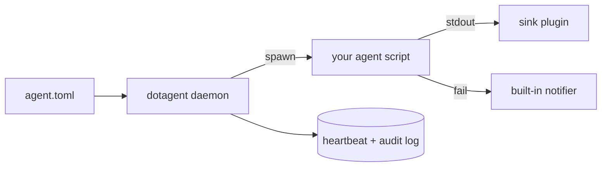

# dotagent

> Write your agent in **any language**. dotagent schedules it, supervises it, and tells you when it breaks.

## How this got here

I'm a CTO. I have a handful of small tasks I run every day — pulling metrics,
drafting reports, triaging the inbox, briefing myself before the week starts.
So I did what every engineer does: I automated them.

**Step 1: Claude Code (openclaw/clawd) ran my schedule.** I wrote the agenda
in plain text/markdown and let the LLM do the rest. Worked for a week. Then I
noticed the bill: every run, the model was *generating a fresh script* in
some language to execute the same piece of the schedule. I was burning tokens
writing throwaway code the model had already written yesterday, last week,
and the week before. Orchestration cost more than the actual work.

**Step 2: I started writing the scripts myself.** I'm a fish user, so the
scripts became fish. I kept `claude -p` around only where I actually needed
intelligence — drafting a sentence, classifying ambiguous input, summarizing
a thread. Everything else was deterministic shell. Tokens dropped, runs got
faster, the work itself stayed the same.

**Step 3: a framework appeared.** As agents multiplied, the same boilerplate
showed up everywhere: load config, write heartbeat, retry, notify on
failure. I extracted it into `lib/agent.fish`. Then a tiny orchestrator on
top. Then I wired the whole thing into **launchd** (the macOS native
scheduler) so the laptop wakes each agent at the right time.

**Step 4: today: dotagent.** Same architecture, rewritten in Rust, shipped
as a single binary. No fish dependency, no shell-specific assumptions,
OS-native scheduling on macOS *and* Linux (launchd + systemd), plugins in any
language. Everything I learned the hard way, baked in by default.

> If you're at step 1 (LLM orchestrating shell scripts) or step 2
> (hand-rolled scripts), this is the road you were already going to walk.
> dotagent is what you'd build if you had the patience to refactor it —
> skip the detour.

## Why

You have a handful of jobs that run on a schedule:

- A daily report that pulls metrics from N APIs
- A 90-min poll that classifies your inbox
- A weekly snapshot that publishes to your knowledge base
- A morning briefing that pings you on iMessage

You started in `cron`. Then you needed retries. Then notifications. Then
preflight checks ("only if VPN is up"). Then you wanted health visibility.
Pretty soon your "tiny shell script" is 800 lines and the orchestration
logic competes with the actual work.

**dotagent extracts the orchestration.** Your agent stays a small script
(Fish, Python, Go, Rust, anything that reads env vars and exits). dotagent
handles the boring-but-load-bearing pieces:

- **OS-native scheduling** — generates launchd plist / systemd unit. No
  daemon polling, no `sleep` loops.
- **Adaptive supervisor** — single daemon sleeps until the next event,
  wakes up, dispatches, sleeps again.
- **Retries + backoff per schedule** — missed windows get detected and
  retried. Out-of-band notification when they give up.
- **Notifications built-in** — desktop, iMessage, Slack, ntfy, Pushover
  ship in the daemon. No extra binaries on `$PATH`, no subprocess fork
  per alert. Declare `[[notifiers]]` and you're done.
- **Pluggable I/O** — preflight checks and output sinks (and third-party
  notifiers) are external binaries speaking a simple JSON-over-stdio
  protocol. Want to publish to Roam? Drop in a sink plugin.
- **No SDK** — your agent just reads env vars and exits with a code.
  That's the entire API.

## Install

```bash
# Homebrew (the repo doubles as its own tap)
brew tap avelino/dotagent https://github.com/avelino/dotagent
brew install dotagent
brew services start dotagent     # runs `dotagent daemon` via launchd/systemd

# Cutting-edge: builds from main, refreshed on every push.
brew install dotagent@beta
brew link --overwrite dotagent@beta

# From a release binary
# Download dotagent-<VERSION>-<ARCH>-<OS>.tar.gz from:
#   https://github.com/avelino/dotagent/releases
# Extract bin/dotagent and bin/dotagent-plugin-* onto $PATH.

# From source (Rust stable)
cargo install --path crates/dotagent
```

Full install reference (every path, with verify steps) is in
[`docs/getting-started/installation.md`](docs/getting-started/installation.md).

## Tour, 5 minutes



**1. Write a manifest** (`~/.config/dotagent/agents/morning-briefing/agent.toml`):

```toml
[agent]
name = "morning-briefing"
timeout_seconds = 300

[run]
command = "python3"
args = ["./brief.py"]

[[schedules]]
id = "daily"
type = "cron"
weekdays = [1, 2, 3, 4, 5]
hours = [8]
minute = 30

[[notifiers]]                  # built into the daemon — no plugin install
driver = "imessage"
to     = "+5511999999999"
events = ["given_up"]
```

```python
# brief.py
import os
print(f"hello from {os.environ['AGENT_NAME']}")
```

**2. Install the daemon** (one unit per system, not per agent):

```bash
dotagent install
launchctl bootstrap "gui/$(id -u)" ~/Library/LaunchAgents/run.avelino.dotagent.plist
# Linux: systemctl --user enable --now run.avelino.dotagent
```

**3. See it run**:

```bash
dotagent status                          # health dashboard
dotagent logs morning-briefing --follow  # tail the agent's output
dotagent tick --dry-run                  # "what would the daemon do right now?"
```

Every weekday at 08:30, the daemon wakes, fires `brief.py`, records the
heartbeat, retries with backoff on failure, and pings your phone on
iMessage when it gives up.

**Step-by-step walkthrough** (15 minutes, zero to daemon-managed
agent): [`docs/getting-started/first-agent.md`](docs/getting-started/first-agent.md).

## Docs

**Writing an agent with an LLM?** Point Claude / your assistant at
[`docs/llms.txt`](docs/llms.txt) — a single-fetch digest with the full
manifest schema, env vars, every notifier driver, every built-in plugin,
exit code semantics, common `doctor` errors, and 3 worked examples. Most
LLMs can write a working `agent.toml` zero-shot after reading it.

Canonical raw URL for `WebFetch`:
`https://raw.githubusercontent.com/avelino/dotagent/main/docs/llms.txt`

**Start here:**

- [Installation](docs/getting-started/installation.md) — every install path with verify steps
- [Your first agent](docs/getting-started/first-agent.md) — zero → daemon-managed agent
- [Architecture](docs/concepts/architecture.md) — daemon, runner, plugins, state
- [CLI reference](docs/reference/cli.md) — every subcommand

**Concepts:**

- [Agents](docs/concepts/agents.md) — patterns, extending, connecting
- [Plugins](docs/concepts/plugins.md) — declaring, using, building
- [Notifications](docs/concepts/notifications.md) — built-in drivers

**Reference:**

- [Agent spec](docs/reference/agent-spec.md) — `agent.toml` schema
- [Plugin protocol](docs/reference/plugin-protocol.md) — formal spec
- [Environment variables](docs/reference/env-vars.md) — injected + read
- [Filesystem layout](docs/reference/paths.md) — where every file lives

**Operating:**

- [Daemon lifecycle](docs/guides/daemon-lifecycle.md) — install / start / stop / reload
- [Troubleshooting](docs/guides/troubleshooting.md) — sintoma → diagnostic
- [Observability](docs/guides/observability.md) — logs + OpenTelemetry
- [Config reference](docs/guides/config-reference.md) — `config.toml`
- [Threat model](docs/security/threat-model.md) — what dotagent defends against
- [Migrating from Fish](docs/guides/migrating-from-fish.md)
- [FAQ](docs/faq.md) — quick answers

## Status

Pre-release. The manifest schema, plugin protocol, and heartbeat shape are
stable; the daemon scheduler is shipping next. Follow
[issues](https://github.com/avelino/dotagent/issues) for milestones.

## License

[MIT](LICENSE).
