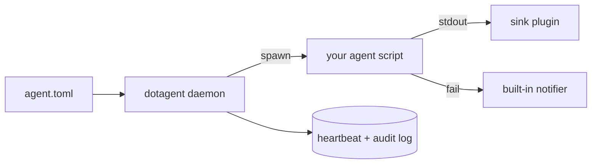

# dotagent

> Polyglot agent orchestrator. You write the agent in whatever language
> you want — dotagent handles scheduling, supervision, health, and
> delivery.

dotagent is a single Rust binary plus a tiny manifest format
(`agent.toml`) that turns any script — Fish, Python, Go, Rust, shell,
binary — into a first-class scheduled agent. It owns the boring parts:
adaptive scheduling, heartbeat, retries, notifications, sinks, audit
log.

---

## Start here

**If this is your first time using dotagent:**

1. [Install](getting-started/installation.md) — pick brew (coming
   soon), GitHub Release binaries, `cargo install`, or build from source.
2. [Write your first agent](getting-started/first-agent.md) — 15-minute
   walkthrough from zero to an agent rodando no daemon, with desktop
   alerts on failure.
3. [Next steps](getting-started/next-steps.md) — where to go after the
   first agent (plugins, notifications, observability, multiple agents).

---

## I want to…

| Goal                                                        | Read                                                                          |
|-------------------------------------------------------------|-------------------------------------------------------------------------------|
| Understand the architecture (crates, lifecycle, isolation)  | [Architecture](concepts/architecture.md)                                       |
| Learn what an agent is, what patterns work                  | [Agents — concept](concepts/agents.md)                                         |
| See every `agent.toml` field                                | [Agent spec](reference/agent-spec.md)                                          |
| Add notifications                                           | [Notifications](concepts/notifications.md)                                     |
| Add a sink / preflight / third-party notifier               | [Plugins — concept](concepts/plugins.md) · [Built-in catalog](plugins/README.md) |
| Write my own plugin                                         | [Plugin protocol](reference/plugin-protocol.md)                                |
| Look up a CLI subcommand                                    | [CLI reference](reference/cli.md)                                              |
| Start / stop / reload the daemon                            | [Daemon lifecycle](guides/daemon-lifecycle.md)                                 |
| Tune verbosity / enable OpenTelemetry                       | [Config reference](guides/config-reference.md) · [Observability](guides/observability.md) |
| Figure out where a file lives                               | [Filesystem layout](reference/paths.md)                                        |
| Figure out which env vars are read / injected               | [Environment variables](reference/env-vars.md)                                 |
| Fix something that's broken                                 | [Troubleshooting](guides/troubleshooting.md)                                   |
| Coming from the Fish framework                              | [Migrating from Fish](guides/migrating-from-fish.md)                           |
| Worry about security                                        | [Threat model](security/threat-model.md)                                       |
| Quick Q&A                                                   | [FAQ](faq.md)                                                                  |

---

## What dotagent is NOT

- **Not a runtime for AI agents.** Your script decides when (and
  whether) to call an LLM.
- **Not an SDK.** There's nothing to import. Your agent just reads
  env vars and exits with a code.
- **Not an MCP proxy.** The separate `mcp` CLI handles that — dotagent
  agents can call it directly when they need to.
- **Not opinionated about your stack.** Fish, Python, Go, Rust, bash,
  a compiled binary — all first-class.
- **Not for Windows.** macOS + Linux only.

---

## Project links

- [GitHub repo](https://github.com/avelino/dotagent)
- [Contributor guide (`CLAUDE.md`)](../CLAUDE.md) — read before opening a PR
- [Changelog](https://github.com/avelino/dotagent/releases) — what shipped when
