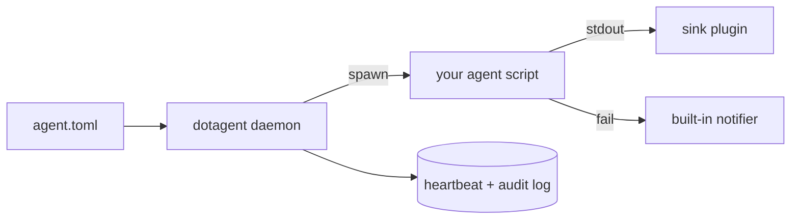

# Introduction

> Write your agent in **any language**. dotagent schedules it, supervises
> it, and tells you when it breaks.

dotagent is a scheduler and supervisor for the small jobs you run every
day. It is **not** an agent runtime, not an SDK, and not an AI product.
Your agent stays a script you own; dotagent handles the parts that are
boring to write and expensive to get wrong.

## How this got here

I'm a CTO. I have a handful of small tasks I run every day: pulling
metrics, drafting reports, triaging the inbox, briefing myself before the
week starts. So I did what every engineer does, I automated them.

**Step 1: an LLM ran my schedule.** I wrote the agenda in plain markdown
and let the model do the rest. Worked for a week. Then I noticed the
bill: every run, the model was *generating a fresh script* to execute the
same piece of the schedule. I was burning tokens writing throwaway code
the model had already written yesterday, last week, and the week before.
Orchestration cost more than the actual work.

**Step 2: I wrote the scripts myself.** I'm a fish user, so they became
fish. I kept `claude -p` only where I actually needed judgment: drafting
a sentence, classifying ambiguous input, summarizing a thread. Everything
else was deterministic shell. Tokens dropped, runs got faster, the work
itself stayed the same.

**Step 3: a framework appeared.** As agents multiplied, the same
boilerplate showed up everywhere: load config, write heartbeat, retry,
notify on failure. I extracted it into `lib/agent.fish`, then a tiny
orchestrator on top, then wired the whole thing into launchd so the
laptop wakes each agent at the right time.

**Step 4: dotagent.** Same architecture, rewritten in Rust, shipped as a
single binary. No fish dependency, no shell-specific assumptions,
OS-native scheduling on macOS *and* Linux, plugins in any language.

> If you're at step 1 (an LLM orchestrating shell scripts) or step 2
> (hand-rolled scripts), this is the road you were already going to walk.
> dotagent is what you'd build if you had the patience to refactor it.

## Why

You have a handful of jobs that run on a schedule:

- A daily report that pulls metrics from N APIs
- A 90-min poll that classifies your inbox
- A weekly snapshot that publishes to your knowledge base
- A morning briefing that pings you on iMessage

You started in `cron`. Then you needed retries. Then notifications. Then
preflight checks ("only if VPN is up"). Then health visibility. Pretty
soon your "tiny shell script" is 800 lines and the orchestration competes
with the actual work.

**dotagent extracts the orchestration.** Your agent stays small (Fish,
Python, Go, Rust, anything that reads env vars and exits). dotagent
handles the load-bearing parts:

- **OS-native scheduling** — generates a launchd plist / systemd unit. No
  polling, no `sleep` loops.
- **Adaptive supervisor** — one daemon sleeps until the next event, wakes,
  dispatches, sleeps again.
- **Retries + backoff per schedule** — missed windows get detected and
  retried, with an out-of-band notification when they give up.
- **Notifications built in** — desktop, iMessage, Slack, ntfy and Pushover
  ship inside the daemon. No extra binaries on `$PATH`.
- **Pluggable I/O** — preflight checks and output sinks are external
  binaries speaking JSON over stdio. Write one in any language.
- **No SDK** — your agent reads env vars and exits with a code. That's the
  entire API.

## What it looks like


```mermaid
flowchart LR
    M[agent.toml] --> D[dotagent daemon]
    D -->|spawn| A[your agent script]
    A -->|stdout| S[sink plugin]
    A -->|fail| N[built-in notifier]
    D --> H[(heartbeat + audit log)]
```

A manifest declares who the agent is, when it runs, and what happens on
success or failure:

```toml
[agent]
name = "morning-briefing"
timeout_seconds = 300

[run]
command = "python3"
args = ["./brief.py"]

[[schedules]]
id = "daily"
type = "cron"
weekdays = [1, 2, 3, 4, 5]
hours = [8]
minute = 30

[[notifiers]]
driver = "imessage"
to = "+5511999999999"
events = ["given_up"]
```

Every weekday at 08:30 the daemon wakes, runs `brief.py`, records the
heartbeat, retries with backoff on failure, and pings your phone once it
gives up.

## Where to go next

- [Installation](getting-started/installation.md) — every install path,
  with verify steps
- [Your first agent](getting-started/first-agent.md) — zero to
  daemon-managed in 15 minutes
- [Architecture](concepts/architecture.md) — daemon, runner, plugins, state
- [Agents](concepts/agents.md) — the patterns worth copying
- [LLM agents](guides/llm-agents.md) — calling `claude -p` from an agent,
  and the headless gotchas
- [FAQ](faq.md) — quick answers

**Writing an agent with an LLM?** Point it at
[`llms.txt`](llms.txt), a single-fetch digest with the full manifest
schema, env vars, every notifier driver and plugin, exit code semantics,
and worked examples. Most models can write a working `agent.toml`
zero-shot after reading it.

Canonical raw URL for `WebFetch`:
`https://raw.githubusercontent.com/avelino/dotagent/main/docs/llms.txt`

## Status

Pre-release. The manifest schema, plugin protocol and heartbeat shape are
stable. Follow
[issues](https://github.com/avelino/dotagent/issues) for milestones.

The project lives at
[github.com/avelino/dotagent](https://github.com/avelino/dotagent) under
the MIT license.
