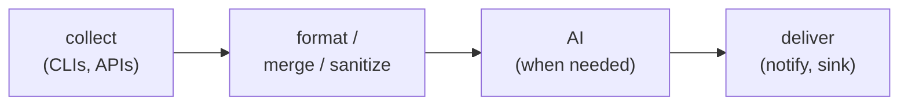
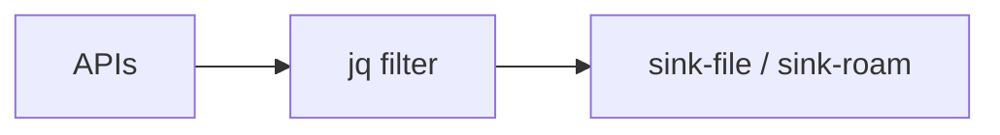
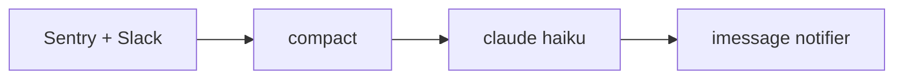
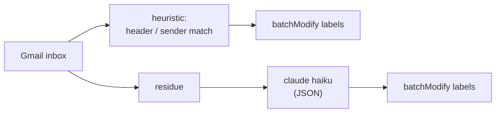
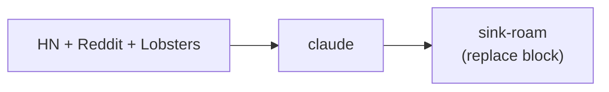
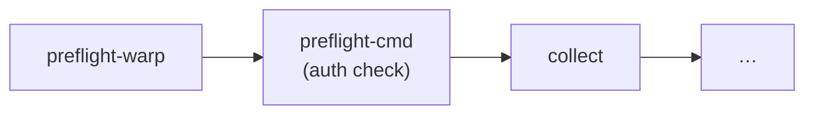

# Agents

> An **agent** is a small program that does, on a schedule, something a
> person would otherwise do — and uses AI when (and only when) judgment is
> actually required.

This guide covers:

1. [What is an agent](#what-is-an-agent) — the idea, why it matters
2. [The dotagent definition](#the-dotagent-definition) — script controls, AI analyzes
3. [Anatomy of an agent](#anatomy-of-an-agent) — directory layout, files
4. [Writing your first agent](#writing-your-first-agent) — end-to-end walkthrough
5. [Patterns](#patterns) — common agent shapes
6. [Extending agents](#extending-agents) — env vars, plugins, lifecycle hooks
7. [Connecting agents](#connecting-agents) — chaining, shared state, handoff
8. [When NOT to write an agent](#when-not-to-write-an-agent)
9. [Examples gallery](#examples-gallery) — real-world inspiration

For the formal `agent.toml` schema see [`agent-spec.md`](../reference/agent-spec.md).
For plugins see [`plugins.md`](plugins.md). For built-in notifiers see
[`notifications.md`](notifications.md).

---

## What is an agent

The word *agent* got crowded in 2024–2025. It came to mean "an LLM that
plans and executes." That definition is useful, but it's not what
dotagent runs.

**Here, an agent is something that automates a discrete piece of your
day** — pulling a report, triaging an inbox, drafting a post, briefing
you before standup. It might use an LLM. It might not. Either way, the
agent is **the script that knows what to do and when**; the LLM is a
component the script calls when judgment is needed.

A useful working definition:

> An agent is *the smallest unit of work you'd otherwise do yourself*,
> wrapped in a script, scheduled by a machine, and delivered to wherever
> you actually look (iMessage, Roam, email, file).

Three properties make a piece of code "an agent" in this sense:

1. **Recurring.** It runs on a schedule (daily 08:30, every 90min,
   whenever inbox grows by N). One-shot scripts aren't agents.
2. **Bounded.** It does one thing well. "Daily DORA metrics for the
   eng team" is an agent. "Run my whole business" is not.
3. **Acting on your behalf.** The output is something you'd otherwise
   produce — a message, a document, a label, a decision. Not just data.

dotagent is the substrate: it schedules, supervises, retries, notifies.
**Writing the agent is your job.** dotagent makes that job small.

---

## The dotagent definition

dotagent agents follow a pattern the legacy Fish framework distilled
over a year of production use:

> **The script controls the flow. AI is a tool the script calls.**

A typical agent looks like:



Concretely, the 5 phases (from the legacy `lib/agent.fish` framework):

| Phase   | What happens                                              |
|---------|-----------------------------------------------------------|
| Init    | Read env vars dotagent injected, create tmpdir            |
| Collect | Hit APIs/CLIs in parallel, dump results to tmpdir         |
| Prompt  | Assemble prompt from collected data + static system prompt|
| Run     | Call `claude -p` (or omit if no AI needed)                |
| Output  | Send to iMessage / Roam / file / stdout                   |

**Why this and not "100% AI agent":**

- **Cost.** When the LLM regenerates the same orchestration code every
  run, you pay tokens for work that's already deterministic.
- **Speed.** A `gh api` + `jq` pipeline finishes in 200ms. An LLM doing
  the same finishes in 8s.
- **Reliability.** Code is deterministic. LLM output isn't.
- **Debuggability.** You can step through 80 lines of shell. You can't
  step through a model.

So: AI when there's actual judgment ("which of these 30 stories is the
most polemic?"). Code when there isn't ("fetch the top 30 stories from
HN's Firebase API"). The skill is knowing the difference.

---

## Anatomy of an agent

An agent is a directory. Everything it owns lives there.

```
my-agent/
  agent.toml         # required — manifest (schema in docs/reference/agent-spec.md)
  agent.fish         # required — the entry point (or .py, .go, a binary, etc.)
  prompt.md          # optional — system prompt for the LLM (if using one)
  config.json        # optional — static data (mappings, allow-lists)
  CLAUDE.md          # optional — doc-for-LLMs explaining the agent
  README.md          # optional — doc-for-humans
```

The entry point is what `[run].command` points to in the manifest. It
can be any executable:

```toml
# Fish
[run]
command = "fish"
args = ["./agent.fish"]

# Python (uv-managed)
[run]
command = "uv"
args = ["run", "./agent.py"]

# Go binary
[run]
command = "./agent"

# Rust binary (built separately)
[run]
command = "./target/release/my-agent"

# Bash one-liner directly
[run]
command = "/bin/sh"
args = ["-c", "curl -s https://example.com/data | jq . > $AGENT_TMPDIR/data.json"]
```

### Discovery

dotagent finds agents by scanning, in order:

1. Every directory in `$DOTAGENT_ROOT` (colon-separated)
2. `~/.config/dotagent/agents/`
3. `$CWD/agents/`
4. `$CWD`

Each direct subdirectory that contains an `agent.toml` becomes an agent.

The most common production setup is to keep agents in their dev repo
(say `~/dotfiles/agents/<name>/`) and symlink each one into
`~/.config/dotagent/agents/`:

```bash
ln -s ~/dotfiles/agents/finops-weekly ~/.config/dotagent/agents/finops-weekly
```

That way `git` versions the agent and dotagent picks it up.

---

## Writing your first agent

Goal: a 10-line agent that pulls the top 5 Hacker News stories every
morning and writes them to a file. No LLM yet — just to see the moving
parts.

### 1. Create the directory

```bash
mkdir -p ~/.config/dotagent/agents/hn-morning
cd ~/.config/dotagent/agents/hn-morning
```

### 2. Write the script

```bash
cat > agent.fish <<'EOF'
#!/usr/bin/env fish

# dotagent injects:
#   $AGENT_TMPDIR  — scratch dir, auto-cleaned
#   $AGENT_HOME    — this directory
#   $AGENT_DRY_RUN — "true" / "false"

set -l stories (curl -s 'https://hacker-news.firebaseio.com/v0/topstories.json' \
    | jq -r '.[:5][]')

for id in $stories
    curl -s "https://hacker-news.firebaseio.com/v0/item/$id.json" \
        | jq -r '"- \(.title)  (\(.score) points)\n  \(.url // "n/a")"'
end
EOF
chmod +x agent.fish
```

### 3. Write the manifest

```bash
cat > agent.toml <<'EOF'
[agent]
name = "hn-morning"
description = "Top 5 HN stories at 08:00"
timeout_seconds = 60

[run]
command = "fish"
args = ["./agent.fish"]

[[schedules]]
id = "daily"
type = "cron"
weekdays = [1, 2, 3, 4, 5]
hours = [8]
minute = 0

# Persist the agent's stdout to a file we can grep later.
[[on_success]]
plugin = "sink-file"
config = { path = "/Users/avelino/reports/hn-today.md", mode = "overwrite" }
EOF
```

### 4. Smoke-test

```bash
dotagent doctor                                 # validate
dotagent run hn-morning --schedule daily        # run once, foreground
cat /Users/avelino/reports/hn-today.md          # see the output
```

If the manifest is right and `agent.fish` is executable, the file shows
up populated.

### 5. Install the daemon

```bash
dotagent install                                # writes the single plist
launchctl bootstrap "gui/$(id -u)" \
    ~/Library/LaunchAgents/run.avelino.dotagent.plist
```

From now on, every weekday at 08:00, dotagent wakes, fires
`agent.fish`, captures stdout, hands it to `sink-file`, writes the
heartbeat, and goes back to sleep. **The whole orchestration is in
`agent.toml`. The agent is 6 lines of fish.**

---

## Patterns

Most useful agents fit one of these shapes. Pick the one closest to your
need and copy.

### Pattern 1 — Pure data collector

No LLM. Just normalize and persist.



**Examples:** roam-hugo-sync, sync-calendars, gemini-notes-to-roam.

**When to pick this:** the output is structured data, not prose. You
know exactly what fields you need.

### Pattern 2 — Brief / digest

Collector + LLM summary + push to humans.



**Examples:** hourly-briefing (hourly CTO briefing), team-standup.

**When to pick this:** the input is noisy (50 issues, 10 Slack channels),
you want 3 bullets. Cheap model (haiku) handles it.

### Pattern 3 — Triage / classifier

Collector + heuristic (no LLM) + LLM for residue + apply labels/actions.



**Examples:** gmail-triage.

**When to pick this:** 60-80% of cases are deterministic. Pay tokens
only for the hard 20%.

### Pattern 4 — Generator with idempotency

Collector + LLM generation + idempotent replace in target.



**Examples:** linkedin-hot-take, gemini-notes-to-roam.

**When to pick this:** output is drafted prose. Re-running shouldn't
duplicate — use a sink that supports `marker_regex` (sink-roam) or
overwrite mode (sink-file).

### Pattern 5 — Watchdog / preflight chain

Mostly preflight plugins. Agent itself is a thin shell.



**Examples:** any agent that depends on a flaky connection (WARP, VPN,
authenticated CLI).

**When to pick this:** the failure mode is "external dep down" more than
"my logic broke." Let preflight gate the run and the daemon retry until
WARP comes back.

---

## Extending agents

### Environment variables dotagent injects

When dotagent invokes your agent, these are set in addition to the
inherited environment (unless `env.inherit = false` in the manifest):

| Variable               | Value                                                 |
|------------------------|-------------------------------------------------------|
| `AGENT_NAME`           | manifest `agent.name`                                 |
| `AGENT_HOME`           | absolute path to the manifest directory               |
| `AGENT_TMPDIR`         | freshly created tempdir, auto-cleaned                 |
| `AGENT_DRY_RUN`        | `"true"` / `"false"`                                  |
| `AGENT_SCHEDULE_ID`    | which schedule is firing                              |
| `AGENT_SLUG`           | derived slug for the heartbeat (from args)            |
| `AGENT_START_EPOCH`    | epoch seconds of `started_at`                         |
| `AGENT_ARGV`           | JSON array of the schedule's `args`                   |
| `AGENT_HEARTBEAT_FILE` | path to the heartbeat file (empty if `dry_run`)       |

Use them. Don't reinvent (no need for your own tempdir, no need to write
your own state).

### Extra env vars

Need a constant in scope of your agent?

```toml
[env]
inherit = true                      # default true; keep parent env
extra = { LOG_LEVEL = "info", PYTHONUNBUFFERED = "1" }
```

### Lifecycle hooks via plugins and notifiers

```toml
[[preflight]]
plugin = "preflight-warp"
config = { connect_command = "warp-cli connect" }

[[on_success]]
plugin = "sink-roam"
config = { page = "today", marker_regex = "#DAILY.*2026-05-19" }

# Notifications are built into the daemon — declare them under [[notifiers]].
# See docs/concepts/notifications.md for every driver.
[[notifiers]]
driver = "imessage"
to     = "+55..."
rate_limit_minutes = 60
events = ["given_up"]   # only fire after retries exhausted
```

The agent's exit code drives this:

- exit 0 → `on_success` plugins + matching `[[notifiers]]` fire
- exit ≠ 0 → matching `[[notifiers]]` + any legacy `on_failure` plugins fire

This is the right place to put cross-cutting concerns — *every*
agent of mine notifies the same way; that doesn't belong in each
`agent.fish`.

### Retry policy

Set per-agent or per-schedule:

```toml
[defaults]
max_retries = 3
retry_backoff_minutes = [5, 15, 30]
stale_after_minutes = 120
```

`stale_after_minutes` matters: if the window passed N minutes ago and
the data isn't useful anymore (a 9am briefing at 2pm isn't a briefing),
the daemon skips retrying silently.

### When your agent legitimately should "do everything"

Sometimes you want one agent that's actually a small pipeline:
collect, transform, run model, write output. That's fine — `agent.fish`
can be 200 lines. The dotagent boundary is at the *orchestration*
edge: scheduling, supervising, notifying, sinking. Below that is your
shell / Python / Go problem.

---

## Connecting agents

There are four ways to make two agents talk to each other. Pick the
simplest one that works.

### 1. Filesystem handoff (preferred)

Agent A writes a file. Agent B reads it on its next run.

```toml
# Agent A — writes
[[on_success]]
plugin = "sink-file"
config = { path = "/tmp/dotagent/handoff/a.json" }

# Agent B — reads
[run]
command = "fish"
args = ["./agent.fish"]
# inside agent.fish: cat /tmp/dotagent/handoff/a.json | jq …
```

**Why preferred:** zero coupling. A doesn't know about B. B is robust
to A not having run yet (empty file or missing file).

### 2. Shared Roam page

Both agents write to / read from the same Roam page using `sink-roam` +
the Roam MCP tools. Block markers (`marker_regex`) keep them from
clobbering each other.

```toml
# Agent A
[[on_success]]
plugin = "sink-roam"
config = { page = "acme/tech/daily", marker_regex = "#a-output" }

# Agent B
[[on_success]]
plugin = "sink-roam"
config = { page = "acme/tech/daily", marker_regex = "#b-output" }
```

Good when the page is the "shared dashboard" the human reads. Roam
becomes the bus, not the storage.

### 3. Direct invocation (rare)

Agent A's script literally calls `dotagent run-now agent-b`.

```fish
# Inside agent-a/agent.fish
if test "$something" = condition
    dotagent run-now agent-b --schedule daily
end
```

**Use sparingly.** It couples A to B and bypasses B's own schedule logic.
Right when the trigger is genuinely event-driven, not time-driven —
"after every gmail-triage success, run the unsubscribe sweep if it
flagged anything."

### 4. Schedule alignment

Two agents that should be coherent in time share schedules:

```toml
# agent-a/agent.toml
[[schedules]]
id = "morning"
type = "cron"
hours = [8]
minute = 0

# agent-b/agent.toml — runs 5 minutes after a, so a's output is fresh
[[schedules]]
id = "morning"
type = "cron"
hours = [8]
minute = 5
```

Loose coupling. If A fails its 08:00 window, B still runs at 08:05 with
yesterday's data. Often that's what you want — "give me *something* at
08:05" is better than "give me nothing because A broke."

### Anti-pattern — chain of LLMs

Don't build a sequence of 4 agents that each prompt Claude with the
previous one's output. You're paying tokens to deserialize and
re-serialize the same information. Either:

- Collapse into one agent with a multi-step prompt.
- Or share intermediate state via filesystem (option 1 above).

---

## When NOT to write an agent

dotagent is a hammer. Not everything is a nail.

- **One-off scripts** → just run them. `cron` or a shell alias is fine.
- **Long-running services** → use a real service manager. dotagent
  agents are spawn-and-die.
- **Interactive workflows** → if you need to *answer* a prompt, that's
  not an agent. That's a CLI you run.
- **Sub-second latency** → dotagent's daemon wakes adaptively; spawn
  overhead is real. Don't schedule something that needs to fire 100x/s.
- **Pure event-driven work** → if the trigger is "webhook hits an
  endpoint," you want a real service. dotagent only wakes on its own
  schedule.

A good rule of thumb: if the task naturally fits in a sentence like
"every weekday at 08:30, …" or "every 90 minutes, …", it's an agent.
Otherwise it's something else.

---

## Examples gallery

The Fish framework that dotagent grew out of has nine agents in
production. The shapes:

| Agent                       | Pattern              | Notes                                                    |
|-----------------------------|----------------------|----------------------------------------------------------|
| `hourly-briefing`            | Brief / digest       | Sentry + Slack → haiku → iMessage. 14 runs/day weekday.  |
| `team-standup`   | Brief / digest       | GitHub (30+ repos) + Sentry → sonnet → Roam. WARP preflight, retry 20x. |
| `finops-weekly`              | Pure collector       | AWS multi-account → sonnet → file. Weekly.               |
| `calendar-to-resend`        | Connector            | gcal → Resend HTTP. No LLM.                              |
| `gemini-notes-to-roam`      | Generator + idempotent| Gmail (Gemini Notes) → sonnet → Roam. Every 4h.          |
| `gmail-triage`              | Triage / classifier  | Gmail → heuristic + haiku → labels. Every 90 min.        |
| `linkedin-hot-take`         | Generator + idempotent| HN + Reddit + Lobsters → claude → Roam draft. Weekday 7am.|
| `roam-hugo-sync`            | Pure collector       | Roam → Hugo blog. 10am + 22h.                             |
| `agent-orchestrator` (legacy)| Watchdog            | Now replaced by `dotagent daemon`.                        |

Each agent's directory in [avelino/dotfiles](https://github.com/avelino/dotfiles)
has a `CLAUDE.md` documenting the pipeline + decisions. Read those for
real-world wiring of the patterns above.

For the **simplest possible agent**, see [`examples/hello-fish/`](../examples/hello-fish/)
in this repo (and the parallel `hello-python/`, `hello-go/`, `hello-rust/`).

---

## Related docs

- [`agent-spec.md`](../reference/agent-spec.md) — formal `agent.toml` schema
- [`plugins.md`](plugins.md) — what plugins are and how to use/build them
- [`notifications.md`](notifications.md) — built-in notifier drivers
- [`plugin-protocol.md`](../reference/plugin-protocol.md) — protocol spec for plugins
- [`migrating-from-fish.md`](../guides/migrating-from-fish.md) — for users of the legacy framework
- [`threat-model.md`](../security/threat-model.md) — security considerations
