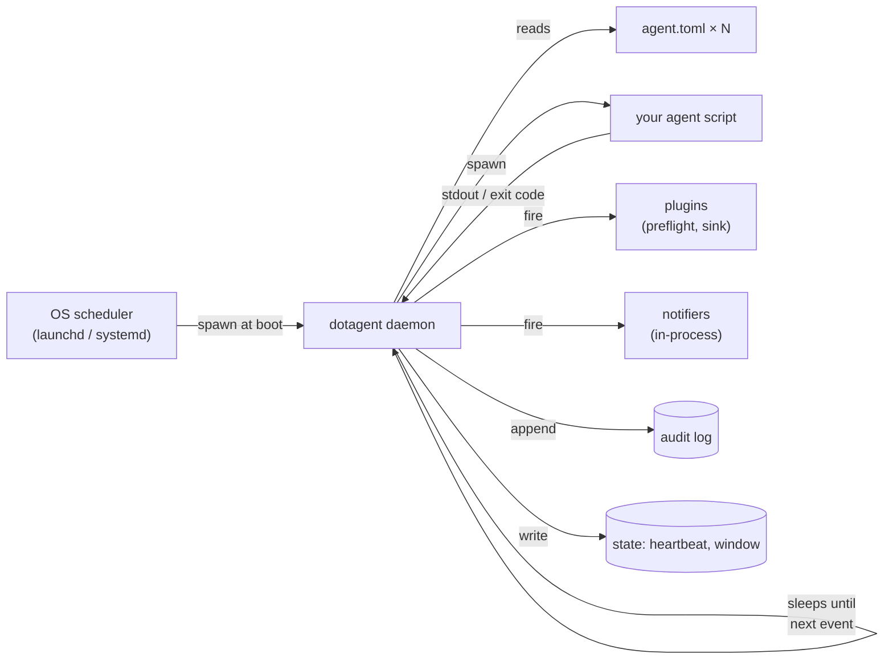
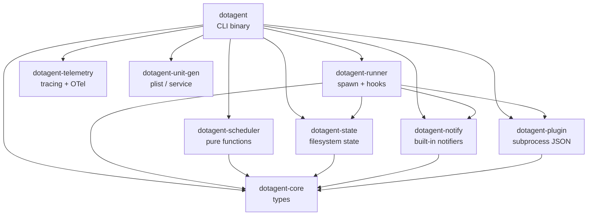
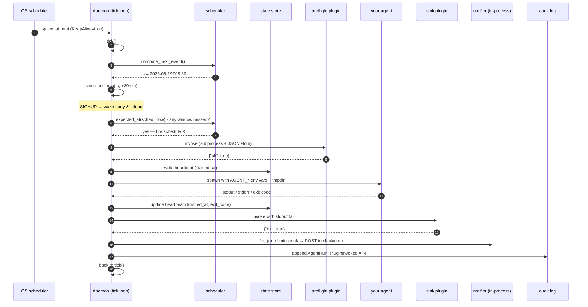
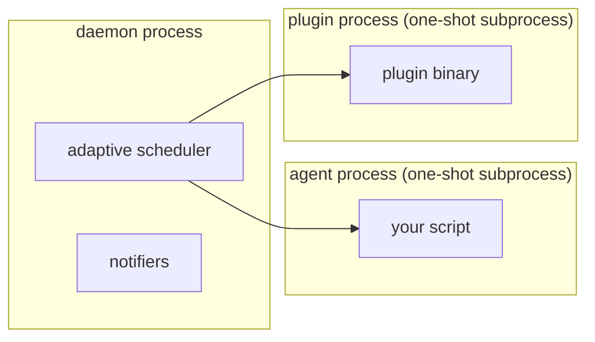

# Architecture

> What the daemon does, what it doesn't, and which crate owns each decision.

dotagent is built like a coffee shop, not a kitchen brigade. **One person
behind the counter takes every order**. The "daemon" is that one person —
it watches the schedules, decides what to fire next, supervises each
agent, and goes back to waiting. There is no per-agent process running
in the background. There is no scheduler poll loop.

Read this if you want to:

- Picture what happens between `dotagent install` and `your agent runs`.
- Know which crate to touch when changing behavior.
- Understand why a panicking plugin doesn't take down everything.

For the user-facing concepts see [`agents.md`](agents.md) and
[`plugins.md`](plugins.md). For the schema details see the
[reference docs](../reference/agent-spec.md).

---

## The 30-second mental model



Three things to internalize:

1. **The OS owns when the daemon runs.** launchd / systemd keep
   `dotagent daemon` alive. dotagent does not install itself as a
   service-aware program — `dotagent install` writes a unit file, and
   the OS does the rest.
2. **The daemon owns when each agent runs.** Not the OS. There is **one**
   unit file (`run.avelino.dotagent`), not one per agent. The daemon's
   adaptive scheduler computes the next event across every schedule of
   every agent and sleeps until that exact moment.
3. **Your agent is a one-shot subprocess.** It reads env vars, does its
   thing, writes stdout, exits. No SDK, no IPC, no long-running state.

Everything else in this doc is detail.

---

## Crate layout

The workspace has eight crates. Each has one responsibility and a single
direction of "depends on" — no cycles.



| Crate                 | Owns                                                                                            |
|-----------------------|-------------------------------------------------------------------------------------------------|
| `dotagent-core`       | Shared types: `AgentManifest`, `Schedule`, `Heartbeat`, `WindowState`, `Config`, `AuditEvent`.  |
| `dotagent-scheduler`  | **Pure** scheduling math. `compute_next_event`, `expected_at`, `should_retry`, `health_state`. No IO. |
| `dotagent-runner`     | Spawn the agent subprocess. Timeout, env injection, stdio capture, heartbeat lifecycle, hook firing. |
| `dotagent-state`      | Filesystem state: heartbeats, window state, audit log, plugin state, manifest cache.            |
| `dotagent-notify`     | Built-in notifier drivers (`desktop`, `slack`, `ntfy`, `pushover`, `telegram`, `imessage`).     |
| `dotagent-plugin`     | `PluginClient` — discover + spawn + JSON-stdio for preflight / sink / third-party notify.       |
| `dotagent-telemetry`  | `tracing` setup, JSON file logging, daily rotation, retention sweep, optional OTLP export.      |
| `dotagent-unit-gen`   | Render `daemon.plist` (macOS) / `daemon.service` (Linux) from templates.                        |
| `dotagent` (binary)   | CLI subcommands. Wires the crates together.                                                     |

**Rule of thumb**: if you can write it as `fn f(now: DateTime, ...) -> X`
with no `std::fs`, it goes in `dotagent-scheduler`. Anything that touches
disk or processes goes in `dotagent-state`, `dotagent-runner`, or
`dotagent-plugin`.

---

## Lifecycle of a single run

The full path from "the daemon wakes up" to "your agent has run and the
audit is written" — step by step.



What's worth pointing out:

- **Step 4 (sleep).** No polling. The daemon computes `ts` once and
  `tokio::time::sleep` until then. `MAX_SLEEP_MINUTES = 30` is the
  safety cap so a new manifest dropped into `agents/` is picked up
  within that window even if no scheduled event fires.
- **Step 7-9 (preflight).** If any preflight returns `ok=false`, the
  agent is **never spawned**. dotagent emits `PreflightFailed` to audit
  and fires the matching notifier.
- **Step 10 (heartbeat start).** Written before the spawn. Crash
  detection: if `started_at` exists but `finished_at` doesn't, the
  previous run died.
- **Step 11 (env injection).** dotagent sets nine `AGENT_*` env vars
  plus whatever `[env].extra` declares. See
  [`reference/env-vars.md`](../reference/env-vars.md).
- **Step 14-15 (sink).** Fires only when the agent exited zero.
  `stdout_tail` (last 500 lines) is the payload.
- **Step 16 (notifier).** Built-in drivers run in-process — no fork.
  Rate-limit state is read from `state/notify/<driver>/<slug>.json`.

---

## Where each decision lives

When debugging "why did X happen", you need to know which crate to grep.

| Question                                              | Where to look                                                    |
|-------------------------------------------------------|------------------------------------------------------------------|
| When does a schedule fire next?                       | `dotagent-scheduler` — `compute_next_event`                       |
| Is this window expected to have run already?          | `dotagent-scheduler` — `expected_at`                              |
| Should this failed window be retried?                 | `dotagent-scheduler` — `should_retry`                             |
| Is this agent `ok` / `degraded` / `failing` / `stale`?| `dotagent-scheduler` — `health_state`                             |
| How does the agent receive env vars?                  | `dotagent-runner` — `apply_env`                                   |
| When does the agent get killed for timeout?           | `dotagent-runner` — `tokio::time::timeout` then `kill` + `SIGKILL` after 5s grace |
| Where is the heartbeat written?                       | `dotagent-state` — `StateStore::write_heartbeat`                  |
| How is `marker_regex` resolved?                       | The sink plugin itself (e.g., `plugins/sink-roam/src/main.rs`)    |
| How are plugins discovered?                           | `dotagent-plugin` — `PluginClient::resolve`                       |
| Where does `dotagent install` write the unit?         | `dotagent-unit-gen` — `launchd::generate_daemon` / `systemd::generate_daemon` |
| What's logged where?                                  | `dotagent-telemetry` — `init_from_default_config`                 |

---

## Crash isolation

A single panicking plugin must not take down the daemon. Same for a
runaway agent or a misconfigured notifier. The boundaries:



| Failure                       | Containment                                                                                            |
|-------------------------------|--------------------------------------------------------------------------------------------------------|
| Agent script panics / segfaults | Subprocess dies. `exit_code` captured. Daemon writes the heartbeat and moves on. Retry policy kicks in. |
| Agent hangs                     | `agent.timeout_seconds` triggers SIGTERM, then SIGKILL after 5s. `exit_code = 124`.                    |
| Plugin panics                   | Subprocess dies. dotagent records `PluginInvoked { ok: false }` and continues. No retry of the plugin. |
| Notifier driver fails (e.g., Slack 503) | The notifier call returns `Err` but the **run already happened**. Audit records the failure. The run is still considered successful. |
| Daemon crashes                  | launchd `KeepAlive=true` / systemd `Restart=always` brings it back. Audit reconstructs state on startup. |
| Audit log tampered              | `verify_chain()` on startup catches it. Emits `AuditChainBroken` (which is itself a chained audit entry) and fires the configured `Critical`-severity notifier. |

The trade-off: **fork+exec per plugin (~5-10ms)**. Plugins fire on
discrete events (preflight, sink-on-success, third-party notify),
never in hot loops, so the cost is invisible. The built-in notifiers
were promoted out of the plugin protocol precisely because they fire
*often* (every failure attempt) — see
[`notifications.md`](notifications.md) for the trade-off.

---

## State on disk

dotagent is "stateless" in the sense that the daemon can be killed and
restarted without losing any decision context — every consequential
write is committed to disk first. The full layout is at
[`reference/paths.md`](../reference/paths.md); the high-points:

```text
~/.config/dotagent/                # $DOTAGENT_HOME
├── agents/                        # YOUR manifests (or symlinks)
├── plugins/                       # YOUR custom plugin binaries
├── config.toml                    # optional global config
├── state/
│   ├── agents/<name>/<slug>.heartbeat.json   # per-run lifecycle
│   ├── windows/<name>-<slug>-<ts>.json       # expected-vs-actual ledger
│   ├── plugins/<plugin>/<key>.json           # plugin-owned state
│   ├── notify/<driver>/<slug>.json           # built-in notifier rate-limit
│   ├── known_manifests.json                  # sha256 cache for drift detection
│   └── daemon.pid                            # for `dotagent reload`
├── logs/
│   ├── daemon/dotagent.log                   # structured JSON, daily rotation
│   ├── daemon/run.avelino.dotagent.log       # launchd/systemd stdout
│   └── agents/<name>/<name>.log              # raw agent stdout+stderr
└── audit.log                                 # append-only, hash-chained, NEVER rotates
```

Two important properties:

1. **`audit.log` is the source of truth for "did this happen".** It is
   append-only, hash-chained (`prev_hash` field), and never rotated.
   Operational logs are dense (debug-grade) and disposable; the audit
   log is sparse and forever.
2. **`known_manifests.json` is how drift / phantom agents are detected.**
   sha256 of every loaded manifest is cached. On the next load, mismatch
   → `ManifestDriftDetected`; new agent not in the cache →
   `PhantomAgentDetected`. Both are `Critical` severity (out-of-band
   notify).

---

## What the daemon does NOT do

- **Run business logic.** Every domain concern (APIs to hit, prompts to
  draft, files to write) belongs in your agent script. dotagent's
  surface ends at "spawn the process, watch what came out."
- **Sleep to wait for time.** Scheduling math is `compute_next_event` +
  `tokio::time::sleep`. No `loop { sleep(1s); check() }`. This is why a
  hundred schedules don't burn CPU.
- **Embed AI / call LLMs.** dotagent has zero LLM dependencies. Your
  agent decides whether and when to invoke `claude -p`, `openai`, the
  `mcp` CLI, or nothing at all.
- **Replace the `mcp` CLI.** dotagent and `mcp` are independent
  projects. Agents that use Roam / Sentry / Grafana / etc. call `mcp`
  directly the same way they did before dotagent existed.
- **Sandbox the agent.** The `[security]` block in `agent.toml` is v0
  schema-only — `doctor` reports inconsistency, but the runner doesn't
  yet enforce `allowed_commands` / `filesystem_writable` / network
  policy. Enforcement (sandbox-exec / bwrap / firejail) lands as a
  follow-up; see [`threat-model.md`](../security/threat-model.md).

---

## Related

- [`agents.md`](agents.md) — what an agent looks like from the author's side
- [`plugins.md`](plugins.md) — how the plugin protocol works
- [`notifications.md`](notifications.md) — why notifiers are NOT plugins
- [`../reference/cli.md`](../reference/cli.md) — every CLI subcommand
- [`../reference/agent-spec.md`](../reference/agent-spec.md) — full manifest schema
- [`../reference/paths.md`](../reference/paths.md) — filesystem layout
- [`../security/threat-model.md`](../security/threat-model.md) — security posture
