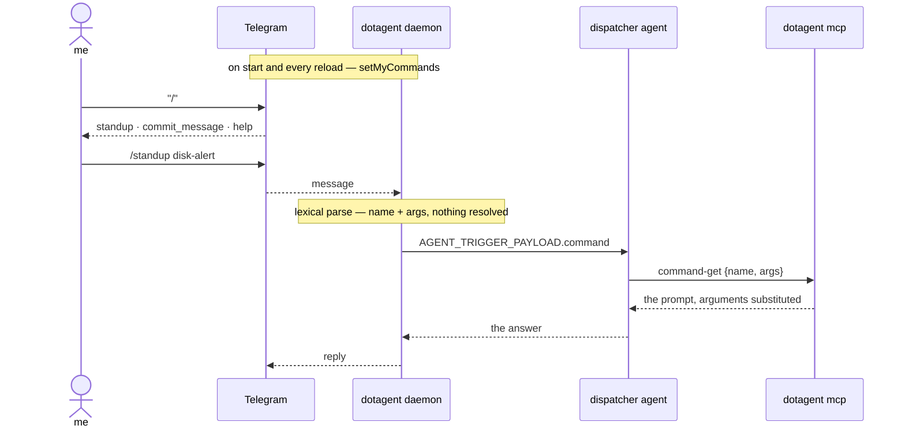

# Commands

> A skill is a procedure the model picks. A command is a procedure **you** pick.

Type `/` in Telegram and the client renders a menu of everything the assistant
can do. Pick one, it runs. No phrasing to remember, no model deciding what you
meant.

```
~/.config/dotagent/commands/
  standup.md
  commit-message.md
  git/status.md          → /git_status
```

Each file is one command, in [Claude Code slash command][cc] format:

```markdown
---
description: What ran overnight, in three lines
argument-hint: "[agent]"
---

Report what the orchestrator did while I was away.
Scope: $ARGUMENTS — if that is empty, every agent.
```

The name comes from the filename. `description` is required — it is the line
the menu shows, and a command nobody can identify is one nobody picks.

[cc]: https://docs.claude.com/en/docs/claude-code/slash-commands

## Why this exists next to skills

[Skills](skills.md) already load a procedure on demand. The difference is who
chooses.

| | Skill | Command |
|---|---|---|
| Chosen by | the model, matching a description | you, by name |
| Discovered through | `tools/list` | a Telegram menu |
| Costs | a model deciding | nothing |
| Wrong outcome | it loads the wrong procedure | there isn't one |

When you already know what you want, dispatch is pure overhead: latency, tokens,
and a chance of picking something else. Commands remove the decision because it
was already made.

Both read the same kind of markdown. A procedure worth having both ways can be
written twice; that is deliberate for now — see [Open edges](#open-edges).

## The shape



The daemon parses `/name args` and publishes the catalog. It never resolves a
command to its body — that is `command-get`, and it belongs to whoever is
dispatching. See [what the daemon does](#what-the-daemon-does-and-does-not).

## Arguments

`$ARGUMENTS` takes everything after the name. `$1`, `$2`, … take
whitespace-separated positions.

```markdown
Review $1 against $2.
```

`/review src/ main` → "Review src/ against main."

Substitution is textual and nothing reaches a shell. Two consequences worth
knowing before they surprise you:

**A body with no placeholder still gets the arguments.** They are appended
under an `Arguments:` header rather than dropped. Typing `/simplify src/foo.rs`
and having the path silently vanish would produce a confident answer to a
question you did not ask.

**`$5.00` loses its 5.** A `$` followed by digits is a position, always. The
alternative — treating `$N` as literal when position N was not supplied — makes
a body mean different things depending on what the caller typed, so `[$1][$2]`
with one argument would emit a literal `$2` that a model reads as an
instruction. Write `USD 5.00`.

## Two names, two collision rules

One command carries two derived names, and they are lossy in different ways:

| File | MCP | Telegram |
|---|---|---|
| `commit-message.md` | `command-commit-message` | `/commit_message` |
| `git/status.md` | `command-git-status` | `/git_status` |

Telegram allows `[a-z0-9_]{1,32}` — **no hyphens**. So `weekly-numbers` and
`weekly_numbers` are two distinct commands that both want `/weekly_numbers`.
The catalog is deduped twice; first discovered wins, and `dotagent doctor` names
the files so you know which to rename:

```
commands: 4 found
    ⚠ weekly-numbers (…/a/weekly-numbers.md), weekly_numbers (…/b/weekly_numbers.md)
      all want /weekly_numbers — only the first is in the menu
```

A name longer than 32 characters is **refused**, not truncated. A truncated
name produces a menu entry that resolves to nothing.

Typing either spelling works: `/commit-message` and `/commit_message` land on
the same file, because those are two spellings of one thing.

## Discovery

Searched in order, first match winning:

1. `[commands] paths` from `config.toml`
2. `$DOTAGENT_ROOT/commands`
3. `$DOTAGENT_HOME/commands/` ← typical
4. `~/.claude/commands/` and `$CWD/.claude/commands/` — **only** when
   `[commands] claude_commands = true`
5. `$CWD/commands/`

Subdirectories nest with `:` up to three levels. A broken file is skipped and
reported by `doctor` rather than emptying the catalog — a menu that silently
loses entries reads as "that command was removed" rather than "that command is
broken".

### Why `~/.claude/commands` is off by default

This is the one place commands differ from skills, where the equivalent switch
defaults to on.

A skill costs a line in a list until a model judges it relevant. A command is
*published as a menu*. And a Claude Code command catalog is typically full of
things that assume a shell and a working directory — `/apply` switching a Nix
profile, `/check` running a test suite, `/dx` opening a terminal layout. An
assistant reached over chat has none of that, so importing them wholesale fills
the menu with entries that cannot work.

Turn it on when the catalog was written for an assistant:

```toml
[commands]
claude_commands = true
```

## What the daemon does, and does not

[Telegram](telegram.md) says plainly: *dotagent itself interprets nothing.*
Commands are the first feature that pushes on that, so the line is drawn
explicitly.

The daemon **does**:

- **Parse lexically.** `/name@bot args` is Telegram wire syntax, the same class
  of thing as reading `update_id`. The result goes into the payload as-is.
- **Publish the catalog** via `setMyCommands` on start and every reload.
  Reading a directory to list what is installed is what discovery already does
  for manifests.
- **Answer about the catalog** — `/help`, and "no command named /typo". Both are
  questions about *what exists*, which is the daemon's own knowledge. Letting
  `/typo` fall through would mean a model improvising an answer to something
  meant to be exact.

The daemon **never** resolves a command to its body, substitutes an argument, or
decides what a command means. That is `command-get`.

Writing your own `help.md` replaces the built-in — an explicit choice beats a
default.

## The payload

An invoked command arrives beside the text, never instead of it:

```json
{
  "text": "/standup disk-alert",
  "chat_id": 123, "user_id": 456, "message_id": 7,
  "reply_to_text": null,
  "command": { "name": "standup", "args": "disk-alert" }
}
```

`command` is `null` for ordinary prose. `name` is the **catalog** name, already
resolved from whatever spelling was typed, so a dispatcher passes it straight to
`command-get` without parsing anything.

A dispatcher that is a `case` statement needs no model at all:

```bash
case "$(jq -r '.command.name // empty' <<<"$AGENT_TRIGGER_PAYLOAD")" in
  standup) exec ./bin/standup ;;
  "")      exec ./bin/ask-a-model ;;
esac
```

## MCP tools

Two tools for the whole catalog — **not** one per command:

| Tool | Arguments | Behavior |
|---|---|---|
| `command-get` | `name`, `args` | Resolve an invoked command into the prompt to follow. |
| `command-list` | — | Every installed command, with what it does and takes. |

This deliberately breaks the pattern skills follow, where each skill is its own
tool. There, the catalog is a menu the model picks from. Here the choice was
already made by a human before the model saw anything — publishing N command
tools would re-open it, letting a model call `command-standup` when the sender
typed `/simplify`. That is precisely what commands exist to make impossible.

`command-get` returns the prompt with arguments substituted. It does not perform
it.

## `allowed-tools` is a hint

The frontmatter field is parsed and passed along, labeled:

```
The command suggests these tools: dotagent-status, dotagent-logs
(A hint from its author, not a restriction dotagent enforces.)
```

dotagent does not own the dispatcher, so it cannot constrain what that
dispatcher's model may call. A dispatcher that *does* control its own harness
can act on the field. Presenting it as a guarantee would be worse than not
having it.

## Configuration

```toml
[commands]
enabled = true            # default
claude_commands = false   # default; see above
paths = []                # extra roots, searched first
```

Nothing is required. An empty catalog costs nothing: no menu is registered and
no tools are listed.

## Security

Installing a command grants **no execution**. A command is a prompt; the only
thing it can do is what the dispatcher's tools already allow. That is the whole
difference from a skill's `scripts/`.

What it does grant is influence over what a model is told to do, so the
directory deserves the same care as any other input the assistant trusts. See
the [threat model](../security/threat-model.md#commands).

The menu is registered per allowlisted chat rather than globally. The allowlist
already gates execution, so a global menu would not be an authorization hole —
but it would publish every command name and description to anyone who finds the
bot.

`dotagent audit` records `command_dispatched` with the **name only**. Arguments
are content, the same reason a message body is never recorded.

## Open edges

- **A command and a skill over one body** currently means two files. Whether
  they merge into one directory with two doors is worth deciding once both have
  been used enough for the overlap to be visible rather than hypothetical.
- **`/cmd@otherbot` in a group chat** is treated as an invocation. dotagent's
  allowlist is per-user, so the 1:1 DM is the case that matters; a group with
  two bots would need the bot's own username to disambiguate.

## See also

- [Skills](skills.md) — the same markdown, chosen by the model
- [Telegram](telegram.md) — the ingress that publishes the menu
- [MCP server](../reference/mcp.md) — `command-get` and `command-list`
- [Config reference](../guides/config-reference.md#commands)
