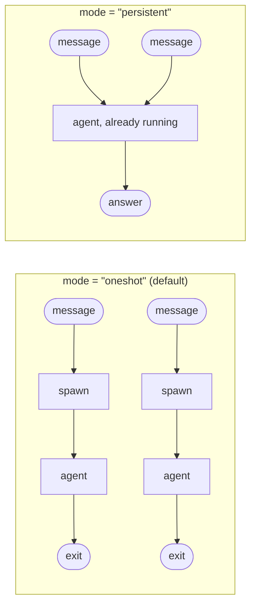

# Lifecycle

> How long one agent process lives.

Every agent is a one-shot subprocess. dotagent spawns it, it reads its
environment, writes stdout, exits, and the exit code is the verdict. That is
the whole execution model, and for a cron agent it is exactly right.

For an agent that holds something, it is exactly wrong.



## When it is worth it

Measured on a real Telegram bot, answering the same trivial message:

| | 1st answer | 2nd answer |
|---|---|---|
| one process per message | 3.91s | 4.94s |
| one process kept alive | 3.46s | **1.90s** |

Every message after the first is a second message. The gap is wider in
practice, because a process that died also has to reload whatever it was
holding before it can answer — for a chat assistant, that is the conversation.

Three shapes benefit:

- **A dispatcher with conversation history.** The expensive part is not the
  spawn, it is rebuilding the transcript.
- **An agent with a warm cache.** A model loaded, an index built, a connection
  negotiated.
- **A watcher with an open connection.** A socket that should not be
  renegotiated per event.

Everything else should stay `oneshot`. A process that lives is a process that
can leak, drift, and hold stale state — costs a cron agent has no reason to
pay.

## Turning it on

```toml
[agent]
name = "telegram-assistant"
# In persistent mode this is the deadline for ONE request, not the lifetime
# of the process.
timeout_seconds = 600

[run]
command = "bash"
args = ["./agent.sh"]

[lifecycle]
mode = "persistent"
key = "chat_id"
idle_timeout_seconds = 1800
max_invocations = 120
max_instances = 8
startup_timeout_seconds = 30
```

`[lifecycle]` absent means `oneshot`, and `oneshot` is the default forever. No
existing agent changes behavior.

The agent itself changes: instead of running once and exiting, it reads
requests and writes answers on a loop. That contract is
[the persistent protocol](../reference/persistent-protocol.md), and
[`examples/hello-persistent`](https://github.com/avelino/dotagent/tree/main/examples/hello-persistent)
implements the whole thing in about twenty lines of bash.

## One process per what

`key` names a field of the trigger payload. Each distinct value gets its own
process.

```toml
key = "chat_id"      # one process per conversation
```

Without it there is one instance for the whole agent — right for a warm cache,
wrong for anything holding per-sender context. A dispatcher with no key puts
every conversation into one process, and whatever it remembers from one person
is there for the next. `dotagent doctor` warns when the Telegram dispatcher is
persistent with no key, because nothing about that setup looks broken until
two people use the bot.

The value is a **selector over the payload the daemon already attested**, never
something a sender can point anywhere. Whatever is in the field is reduced to
`[A-Za-z0-9_-]` before it reaches a process label; anything else becomes a
stable digest of itself. Two different values never collapse into one process.

`max_instances` caps how many live at once. Past the ceiling, the least
recently used one is terminated to make room — its next message spawns a fresh
process, which for a chat means it forgot the conversation.

## When an instance goes away

| Reason | Trigger |
|---|---|
| `idle` | Nothing asked it anything for `idle_timeout_seconds`. |
| `max_invocations` | It answered its quota. A process holding a conversation degrades as that conversation grows; this is the ceiling that stops it. |
| `timeout` | One request outlived `[agent] timeout_seconds`. |
| `crashed` | It exited on its own. |
| `evicted` | `max_instances` needed the room. |
| `config_changed` | `dotagent reload` — a live process still carries the old manifest. |
| `shutdown` | The daemon is stopping. |

Each one writes `persistent_agent_recycled` to the audit log with the reason
and how many requests it answered. `crashed` and `timeout` are `Critical`; the
rest are routine.

**A crash is not a lost message.** The next request finds the dead process,
discards it, and spawns a replacement — and if the process dies in the narrow
window between "we set the deadline" and "we wrote the request", the request is
retried once against a fresh instance. Twice in a row is a real failure and is
reported as one.

## What the daemon owes it

Nothing here is new machinery. A persistent instance is spawned through the
same supervisor as every other subprocess, which is the entire argument for
this living in the orchestrator rather than beside it:

- **Supervision.** Real process groups, real kill-tree. A deadline reaches
  grandchildren.
- **Visibility.** It shows up in `dotagent status` under `persistent`, and its
  spawn and recycle land in the audit log.
- **Reaping.** A graceful daemon shutdown retires it through the pool, then
  the supervisor kill-trees whatever is left. A daemon that dies *without*
  running that path — `SIGKILL`, a panic, `launchctl kickstart -k` — does
  orphan its instances: nobody is holding their deadline anymore. Those are
  collected on the next boot, before the daemon starts anything of its own.
  See [Boot orphan reap](../guides/daemon-lifecycle.md#boot-orphan-reap).
- **One instance per key.** The pool lives inside the daemon, so there is no
  second one to race it. This replaces the `flock` an external pool would need.

The idle timeout is not a timer of its own. The supervisor's reaper already
kills anything past its deadline, so the pool simply re-points that clock:
the request deadline while an answer is in flight, the idle window while it is
not. One clock, one kill path, no second implementation to get wrong.

## Trigger gateway concurrency

The trigger gateway is separate from the persistent-process pool. It owns one
FIFO worker per `(source, session_id/reply_to/default)` conversation, so a
second request for the same conversation queues rather than interleaving with
the first. Different conversations can run concurrently up to four live
gateway workers by default.

The local Unix-socket API and Telegram ingress use this gateway. A local client
also has a 64-job per-conversation queue and a 30-request-per-minute local
admission limit. Telegram keeps its allowlist and its own configured rate
limit before submission. New conversations over the gateway cap and full
conversation queues are rejected; they do not block unrelated conversations.

This is independent of `[lifecycle]`:

- In `oneshot` mode, each admitted message still spawns one supervised agent
  process.
- In `persistent` mode, the pool reuses a process, while the gateway still
  owns trigger ordering and admission.

What persistence removes is the startup cost, not the gateway's ordering or
capacity policy. See [Triggers](triggers.md#serialization) for the shared
state boundaries.

`dotagent reload` retires persistent instances so the next request re-reads the
manifest. Telegram ingress is restarted against the new configuration. The
local API listener intentionally stays on the same socket and keeps one owner
until daemon restart; a changed `dispatcher_agent` therefore does not replace
the local handler during reload.

## Outside the daemon

`dotagent run`, `dotagent run-now`, `dotagent tick` and MCP tool calls all live
in short-lived processes. A persistent agent still speaks its protocol there —
each command builds a pool that lasts exactly as long as the call and tears it
down after. Running it one-shot instead would hand it a closed stdin, which
every correct implementation reads as "shut down", so the agent would exit
without answering.

The startup cost is paid and thrown away, which is the point: a one-off
invocation should behave like one, and `dotagent run` should exercise the real
path rather than a fiction.

## See also

- [Persistent protocol](../reference/persistent-protocol.md) — the wire format
- [Agent spec](../reference/agent-spec.md#lifecycle--how-long-one-process-lives) — every field
- [Triggers](triggers.md) — what causes a run
- [Local Client API](../reference/local-api.md) — Unix-socket streaming transport
- [Architecture](architecture.md) — where the pool sits
- [Threat model](../security/threat-model.md) — state shared between senders
