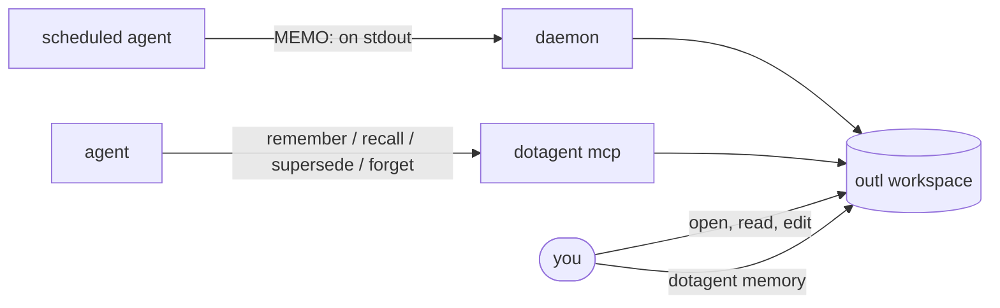
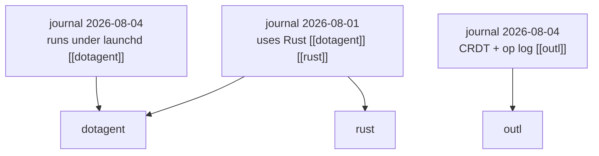

# Memory

> Facts that outlive the conversation, in a workspace you can open and edit.

An agent that talks to you needs two kinds of recall, and they are not the same thing.

**Conversation history** is what was just said. It makes "yes" resolve to the thing that was proposed a minute ago. That lives in whatever the agent uses to hold a session, and it is the agent's business.

**Memory** is what stays true next week: a preference, a decision, a correction. That is what this page is about.



## It is a graph, not a list

A fact is stored once, in the journal for the day it was learned, and tagged with topics. Each topic is a `[[link]]` to a page, and outl resolves the backlinks — so the topic page gathers every fact that mentioned it, from whichever day.



Ask for the day and you get what happened. Ask for `dotagent` and you get everything known about it, gathered across months. One copy, two ways in.

Topics are normalized before they become slugs: `Roam Research`, `roam research` and `  Roam   Research  ` all land on `roam-research`. Without that, capitalization alone would split a subject into disconnected pages and each half would look incomplete. A `/` survives, because hierarchy is a real thing in outl — `ops/cost-report` is a page path.

**Reuse topics.** The value is in the gathering, and gathering only works if the same subject keeps the same name. `memory-topics` exists so an agent can check before inventing one — and an agent running under the `[assistant]` harness does not have to ask: the topics already in use are appended to the memory block it receives, so the vocabulary is in front of it while it writes.

## Where it lives

An [outl](https://github.com/avelino/outl) workspace at `~/.config/dotagent/outl`, scaffolded the first time the daemon starts. Nothing to configure.

That choice is the point: memory is a normal outl workspace, not an opaque store. Open it in the desktop app, read what an agent decided to keep, fix a memory that is wrong, delete a page. One block per fact, in the journal for the day it was learned.

```
~/.config/dotagent/outl/
├── journals/2026-08-04.md      ← the facts, one block each
├── journals/2026-08-04.outl    ← block identity sidecar
├── pages/dotagent.md           ← a topic; backlinks gather here
└── ops/                        ← the op log, source of truth
```

A journal reads as an ordinary outline — the fact on the bullet, its
bookkeeping indented under it as properties:

```markdown
- o dotagent roda no launchd [[dotagent]]
  agent:: telegram-assistant
  seen:: 1
  source:: telegram
```

Point it somewhere else — including at the workspace holding your own notes — with `[memory] workspace` in `config.toml`. See the [config reference](../guides/config-reference.md#memory).

## The tools

`dotagent mcp` exposes five, alongside the agent catalog. The same verbs are available from a shell as [`dotagent memory`](../reference/cli.md#memory), which is what lets a consolidation pass be an ordinary scheduled agent instead of logic buried in the daemon.

| Tool | Arguments | Behavior |
|---|---|---|
| `memory-remember` | `text`, `topics[]` | Store one fact in today's journal, linked to each topic. Topic pages are created if absent. Restating a fact reinforces the one already there. |
| `memory-recall` | `query` **or** `topic` | With `query`, ranks facts by relevance. With `topic`, returns every fact linked to it via backlinks. |
| `memory-topics` | — | Lists the subjects that exist. |
| `memory-supersede` | `id`, `text`, `topics[]` | Replace a fact that stopped being true. |
| `memory-forget` | `id` | Delete a fact outright. |

Recall results lead with the fact's id, and that id is what `supersede` and `forget` take — an agent that recalls something wrong can fix it in the next call instead of asking which one.

### Ranking is lexical, not semantic

A fact competes only if it shares a real word with the question. Among those, recency and repetition break the tie:

```text
score = 3.0 × (fraction of query terms matched, topics counting extra)
      + recency  (decays to ~37% over two months)
      + 0.4 × ln(times the fact was stated)
```

Words split on punctuation, so `databricks-cost-daily` is findable as "databricks"; stopwords and two-letter tokens are dropped, because matching on "de" or "the" makes every fact a hit and flattens the ranking back into pure recency.

Query and fact are normalized the same way before they meet: accents fold and a trailing plural `s` comes off. Portuguese gets typed both ways and a topic slug is whatever the agent coined, so a question about "pendência" has to find a fact tagged `pendencias`. Irregular plurals are left alone — a stemmer that guesses is how "reunião" starts matching "reunir".

No vectors, on purpose. outl stores text, and an assistant states recall results as fact — a near-miss surfaced confidently is worse than a miss. So a question about kubernetes, in a store that knows nothing about kubernetes, returns nothing rather than the closest thing.

Recall by topic is still the better question when it applies: it asks the graph rather than guessing which words the fact happened to use.

## What keeps it from rotting

A store that only ever appends degrades into noise, and recall from noise is worse than no recall.

**Restating a fact reinforces it.** "prefere reunião depois das 14h" said twice is one fact with `seen:: 2`, not two blocks. Repetition becomes a ranking signal instead of a duplicate that crowds out everything else. Any topic the restatement names is merged into the fact already stored.

**A fact that changed is superseded, not contradicted.** When "prefere reunião de manhã" becomes "prefere depois das 14h", the old block is marked `superseded-by::` and stops coming back from recall. It stays readable in the journal for the day it was true — the history of a changed preference is worth keeping — but the assistant is never picking between two answers.

**Every fact records where it came from.** A memory store you cannot audit is one you stop trusting: when an assistant states something wrong, the first question is which run put it there.

```text
- prefere reunião depois das 14h [[agenda]] [[reuniao]]
  agent:: telegram-assistant
  last-seen:: 2026-08-21
  seen:: 2
  session:: 8f2a
  source:: telegram
```

Those are outl block properties, not text dotagent invented: the desktop app shows them as properties, they round-trip through the `.md` projection, and the fact itself stays one readable sentence. They are also never children of the block — a child block is another fact, and recall would hand back `agent:: telegram-assistant` as something the assistant knows.

## What belongs in it

Whatever an agent writes here it will read back months later, with none of the surrounding context. That shapes what is worth keeping.

Worth remembering: a stated preference, a decision and its reason, a correction of something the agent got wrong, a name it will need again. Always with topics — a fact stored without them is a fact that will only be found by accident.

Not worth remembering: anything already in the current conversation, anything the agent can look up on demand (calendar, metrics, repository state), and small talk. **A memory store full of noise is worse than an empty one** — recall starts returning the wrong thing, and the agent starts answering from it.

This is guidance for whoever writes the agent's prompt. dotagent stores what it is given; it does not judge.

## Who writes to it

Three doors, all landing in the same workspace:

| Writer | How | Provenance recorded |
|---|---|---|
| A conversational agent | `MEMO:` lines in its reply, captured by the `[assistant]` harness | agent, source, session |
| The same agent, when it forgets | `[assistant.extractor]` — a command the daemon runs over the turn after the reply goes out | agent, source, session |
| An ordinary agent, when it forgets | `[memory.extractor]` — a command the daemon runs after a successful scheduled run | agent, `source:: schedule` |
| Any other agent | `MEMO:` lines on stdout, when its manifest declares `[memory]` | agent, `source:: schedule` |
| Anything holding the tools | `memory-remember` over MCP, or `dotagent memory remember` | agent |

Dates in a fact are linked on the way in. `TODO até 2026-08-24: abrir a
issue` is stored as `TODO até [[2026-08-24]]: abrir a issue`, so the day's
journal backlinks to the pendency and asking "what is due Monday" is a
backlink walk rather than a text search. Only ISO dates, because that is the
slug a daily page carries; a date already in brackets is left alone, so
re-rendering a fact never nests them. The link is added by the store, not
asked of a model — a rule that depends on whichever model wrote the fact
remembering the syntax is not a rule.

A linked day is a link, never a topic page: the journal for that date already
exists, and creating a `pages/2026-08-24.md` beside it would leave two pages
answering to one name with the backlink landing on the empty one.

The second door is what keeps the first from being a single point of failure.
`MEMO:` capture works only when the dispatcher's prompt asks for it *and* the
model complies, and neither is something the daemon controls: a model that
finishes a conversation without emitting a line leaves no error behind, just a
journal that did not grow. Declaring an
[`[assistant.extractor]`](../reference/agent-spec.md#assistantextractor--capturing-what-the-model-did-not-volunteer)
moves the decision to a command the operator names, run by the daemon after
every turn. The model's own lines remain a shortcut worth taking; they stop
being the only way in.

The third door is the one that makes the store grow on its own: a scheduled agent that learns something durable prints `MEMO: <fact> | topics: a, b` and the daemon files it. Opt-in per manifest, and only on a successful run — see [`[memory]` in the agent spec](../reference/agent-spec.md#memory--memory-capture-for-a-plain-agent-opt-in).

An ordinary scheduled agent can configure `[memory.extractor]` when it does
not control its output format. The daemon passes the successful run output as
JSON to the configured command, parses returned `MEMO:` lines, merges them
with explicit stdout memos, and adds the manifest's topics. Extractor errors
are best-effort and do not turn a successful run into a failure. An agent with
`[assistant] memory = true` is excluded from this path because the assistant
harness owns its memory capture.

Opt-in rather than automatic because most agents print status, not knowledge. A store that absorbs status is a store whose recall returns status, and then the assistant answers from it.

## Transcripts are somewhere else

Memory is curated: an agent decides a fact is durable and stores it. It is not a log of what happened.

For "what did the bot do today", read the agent's output:

```bash
dotagent logs telegram-assistant -n 100
```

Keeping the two apart is deliberate. A transcript in the same journal would make `memory-recall` compete with chatter — a search for "meeting" would return every time the word came up in conversation instead of the one preference that matters.

## The embedder contract

`dotagent-memory` embeds `outl-ws` and `outl-actions` rather than shelling out. Three things follow from outl's [embedding contract](https://github.com/avelino/outl/blob/main/docs/embedding.md), and getting them wrong corrupts a workspace:

**Mutate through actions, then project.** Every write goes through `outl-actions` and is projected back to `.md`. Skip the projection and the op log holds the fact while the file on disk does not.

**Never edit the `.md` directly.** The op log is the source of truth; the markdown is a projection of it.

**Each call opens and drops the workspace.** `dotagent mcp` is short-lived, and holding the lock across a session would block the desktop app. Getting an ephemeral actor because something else owns the config actor is the normal case, not an error.

## Turning it off

```toml
# config.toml
[memory]
enabled = false
```

The tools disappear from `tools/list` and the workspace is left alone. `dotagent doctor` reports where memory lives, or that it is off.

> **Two sections named `[memory]`.** This one, in `config.toml`, says where the workspace lives and whether memory exists at all. The one in an `agent.toml` says whether *that agent* writes to it. Different files, different questions.

## See also

- [MCP server](../reference/mcp.md) — how the tools are exposed
- [`dotagent memory`](../reference/cli.md#memory) — the same verbs from a shell
- [Agent spec](../reference/agent-spec.md#memory--memory-capture-for-a-plain-agent-opt-in) — `[memory]` capture for a plain agent
- [Config reference](../guides/config-reference.md#memory)
- [Triggers](triggers.md) — the other half of a conversational agent
