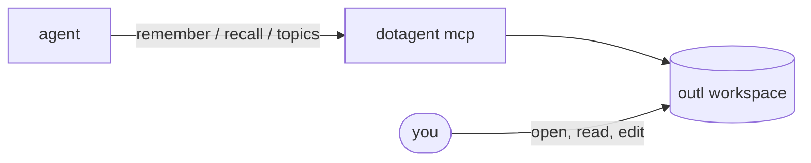
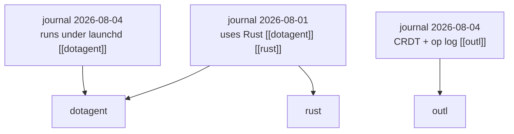

# Memory

> Facts that outlive the conversation, in a workspace you can open and edit.

An agent that talks to you needs two kinds of recall, and they are not the same thing.

**Conversation history** is what was just said. It makes "yes" resolve to the thing that was proposed a minute ago. That lives in whatever the agent uses to hold a session, and it is the agent's business.

**Memory** is what stays true next week: a preference, a decision, a correction. That is what this page is about.



## It is a graph, not a list

A fact is stored once, in the journal for the day it was learned, and tagged with topics. Each topic is a `[[link]]` to a page, and outl resolves the backlinks — so the topic page gathers every fact that mentioned it, from whichever day.



Ask for the day and you get what happened. Ask for `dotagent` and you get everything known about it, gathered across months. One copy, two ways in.

Topics are normalized before they become slugs: `Roam Research`, `roam research` and `  Roam   Research  ` all land on `roam-research`. Without that, capitalization alone would split a subject into disconnected pages and each half would look incomplete. A `/` survives, because hierarchy is a real thing in outl — `ops/cost-report` is a page path.

**Reuse topics.** The value is in the gathering, and gathering only works if the same subject keeps the same name. `memory-topics` exists so an agent can check before inventing one.

## Where it lives

An [outl](https://github.com/avelino/outl) workspace at `~/.config/dotagent/outl`, scaffolded the first time the daemon starts. Nothing to configure.

That choice is the point: memory is a normal outl workspace, not an opaque store. Open it in the desktop app, read what an agent decided to keep, fix a memory that is wrong, delete a page. One block per fact, in the journal for the day it was learned.

```
~/.config/dotagent/outl/
├── journals/2026-08-04.md      ← the facts, one block each
├── journals/2026-08-04.outl    ← block identity sidecar
├── pages/dotagent.md           ← a topic; backlinks gather here
└── ops/                        ← the op log, source of truth
```

Point it somewhere else — including at the workspace holding your own notes — with `[memory] workspace` in `config.toml`. See the [config reference](../guides/config-reference.md#memory).

## The tools

`dotagent mcp` exposes three, alongside the agent catalog:

| Tool | Arguments | Behavior |
|---|---|---|
| `memory-remember` | `text`, `topics[]` | Append one fact to today's journal, linked to each topic. Topic pages are created if absent. |
| `memory-recall` | `query` **or** `topic` | With `topic`, returns every fact linked to it via backlinks. With `query`, searches text. |
| `memory-topics` | — | Lists the subjects that exist. |

Text recall is **substring, not semantic**. outl stores text, not vectors. A fuzzy match that returns a near-miss is worse than no match at all, because an assistant states recall results as fact — a confidently wrong memory is the failure mode worth avoiding.

Recall by topic is the better question when it applies: it asks the graph rather than guessing which words the fact happened to use.

## What belongs in it

Whatever an agent writes here it will read back months later, with none of the surrounding context. That shapes what is worth keeping.

Worth remembering: a stated preference, a decision and its reason, a correction of something the agent got wrong, a name it will need again. Always with topics — a fact stored without them is a fact that will only be found by accident.

Not worth remembering: anything already in the current conversation, anything the agent can look up on demand (calendar, metrics, repository state), and small talk. **A memory store full of noise is worse than an empty one** — recall starts returning the wrong thing, and the agent starts answering from it.

This is guidance for whoever writes the agent's prompt. dotagent stores what it is given; it does not judge.

## Transcripts are somewhere else

Memory is curated: an agent decides a fact is durable and stores it. It is not a log of what happened.

For "what did the bot do today", read the agent's output:

```bash
dotagent logs telegram-assistant -n 100
```

Keeping the two apart is deliberate. A transcript in the same journal would make `memory-recall` compete with chatter — a search for "meeting" would return every time the word came up in conversation instead of the one preference that matters.

## The embedder contract

`dotagent-memory` embeds `outl-ws` and `outl-actions` rather than shelling out. Three things follow from outl's [embedding contract](https://github.com/avelino/outl/blob/main/docs/embedding.md), and getting them wrong corrupts a workspace:

**Mutate through actions, then project.** Every write goes through `outl-actions` and is projected back to `.md`. Skip the projection and the op log holds the fact while the file on disk does not.

**Never edit the `.md` directly.** The op log is the source of truth; the markdown is a projection of it.

**Each call opens and drops the workspace.** `dotagent mcp` is short-lived, and holding the lock across a session would block the desktop app. Getting an ephemeral actor because something else owns the config actor is the normal case, not an error.

## Turning it off

```toml
[memory]
enabled = false
```

The tools disappear from `tools/list` and the workspace is left alone. `dotagent doctor` reports where memory lives, or that it is off.

## See also

- [MCP server](../reference/mcp.md) — how the tools are exposed
- [Config reference](../guides/config-reference.md#memory)
- [Triggers](triggers.md) — the other half of a conversational agent
