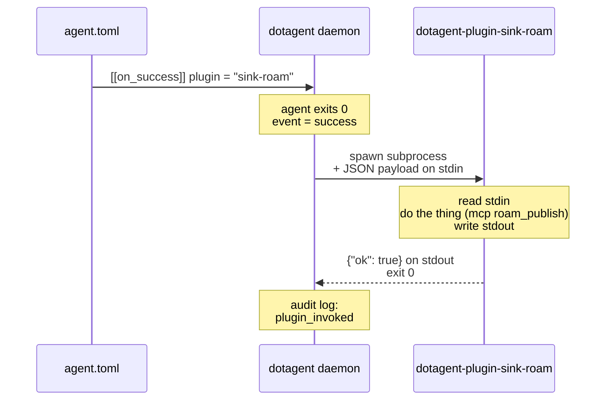

# Plugins

> Plugins are how dotagent talks to the outside world for **preflight
> checks**, **output sinks**, and **third-party notifiers**. Anything that
> isn't *scheduling the agent* and isn't a built-in notifier lives in a
> plugin.

> **Looking for notifications?** The five common notifiers (`desktop`,
> `imessage`, `slack`, `ntfy`, `pushover`) are now **built into the
> daemon** — they are not plugins. See
> [`notifications.md`](notifications.md) for the `[[notifiers]]` shape.
> The plugin protocol below is still how you wire a *custom* notifier
> (Discord, Teams, etc.) via `driver = "plugin"`.

This guide covers:

1. [What is a plugin](#what-is-a-plugin)
2. [Using a plugin](#using-a-plugin) — declaring, configuring, debugging
3. [Built-in plugins](#built-in-plugins) — first-party preflights and sinks
4. [Creating a plugin](#creating-a-plugin) — protocol, languages, examples
5. [Publishing a plugin](#publishing-a-plugin) — distribution, signing, brew
6. [Best practices](#best-practices) — single-purpose, secrets, idempotency
7. [Debugging](#debugging) — stderr, `dotagent plugin invoke`, audit log

For the formal protocol spec (verbs, payload shapes, exit codes) see
[`plugin-protocol.md`](../reference/plugin-protocol.md).

---

## What is a plugin

A **dotagent plugin** is a separate binary that follows a tiny CLI
protocol over JSON stdio. dotagent invokes it as a subprocess at specific
lifecycle moments and acts on what comes back.



### Why subprocess + JSON instead of an SDK / dylib / WASM

- **Any language.** Rust, Go, Python, Bash, Node — if it can read stdin and
  write JSON to stdout, it can be a plugin.
- **Crash isolation.** A panicking plugin doesn't take down the daemon.
- **Independent versioning.** Plugins ship and update on their own cadence.
- **No ABI.** No `cdylib`, no `extern "C"`, no symbol versioning headaches.

Trade-off: every invocation pays `fork+exec` (~5–10ms). Plugins fire on
discrete events (notification, preflight, sink-on-success), not in hot
loops, so the cost is invisible.

### Three kinds of plugins

| Kind        | When dotagent invokes it                                   | Decides what?                           |
|-------------|------------------------------------------------------------|-----------------------------------------|
| `preflight` | BEFORE spawning the agent                                  | Can the agent run? (`ok=true` = proceed) |
| `notify`    | On failure events (`attempt_failed`, `given_up`, `recovered`) | Sends a human-facing message            |
| `sink`      | On successful run                                          | Persists the agent's output             |

A plugin can declare multiple `kinds` in its `info` response if it makes
sense — but most plugins are single-kind for clarity.

### What a plugin is NOT

- **Not a place for agent business logic.** Your agent already does that.
- **Not a way to schedule other work.** Scheduling lives in `agent.toml`.
- **Not a service.** No long-running process, no IPC, no daemon-to-daemon.
  Each invocation is a one-shot.

---

## Using a plugin

### 1. Declare it in your `agent.toml`

```toml
[agent]
name = "my-agent"

[run]
command = "fish"
args = ["./agent.fish"]

[[schedules]]
id = "daily"
type = "cron"
weekdays = [1, 2, 3, 4, 5]
hours = [8]
minute = 30

# Preflight: abort the run if Cloudflare WARP isn't connected.
[[preflight]]
plugin = "preflight-warp"
config = { connect_command = "warp-cli connect" }

# On success: persist the output to Roam.
[[on_success]]
plugin = "sink-roam"
config = { page = "today", marker_regex = "#DORA.*2026-05-19" }

# Notifications are built-in — declare them via [[notifiers]], not [[on_failure]].
# See docs/concepts/notifications.md.
[[notifiers]]
driver = "imessage"
to     = "+5511999999999"
rate_limit_minutes = 60
events = ["given_up"]
```

**Top-level keys**:

- `plugin` — the short name. dotagent resolves it to a binary called
  `dotagent-plugin-<name>` (see [Discovery](#discovery-order) below).
- `config` — opaque JSON forwarded to the plugin's `invoke` verb. The
  plugin's `info` response describes the schema.
- `events` (optional, only on `on_success` / `on_failure`) — restrict
  firing to specific events. Empty / omitted = all events. Valid values:
  `attempt_failed`, `given_up`, `recovered`, `timed_out`, `preflight`,
  `success`, `daily_summary`.

### 2. Validate at install time

```bash
dotagent doctor
```

This iterates every manifest and:

- Resolves every plugin reference to a binary path.
- Calls `info` to confirm the plugin actually responds.
- Reports `✗ plugin <name> not found` if discovery failed.

### 3. List discovered plugins

```bash
dotagent plugin list
```

Outputs a table of every plugin referenced by any manifest, with its
version, kinds, and resolved path.

### 4. Invoke manually (debug)

When a plugin misbehaves and you want to see exactly what's happening:

```bash
echo '{
  "kind": "sink",
  "agent": "test",
  "schedule": "test",
  "event": "success",
  "message": "hello world",
  "config": { "page": "today", "marker_regex": "#test" }
}' | dotagent-plugin-sink-roam invoke
```

Stdout = the JSON response. Stderr = the plugin's human-readable log.

### Discovery order

When you write `plugin = "sink-roam"` in a manifest, dotagent looks
for a binary called `dotagent-plugin-sink-roam` in this order:

1. Every directory in `$DOTAGENT_PLUGIN_PATH` (colon-separated)
2. `~/.config/dotagent/plugins/`
3. `/usr/local/lib/dotagent/plugins/`
4. Every directory in `$PATH`

First match wins. The Homebrew formula drops every first-party plugin
into the same `bin/` as `dotagent`, which means `$PATH` resolution covers
the default install with zero config.

To verify which binary will be used:

```bash
dotagent plugin list
# output: sink-roam  0.0.1  sink  /opt/homebrew/bin/dotagent-plugin-sink-roam
```

### The `events` filter

`on_success` / `on_failure` entries can filter on event name. Events
dotagent emits:

| Event             | When                                                                |
|-------------------|---------------------------------------------------------------------|
| `success`         | agent exit code 0                                                   |
| `attempt_failed`  | agent exit ≠ 0 but more retries available                           |
| `timed_out`       | agent killed for exceeding `timeout_seconds`                        |
| `given_up`        | retries exhausted (`max_retries` reached)                           |
| `recovered`       | success on a window that had ≥1 previous failed attempt             |
| `preflight`       | preflight plugin returned `ok=false` and the run was aborted        |
| `daily_summary`   | the daemon's internal 22:45 health summary (or `dotagent daily-summary`) |

**Example — only fire a sink for daily summaries** (not on every run):

```toml
[[on_success]]
plugin = "sink-file"
config = { path = "/tmp/dotagent/daily-summary.md", mode = "overwrite" }
events = ["daily_summary"]
```

**Example — fire a sink on every successful run** (no filter):

```toml
[[on_success]]
plugin = "sink-roam"
config = { page = "today", marker_regex = "#daily" }
# `events` omitted → fires on every success
```

> Notifications follow the same event semantics but are configured
> under `[[notifiers]]` — see [`notifications.md`](notifications.md).

---

## Built-in plugins

These ship with the Homebrew install and live under
[`plugins/`](../plugins/) in this repo.

| Plugin                         | Kind        | Purpose                                                       |
|--------------------------------|-------------|---------------------------------------------------------------|
| `preflight-warp`               | preflight   | Checks `warp-cli status` reports "Connected".                 |
| `preflight-cmd`                | preflight   | Generic: runs an arbitrary command, checks exit code + stdout.|
| `sink-roam`                    | sink        | Publishes hierarchical content to Roam Research via `mcp` CLI.|
| `sink-file`                    | sink        | Writes the message to a file (overwrite or append).           |

> Notifications (`desktop`, `imessage`, `slack`, `ntfy`, `pushover`) are
> **not** plugins anymore — they ship as in-process drivers inside the
> daemon. See [`notifications.md`](notifications.md).

For per-plugin details (config schema, examples, troubleshooting) see
**[`docs/plugins/`](../plugins/README.md)**.

### Quick config reference

```toml
# preflight-warp
config = { connect_command = "warp-cli connect" }

# preflight-cmd
config = { command = "gh", args = ["auth", "status"], expect_exit = 0 }

# sink-roam
config = { page = "today", marker_regex = "#DORA.*2026-05-19" }

# sink-file
config = { path = "/Users/me/reports/today.md", mode = "overwrite" }
```

Run `dotagent-plugin-<name> info | jq .schema` for the full JSON schema
of each plugin's `config`.

---

## Creating a plugin

The full protocol spec is in
[`plugin-protocol.md`](../reference/plugin-protocol.md). This section is the friendly
quickstart.

### Anatomy of a plugin

A plugin is **any executable** named `dotagent-plugin-<kind>-<name>`
(e.g., `dotagent-plugin-notify-discord`) that accepts one of three verbs
as its first positional argument:

```
dotagent-plugin-<name> info        # describe yourself
dotagent-plugin-<name> validate    # check the config (stdin JSON)
dotagent-plugin-<name> invoke      # do the thing (stdin JSON)
```

### `info` — no stdin, prints metadata

```jsonc
{
  "name": "notify-discord",
  "version": "0.1.0",
  "kinds": ["notify"],          // "notify" | "preflight" | "sink"
  "platforms": ["darwin", "linux"],
  "schema": {                   // JSON Schema for `config`
    "type": "object",
    "required": ["webhook_url"],
    "properties": {
      "webhook_url": { "type": "string" },
      "username":    { "type": "string" }
    }
  }
}
```

### `validate` — stdin is the `config` object

```jsonc
// stdin
{ "webhook_url": "https://discord.com/api/webhooks/..." }

// stdout
{ "ok": true }

// or on failure
{ "ok": false, "error": "webhook_url must start with https://" }
```

dotagent calls `validate` when loading manifests. It's how `dotagent doctor`
catches typos before runtime.

### `invoke` — stdin is the full payload

```jsonc
// stdin
{
  "kind": "notify",                    // mirrors what the plugin advertised
  "agent": "finops-weekly",
  "schedule": "weekly",
  "event": "given_up",
  "message": "🚨 5-line tail of stderr ...",
  "config": { "webhook_url": "..." }
}

// stdout
{ "ok": true }
```

Stdout is REQUIRED to be valid JSON with at least `{"ok": bool}`. Extra
fields are forwarded into dotagent's audit log and `--verbose` output.

Stderr is for human-readable logs and is captured by the daemon (visible
via `dotagent logs dotagent`).

### Minimal plugins, three languages

#### Rust (single-file)

```rust
// plugins/notify-discord/src/main.rs
use std::io::Read;
use serde_json::{json, Value};

fn main() -> anyhow::Result<()> {
    let verb = std::env::args().nth(1).ok_or_else(|| anyhow::anyhow!("missing verb"))?;
    match verb.as_str() {
        "info" => {
            println!(r#"{{"name":"notify-discord","version":"0.1.0","kinds":["notify"],
                "platforms":["darwin","linux"],
                "schema":{{"type":"object","required":["webhook_url"],
                "properties":{{"webhook_url":{{"type":"string"}}}}}}}}"#);
        }
        "validate" => {
            let v: Value = serde_json::from_reader(std::io::stdin())?;
            let ok = v.get("webhook_url").and_then(|s| s.as_str()).is_some_and(|s| s.starts_with("https://"));
            println!("{}", json!({"ok": ok}));
        }
        "invoke" => {
            let mut raw = String::new();
            std::io::stdin().read_to_string(&mut raw)?;
            let v: Value = serde_json::from_str(&raw)?;
            let url = v.pointer("/config/webhook_url").and_then(|s| s.as_str()).unwrap_or("");
            let msg = v.get("message").and_then(|s| s.as_str()).unwrap_or("");
            let resp = ureq::post(url).send_json(json!({"content": msg}));
            println!("{}", json!({"ok": resp.is_ok()}));
        }
        _ => anyhow::bail!("unknown verb"),
    }
    Ok(())
}
```

#### Python

```python
#!/usr/bin/env python3
"""dotagent-plugin-notify-discord — Python implementation."""
import json
import sys
import urllib.request

verb = sys.argv[1] if len(sys.argv) > 1 else ""

if verb == "info":
    print(json.dumps({
        "name": "notify-discord",
        "version": "0.1.0",
        "kinds": ["notify"],
        "platforms": ["darwin", "linux"],
        "schema": {
            "type": "object",
            "required": ["webhook_url"],
            "properties": {"webhook_url": {"type": "string"}},
        },
    }))
elif verb == "validate":
    cfg = json.load(sys.stdin)
    ok = cfg.get("webhook_url", "").startswith("https://")
    print(json.dumps({"ok": ok}))
elif verb == "invoke":
    payload = json.load(sys.stdin)
    url = payload["config"]["webhook_url"]
    msg = payload.get("message", "")
    req = urllib.request.Request(
        url, data=json.dumps({"content": msg}).encode(),
        headers={"Content-Type": "application/json"},
    )
    try:
        urllib.request.urlopen(req, timeout=10)
        print(json.dumps({"ok": True}))
    except Exception as e:
        print(json.dumps({"ok": False, "error": str(e)}))
        sys.exit(1)
else:
    sys.exit(2)
```

Drop this in `~/.config/dotagent/plugins/dotagent-plugin-notify-discord`,
`chmod +x`, and dotagent finds it on the next `doctor`.

#### Bash

```bash
#!/usr/bin/env bash
# dotagent-plugin-sink-tee — append message to a file AND echo to stdout
set -euo pipefail

case "${1:-}" in
  info)
    cat <<'JSON'
{
  "name": "sink-tee",
  "version": "0.1.0",
  "kinds": ["sink"],
  "platforms": ["darwin", "linux"],
  "schema": {
    "type": "object",
    "required": ["path"],
    "properties": { "path": { "type": "string" } }
  }
}
JSON
    ;;
  validate)
    cfg="$(cat)"
    path=$(echo "$cfg" | jq -r '.path // empty')
    if [[ -z "$path" ]]; then
      echo '{"ok": false, "error": "path is required"}'; exit 0
    fi
    echo '{"ok": true}'
    ;;
  invoke)
    payload="$(cat)"
    path=$(echo "$payload" | jq -r '.config.path')
    msg=$(echo "$payload"  | jq -r '.message // ""')
    mkdir -p "$(dirname "$path")"
    printf '%s\n' "$msg" | tee -a "$path" >/dev/null
    echo '{"ok": true}'
    ;;
  *) echo "{\"ok\":false,\"error\":\"unknown verb\"}"; exit 2 ;;
esac
```

### Local testing

```bash
# 1) info
./my-plugin info | jq .

# 2) validate
echo '{"webhook_url":"https://..."}' | ./my-plugin validate

# 3) invoke (mimic dotagent's payload)
echo '{
  "kind": "notify",
  "agent": "test",
  "schedule": "test",
  "event": "given_up",
  "message": "hi",
  "config": {"webhook_url":"https://..."}
}' | ./my-plugin invoke
```

If all three return valid JSON and exit 0 on the happy path, the plugin
integrates.

### Walking through a build — Discord notify plugin (third-party)

> Discord, Teams, and other custom notifiers don't ship as built-in
> drivers — wire them as plugins and reference them with
> `driver = "plugin"` under `[[notifiers]]`. The pattern below scaffolds
> a Discord notify plugin from scratch.

```bash
# 1) Create a new directory under your dotagent checkout's plugins/.
mkdir -p plugins/notify-discord/src
cd plugins/notify-discord

# 2) Cargo.toml — start from a sink plugin that already POSTs JSON over
#    HTTPS. `sink-roam` and `sink-file` are the in-tree references; copy
#    whichever is closest in shape.
cp ../sink-file/Cargo.toml ./Cargo.toml
sed -i '' 's/sink-file/notify-discord/g' Cargo.toml

# 3) Write src/main.rs — implement info/validate/invoke, POST to the
#    Discord webhook URL on `invoke`.

# 4) Register the new crate in the workspace.
# Append `plugins/notify-discord` to members in /Cargo.toml.

# 5) Build + smoke.
cargo build --release -p dotagent-plugin-notify-discord
./target/release/dotagent-plugin-notify-discord info | jq .

# 6) Wire it into an agent and run doctor.
# In some agent's agent.toml:
#   [[notifiers]]
#   driver = "plugin"
#   name   = "notify-discord"
#   events = ["given_up"]
#   [notifiers.config]
#   webhook_url = "https://discord.com/api/webhooks/..."
DOTAGENT_PLUGIN_PATH=$PWD/target/release dotagent doctor
```

For the agent-side ergonomics see the
[`new-plugin` skill](../../.claude/skills/new-plugin/SKILL.md) — it's the
quickest scaffold.

---

## Publishing a plugin

### Option A — bundle with your dotfiles

Put the binary or script in `~/.config/dotagent/plugins/` and check it
into version control. No further work. This is the right move for
plugins that wrap your private secrets.

### Option B — Homebrew (first-party or community)

The `dotagent` Homebrew formula installs every plugin shipped with the
core release. For a community plugin, create a separate formula:

```ruby
# Formula/dotagent-plugin-pushover-pro.rb (your tap)
class DotagentPluginPushoverPro < Formula
  desc "dotagent plugin: enhanced Pushover with retry + dedup"
  homepage "https://github.com/you/dotagent-plugin-pushover-pro"
  url ".../v0.1.0/binaries.tar.gz"
  sha256 "..."

  depends_on "dotagent"   # optional, but signals intent

  def install
    bin.install "dotagent-plugin-pushover-pro"
  end

  test do
    assert_match "kinds", shell_output("#{bin}/dotagent-plugin-pushover-pro info")
  end
end
```

Users tap your repo and install:

```bash
brew tap you/dotagent-plugins
brew install dotagent-plugin-pushover-pro
```

The plugin lands in `bin/` and dotagent finds it via `$PATH`.

### Option C — `cargo install`, `go install`, `pip install`

```bash
cargo install --git https://github.com/you/dotagent-plugin-pushover-pro
go install github.com/you/dotagent-plugin-foo@latest
pipx install dotagent-plugin-bar
```

Whatever package manager — as long as the binary lands in a directory
on `$PATH`, dotagent finds it.

### Versioning

Plugins are versioned independently of dotagent. The `info` response
reports the plugin's own `version` so the daemon can record it in audit
events (which version actually ran).

dotagent itself only commits to keeping the **protocol** stable —
specifically the three verbs and the JSON shape of `invoke`'s payload.

---

## Best practices

### Single-purpose

Each plugin does ONE thing. Don't combine notify + sink into one binary.
Easier to test, easier for others to discover, easier to swap.

### Stdout = JSON, stderr = humans

Never log info text to stdout. Stdout is parsed strictly. Use stderr for
"connecting to webhook…", "retrying after 503…", etc.

### Don't leak secrets

The agent's `config` is opaque to dotagent — but if your plugin logs the
config to stderr, those secrets show up in the daemon's log file. Redact
or omit.

### Be idempotent where it makes sense

A `sink` plugin running twice on the same window with the same input
should produce the same end state. `sink-roam` does this via
`marker_regex` (delete the old block before writing the new one).

### Handle external failures gracefully

If your plugin makes a network call, **don't panic**. Return
`{"ok": false, "error": "503 from upstream"}` and exit non-zero. dotagent
records this as a `plugin_invoked` audit event with `ok=false` but
doesn't crash.

### Respect platform declarations

If your plugin only works on macOS, declare `"platforms": ["darwin"]`
in `info`. `dotagent doctor` warns when a manifest references a plugin
that won't work on the current host.

### Rate-limit external services

Plugins that send to humans (custom Discord/Teams notifiers, etc.)
should support a `rate_limit_minutes` config so the user can throttle
without modifying the plugin. See the built-in `imessage` driver
(`dotagent-notify/src/drivers/imessage.rs`) for the canonical pattern
— state lives under `$DOTAGENT_HOME/state/notify/<driver>/<slug>.json`
for built-ins; mirror that under `~/.config/dotagent/state/plugins/<name>/`
for plugins.

### Validate early, fail clearly

`validate` is your chance to reject bad config when the user runs
`dotagent doctor` — long before a real event fires. Be strict.

---

## Debugging

### "Plugin not found"

```
✗ plugin notify-discord not found
```

`dotagent doctor` couldn't resolve the binary. Check:

```bash
which dotagent-plugin-notify-discord     # is it on $PATH?
echo $DOTAGENT_PLUGIN_PATH                # custom dir?
ls ~/.config/dotagent/plugins/            # local install?
```

### "Plugin failed (exit N): …"

Stderr is captured. Either run the plugin manually with the same payload
or `tail -F ~/.config/dotagent/logs/run.avelino.dotagent-error.log`.

### "Plugin returned ok=false"

The plugin spoke the protocol but reported failure. The audit log has the
plugin response:

```bash
tail ~/.config/dotagent/audit.log | jq 'select(.event.event_type == "plugin_invoked")'
```

### Manifest references plugin but it never fires

Check the `events` filter. If you wrote:

```toml
[[on_success]]
plugin = "sink-roam"
events = ["daily_summary"]
```

…and your agent never emitted `daily_summary`, the plugin won't fire on
ordinary `success` events. Remove the filter or add the event you wanted
to see.

### Plugin works manually but not from the daemon

The daemon clears `$DOTAGENT_PLUGIN_PATH` if you start it from a fresh
launchd session. Check `launchctl getenv DOTAGENT_PLUGIN_PATH` or move
the plugin into `~/.config/dotagent/plugins/` (which is always searched).

### See every plugin invocation in real time

```bash
RUST_LOG=dotagent_plugin=debug dotagent daemon
```

Each invocation logs `invoking plugin <name>` plus the resolved binary
path.

### Run a plugin with the exact payload the daemon would send

```bash
dotagent plugin invoke sink-roam '{
  "kind": "sink",
  "agent": "test",
  "schedule": "test",
  "event": "success",
  "message": "smoke test",
  "config": {"page": "today", "marker_regex": "#test"}
}'
```

(`dotagent plugin invoke` accepts the payload as a positional arg or `-`
to read from stdin.)

---

## Related docs

- [`notifications.md`](notifications.md) — built-in notifier drivers
  (replaces the old `notify-*` plugins)
- [`plugin-protocol.md`](../reference/plugin-protocol.md) — formal protocol spec
- [`agent-spec.md`](../reference/agent-spec.md) — manifest schema (where `[[preflight]]`
  / `[[on_*]]` / `[[notifiers]]` live)
- [`threat-model.md`](../security/threat-model.md) — security considerations
  (especially around untrusted plugins)
- [`.claude/skills/new-plugin/SKILL.md`](../../.claude/skills/new-plugin/SKILL.md)
  — scaffolding shortcut
