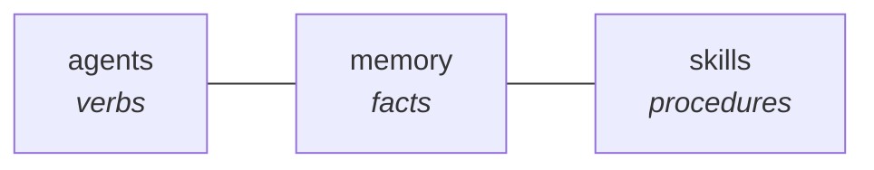
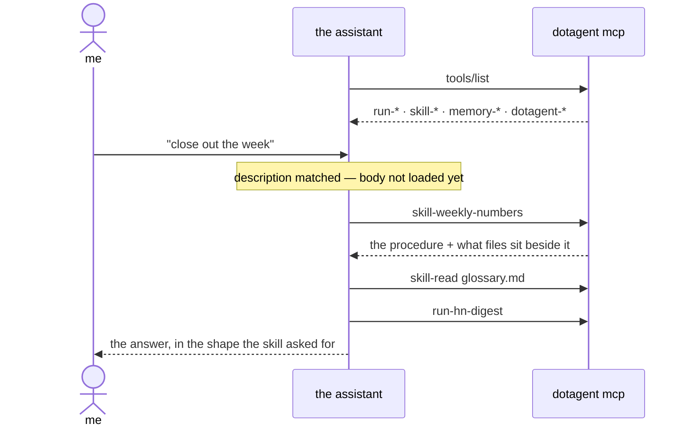

# Skills

> Procedures an assistant loads when they apply, and ignores when they do not.

An assistant wired to dotagent knows three things. It knows what can be **run** —
one tool per installed agent. It knows what is **true** — [memory](memory.md).
It knows how things are **doing** — status, logs, inspect.

A skill is the fourth: **how to do something**.



Without them, a procedure has two bad homes. Put it in the system prompt and
every message pays for something one message in fifty uses. Make it an agent and
a procedure is forced to become a script — but "pull these three agents, compare
against last week, answer in this shape" has nothing to execute. It has
something to *follow*.

## The shape

A skill is a directory with a `SKILL.md`:

```
~/.config/dotagent/skills/weekly-numbers/
├── SKILL.md              ← frontmatter + the procedure
├── scripts/
│   └── compare.sh        ← optional, runnable
└── references/
    └── glossary.md       ← optional, readable
```

```markdown
---
name: weekly-numbers
description: How to close out the week. Use when asked for "the numbers",
  the weekly summary, or how last week went.
---

1. Call `run-hn-digest` and `run-disk-alert`.
2. Compare against last week — `scripts/compare.sh` does the arithmetic.
3. Answer in one paragraph, leading with what changed.
```

`name` and `description` are the contract. `description` is the **trigger**: it
is the only part a model sees before deciding, so a skill without one is a skill
nothing will ever call. That is a validation error, not a warning.

Everything else in the frontmatter is ignored, which is what lets a file written
for another tool land here unchanged.

## How a model reaches it

Each skill becomes a tool, `skill-<name>`. The catalog costs one line per skill;
the procedure costs nothing until it is asked for.



Three tools, and the last two are why a multi-file skill works at all:

| Tool | Arguments | Behavior |
|---|---|---|
| `skill-<name>` | — | Return the procedure, plus an index of the files next to it. |
| `skill-read` | `skill`, `path` | Return one supporting file. |
| `skill-run` | `skill`, `script`, `args[]` | Execute one `scripts/` entry, return its output. |

Loading a skill **returns text**. It does not perform the procedure — the tool
description says so out loud, because half of these are written in the
imperative ("Cut a new release") and a model could reasonably read the call
itself as doing the thing.

## Reusing what you already wrote

The format is Anthropic's [Agent Skills] layout, and `~/.claude/skills/` is
searched by default. A skill you wrote for Claude Code is already installed
here; nothing to copy, nothing to symlink.

Search order, first match winning a name:

1. `[skills] paths` from `config.toml`
2. `$DOTAGENT_ROOT` and `$DOTAGENT_ROOT/skills` — for testing
3. `~/.config/dotagent/skills/`
4. `~/.claude/skills/` and `./.claude/skills/`
5. `./skills/`

**Not everything ports, and the part that does not is worth naming.** A skill
that is a procedure plus its own `scripts/` works anywhere. A skill whose steps
are "use Read, then Grep, then invoke another skill" assumes the Claude Code
harness — an assistant reached over MCP has no Bash, no filesystem tools and no
nested skill invocation. dotagent serves the text faithfully; it cannot conjure
the tools the text asks for.

So the value is not in Claude Code, which already reads those files natively.
It is in everywhere else: a Telegram assistant, Claude Desktop, an aggregating
proxy — anywhere a model has no harness of its own.

A bundle that keeps its skills one level down (`radar/skills/*/SKILL.md`) is not
walked recursively. Point at it directly:

```toml
[skills]
paths = ["/Users/me/.claude/skills/radar/skills"]
```

[Agent Skills]: https://code.claude.com/docs/en/skills

## Packaged scripts

`scripts/` makes a skill a unit rather than a paragraph — the procedure and the
mechanical part travel together. Two rules, both narrowing:

**`scripts/` only.** A `references/` file is a document, and "run this document"
is never the intent.

**Executable bit required.** It is the author naming the entry points. Dropping
a helper next to them does not silently make it callable.

Execution goes through the supervisor, like every other orchestrated
subprocess: a deadline that is enforced, and kill-tree so a script that spawns
children cannot leave orphans. `timeout_seconds` in the frontmatter overrides
the 300-second default. If the daemon itself dies before the deadline lands,
the next boot collects what it left behind — see
[boot orphan reap](../guides/daemon-lifecycle.md#boot-orphan-reap).

The script gets `SKILL_NAME` and `SKILL_DIR` in its environment, runs with the
skill directory as its working directory, and receives arguments through argv —
never a shell.

Every run is audited as `skill_invoked`. This is code executing outside any
manifest, so without that entry "what ran on this machine" would have a hole
in it.

## What a caller cannot reach

`skill-read` and `skill-run` take a path from the model, which makes them a
boundary rather than a convenience:

- Absolute paths and `..` are refused before anything touches the disk.
- The resolved path must still sit under the skill directory after
  canonicalization — which is what catches a symlink pointing outside.
- A name that is not in the catalog is not a skill, and `../` in one is refused
  rather than followed.

Installing a skill is the decision. Anyone who can write to a skill directory
can put a script there and have it run — the same statement the
[threat model](../security/threat-model.md) already makes about manifests.

## Configuration

None required. Skills are on, the catalog starts empty, and an empty catalog
lists no tools.

```toml
[skills]
enabled = false                  # drop the tools entirely
claude_skills = false            # stop searching ~/.claude/skills
paths = ["/opt/team-skills"]     # extra roots, searched first
```

`dotagent doctor` reports how many were found, which failed to parse, and any
two names that collapse to the same tool name.

## Writing one worth calling

The description is the whole interface. "Weekly report stuff" will never fire;
"Use when asked for the weekly numbers, the summary, or how last week went"
will.

Keep the body short enough to act on. A procedure long enough to evict what the
assistant needs in order to follow it has defeated itself — the body is capped
at 32 KB and truncation is announced, but a skill that hits the cap should be
split, with the detail moved into `references/` where it is fetched only when
needed.

Say what **not** to do. Half of a good procedure is ruling out the plausible
wrong move, and that is exactly the part a model will not infer.

## See also

- [Commands](commands.md) — the same markdown, invoked by name instead of chosen
- [MCP server](../reference/mcp.md) — how the tools are exposed
- [Memory](memory.md) — the facts half of the same problem
- [Agents](agents.md) — the verbs
- [Threat model](../security/threat-model.md#v10--skill-script-execution)
