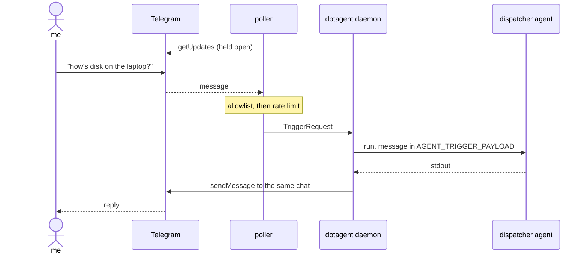

# Telegram

Telegram works in both directions. Outbound is the `telegram` notifier driver, which posts when a run fails — see [Notifications](notifications.md). This page is about inbound: messages that cause agents to run.

Off unless you configure it. dotagent never opens an inbound path you did not ask for.

## The shape



The daemon holds a `getUpdates` connection open rather than polling on a timer, so replies are near-instant without a webhook, a public IP, TLS termination or a tunnel. dotagent runs on laptops behind NAT; a webhook would make the common case the hard one.

## Setup

**1. Bot and user id.** Create a bot with [@BotFather](https://t.me/BotFather). Get your numeric id from [@userinfobot](https://t.me/userinfobot) — the number, not the `@username`.

**2. Token in the secrets file**, `~/.config/dotagent/secrets.env`, mode `600`:

```
TELEGRAM_BOT_TOKEN=123456:AA...
```

**3. Config**, `~/.config/dotagent/config.toml`:

```toml
[telegram]
bot_token        = "${TELEGRAM_BOT_TOKEN}"
allowed_user_ids = [123456789]
dispatcher_agent = "telegram-assistant"
```

**4. Reload.** `dotagent reload`. The log line `telegram ingress started` confirms it.

Every `[telegram]` change takes effect on reload, including the allowlist — the
daemon stops the running poller and starts a fresh one against the new config.
Revoking a user id and reloading revokes it immediately, rather than leaving
them able to trigger runs until the next restart.

Full field list in the [config reference](../guides/config-reference.md#telegram).

## Why the config is daemon-level

Telegram allows exactly one `getUpdates` consumer per bot token. If each manifest declared its own token, N pollers would compete for the same offset and silently drop each other's messages. One bot, one consumer, one place to configure it.

## The allowlist is the whole gate

`allowed_user_ids` is what stands between a bot token and arbitrary local execution. Two consequences:

**Numeric ids only.** A `@username` is changeable and therefore not an authorization input.

**Empty means nobody.** A token with an empty allowlist leaves the ingress off, and the daemon logs why. The other reading — "empty means no restriction" — would turn one forgotten line into an open remote-execution endpoint.

Messages from unlisted senders are refused before anything runs and recorded as `trigger_rejected` at `Critical` severity. That severity is deliberate: it means somebody found your bot.

## Rate limiting

`rate_limit_per_minute` (default 10) caps accepted messages per sender. Excess is dropped with an audit entry. The bot is reachable from anywhere on the internet, so this is the backstop that keeps one sender from occupying the daemon indefinitely.

The window is in memory. A daemon restart clears it — acceptable, and cheaper than a disk write on every message.

## The dispatcher

`dispatcher_agent` names the agent every accepted message goes to. It is an ordinary agent: env vars in, stdout out, exit code for success. It receives the message through `AGENT_TRIGGER_PAYLOAD` and whatever it prints becomes the reply.

What it does with the message is entirely up to it. [`examples/telegram-assistant`](https://github.com/avelino/dotagent/tree/main/examples/telegram-assistant) hands it to `claude -p` with the [MCP server](../reference/mcp.md) attached, so a model picks the right agent from a closed catalog. A dispatcher that just matches `/disk` with `case` is equally valid and costs no tokens.

dotagent itself interprets nothing. There is no model, no provider and no prompt in the daemon.

## Replies

The dispatcher's stdout goes back to the chat that asked. Sent as plain text, not MarkdownV2 — the body is agent output, and an unescaped backtick or underscore in a log line would otherwise turn into a Bot API 400. Delivery beats formatting.

Telegram caps a message at 4096 characters. Longer output is trimmed with a `[truncated]` marker; the full text stays in `dotagent logs`.

## Offset

The last acknowledged `update_id` lives in `~/.config/dotagent/state/notify/telegram/offset.json`, written tmp-then-rename.

Telegram redelivers every update until you acknowledge it. Without persistence, a daemon restart would replay the backlog — and for a bot that runs agents, replay means re-running whatever the last messages asked for. Delivery is at-most-once on purpose.

## What is never recorded

Message bodies do not reach the audit log. `trigger_received` records the sender id and the chat id; the text is not attribution, it is content, and a chat can contain anything you pasted into it.

## Failure modes

**Nothing happens.** Usually the allowlist. Check the audit log for `trigger_rejected`, and confirm the id is numeric and yours.

**`telegram bot_token set but allowed_user_ids is empty`.** The ingress stayed off by design. Add your id.

**`telegram poll failed`** repeating with a growing backoff. Transport problem — network, or a revoked token. The backoff doubles to a 60-second ceiling so a dropped connection does not become a tight retry loop.

**The reply never comes but the log shows the run.** The dispatcher printed nothing on stdout, or printed to stderr. stdout is the reply.

## See also

- [Triggers](triggers.md) — the general concept
- [MCP server](../reference/mcp.md) — how a model picks an agent
- [Threat model](../security/threat-model.md) — what changes when this is on
- [Notifications](notifications.md) — the outbound driver
