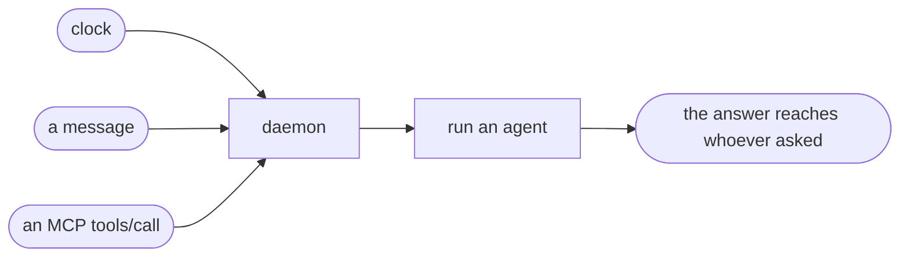

# Triggers

> A run that no clock asked for.

Every run used to come from a `[[schedules]]` window: cron, interval, or expression. A trigger is the other cause — a chat message arrived, an MCP client called a tool, an agent finished and wants to start the next one.

## What a triggered run keeps

Everything a scheduled run has. Same supervisor, same heartbeat, same audit trail, same `[[on_success]]` / `[[on_failure]]` hooks, same built-in notifiers. A trigger changes *why* a run started, not *how* it is run.

Two things are deliberately different.

**No window state.** A triggered run has no attempts counter, never consumes a retry, and can never mark a cron window as given up. Retry policy exists to answer "did the 08:30 window succeed"; a message at 14:00 is not an answer to that question.

**Its own slug.** State files are keyed by `trigger-<source>` instead of the schedule's args, so `~/.config/dotagent/state/agents/<name>/trigger-telegram.heartbeat.json` sits beside the scheduled history rather than on top of it. Without this, asking an agent to run on demand would write `last_success_at` for a window that never fired, and the scheduler would stop retrying a genuinely missed run.

## Sources

| Source | Who produces it | Answers back? |
|---|---|---|
| `telegram` | the daemon's inbound poller — see [Telegram](telegram.md) | yes, in the same chat |
| `mcp` | `dotagent mcp`, one tool per agent — see [MCP server](../reference/mcp.md) | yes, as the tool result |
| `cli` | reserved | no |

## Serialization

Triggers arrive on a bounded channel drained by a worker task of its own, separate from the daemon's tick loop. The worker takes requests FIFO and awaits each one to completion before pulling the next, so triggers stay serialized **against each other**: request N+1 is not even started until N has answered, which preserves per-conversation order by construction rather than by luck.

One worker, not one task per message. A task per message would hand ordering to the scheduler and to whichever task reached the persistent pool's per-key mutex first — non-deterministic, and wrong exactly when a conversation is moving fast. It would also turn a burst of N messages into N concurrent agent processes; queueing them bounds the expensive half.

What is *no longer* serialized is a trigger against the tick. The channel used to be an arm of the daemon's main `select!`, and that arm is only reached **between** ticks — a tick awaits every scheduled run inline. A single scheduled run with a 20-minute deadline therefore held every queued message for its whole duration: the sender saw silence, resent, and got both answers at once when the run finally ended. A triggered run now proceeds beside the tick.

That pair is the only new concurrency, and it is safe on everything the two touch in common:

- **Heartbeat.** A triggered run's slug is namespaced by source (`trigger-telegram`), so it never shares a file with the scheduled history of the same agent. The state store takes a per-file `flock` regardless.
- **Window state.** Triggered runs never write it, so retry accounting stays single-writer.
- **Audit log.** Every append takes an exclusive `flock` on the log.
- **Persistent instances.** The pool keys a mutex per `(agent, key)`, so a scheduled and a triggered request for the same instance queue instead of interleaving.

Scheduled runs remain serialized against each other — the tick still awaits each one inline. Only the trigger-vs-tick pair became concurrent.

The practical consequence: a long *trigger* still delays the next trigger. A ten-minute answer means a message arriving at minute two waits. A long *scheduled run* no longer does. If the remaining queueing matters for your setup, keep the dispatcher fast and let it hand slow work to something else.

The channel holds 64 pending requests. That is deep enough for a burst of chat messages to survive one slow answer, and shallow enough that a wedged daemon applies backpressure to the ingress instead of growing without bound.

`[lifecycle] mode = "persistent"` does not change this. It removes the startup cost of each run, not the queue.

One consequence worth knowing before you `dotagent reload`: retiring persistent instances waits for whatever they are answering. A SIGHUP that arrives while a triggered request is in flight is applied after it finishes, bounded by that agent's `timeout_seconds`. See [Daemon lifecycle](../guides/daemon-lifecycle.md#reload-sighup).

## What the agent receives

Trigger context arrives as environment variables, alongside the usual `AGENT_*` block:

| Variable | Meaning |
|---|---|
| `AGENT_TRIGGER_SOURCE` | `telegram`, `mcp`, `cli` |
| `AGENT_TRIGGER_ACTOR` | who asked, as the source can attest it |
| `AGENT_TRIGGER_REPLY_TO` | opaque handle for the conversation to answer |
| `AGENT_TRIGGER_PAYLOAD` | source-specific JSON body |

`AGENT_TRIGGER_PAYLOAD` carries the message text, plus a `command` object when the sender invoked one — see [Commands](commands.md#the-payload). It rides in the environment rather than argv on purpose: a body that reached argv would be one quoting bug away from a shell problem, and every current producer is bounded well under `ARG_MAX` (a Telegram message caps at 4096 characters). A source with unbounded payloads should write a file into `AGENT_TMPDIR` rather than grow this variable.

These variables are applied *before* the `AGENT_*` block, so a payload can never redefine `AGENT_NAME` or `AGENT_HEARTBEAT_FILE`.

A [persistent](lifecycle.md) agent gets none of them. An environment is fixed at spawn and that process answers many different messages, so the same context arrives in the `trigger` field of each request frame instead — see [the persistent protocol](../reference/persistent-protocol.md).

An agent with no `[[schedules]]` at all is legal and gets the synthetic schedule id `trigger`. That is the natural shape for an agent that only ever runs because someone asked.

## Answering

Whatever the agent prints on stdout goes back to whoever asked, when the source supports it. Log to stderr — it is captured for `dotagent logs` and stays out of the reply.

The agent that a dispatcher *calls* never learns a chat exists. Only the triggered agent has `AGENT_TRIGGER_REPLY_TO`, and it is the one whose stdout gets delivered.

## Security

A trigger can originate from outside the machine. The full posture is in the [threat model](../security/threat-model.md); the short version:

- `agent` in a trigger is a **selector, not a command**. It resolves against manifests already on disk, and anything else is refused.
- Nothing in a trigger reaches a shell.
- Every accepted trigger writes `trigger_received` and `agent_triggered` to the audit log; every refused one writes `trigger_rejected` at `Critical`.
- Message bodies are never written to the audit log. It records attribution, not transcripts.

## See also

- [Lifecycle](lifecycle.md) — keeping a dispatcher alive between messages
- [Telegram](telegram.md) — the inbound chat source
- [MCP server](../reference/mcp.md) — agents as tools
- [`examples/telegram-assistant`](https://github.com/avelino/dotagent/tree/main/examples/telegram-assistant) — the whole loop end to end
