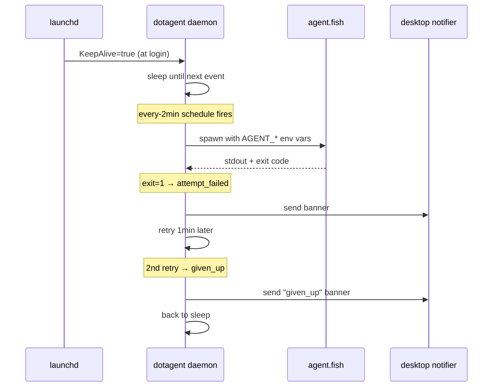

# Your first agent

> Goal: in 15 minutes you'll have an agent that prints "hello" every
> few minutes under the dotagent daemon, with logs you can tail and a
> desktop notification when it fails.

Prerequisites: `dotagent --version` works. If not, go back to
[`installation.md`](installation.md).

The walkthrough has six steps. Each step ends with a "**Verify**" line —
if that command doesn't behave as described, jump to
[Troubleshooting](#troubleshooting) at the bottom.

---

## Step 1 — Pick the language

Every example below uses **Fish** for brevity, but dotagent runs any
executable. If you'd rather use Python, Go, or Rust, copy
[`examples/hello-python/`](../../examples/hello-python/),
[`examples/hello-go/`](../../examples/hello-go/), or
[`examples/hello-rust/`](../../examples/hello-rust/) instead. The flow is
identical — only `[run].command` and the script body change.

```bash
# Verify your shell of choice exists.
which fish      # or: which python3 / which go / which cargo
```

---

## Step 2 — Create the agent directory

dotagent discovers agents by scanning `~/.config/dotagent/agents/` (and a
few other roots — see [`reference/paths.md`](../reference/paths.md)).
Each agent is a single directory.

```bash
mkdir -p ~/.config/dotagent/agents/hello
cd ~/.config/dotagent/agents/hello
```

**Verify:**

```bash
ls -ld ~/.config/dotagent/agents/hello
# → drwxr-xr-x ... hello
```

---

## Step 3 — Write the script

This script just echoes the env vars dotagent injects. It exits 0 most
of the time and exits 1 every 5th minute so we can see the failure
notification later.

```fish
# ~/.config/dotagent/agents/hello/agent.fish
#!/usr/bin/env fish

# dotagent injects:
#   $AGENT_NAME         — manifest's agent.name
#   $AGENT_TMPDIR       — scratch dir, auto-cleaned after the run
#   $AGENT_SCHEDULE_ID  — which schedule fired
#   $AGENT_START_EPOCH  — unix epoch of the start

echo "=== hello from $AGENT_NAME ==="
echo "schedule: $AGENT_SCHEDULE_ID"
echo "tmp:      $AGENT_TMPDIR"
echo "epoch:    $AGENT_START_EPOCH"

# Every 5 minutes (00, 05, 10...) fail on purpose so we can see the
# notifier kick in. Comment this out once you've seen one alert.
set -l minute (date +%M | string trim --left --chars=0)
if test -z "$minute"; set minute 0; end
if test (math "$minute % 5") -eq 0
    echo "intentional failure for demo" >&2
    exit 1
end

exit 0
```

Make it executable:

```bash
chmod +x ~/.config/dotagent/agents/hello/agent.fish
```

**Verify** (running the script directly should work — env vars will be
empty, that's fine):

```bash
./agent.fish
# → === hello from  ===
# → schedule:
# → ...
# → exit 0 (or 1 if you're on a minute divisible by 5)
```

---

## Step 4 — Write the manifest

`agent.toml` is the contract. It declares identity, how to run the
script, when to run it, what to do on failure.

```toml
# ~/.config/dotagent/agents/hello/agent.toml

[agent]
name = "hello"
description = "Tutorial agent — prints hello every 2 minutes."
timeout_seconds = 30

[run]
command = "fish"
args = ["./agent.fish"]

# Run every 2 minutes so you don't have to wait long.
[[schedules]]
id = "every-2min"
type = "interval"
interval_minutes = 2

# Retry policy: 2 retries, 1 minute between attempts.
# Used so we can see `attempt_failed` AND `given_up` events fire.
[defaults]
max_retries = 2
retry_backoff_minutes = [1]

# Desktop banner whenever a run fails (every attempt).
# Built-in driver — no plugin subprocess.
[[notifiers]]
driver = "desktop"
title  = "hello"
sound  = true
events = ["attempt_failed", "given_up"]
```

That's the whole manifest. No SDK. No imports. No registration.

**Verify** — dotagent should now discover the agent and validate the
manifest end-to-end:

```bash
dotagent doctor
# → ✓ hello: manifest ok
# →     notifier driver=desktop (built-in)
# →     ⚠ hello: no [security] section — blast radius is unbounded.
# → summary: 1 agent(s), 0 error(s), 1 warning(s)
```

The `[security]` warning is harmless for now — v0 is schema-only. Read
[`security/threat-model.md`](../security/threat-model.md) when you're
ready.

---

## Step 5 — Smoke-test (foreground)

Before handing the agent to the daemon, run it once in the foreground.
This is what `dotagent run` does — useful for development too.

```bash
dotagent run hello --schedule every-2min
# === hello from hello ===
# schedule: every-2min
# tmp:      /tmp/.tmpXXXXXX
# epoch:    1700000000
```

The agent ran in the foreground, dotagent injected env vars, captured
stdout, wrote the heartbeat, and exited.

**Verify**:

```bash
ls ~/.config/dotagent/state/agents/hello/
# → default.heartbeat.json

cat ~/.config/dotagent/state/agents/hello/default.heartbeat.json | jq .
# → { "name": "hello", "slug": "default", "started_at": ..., "exit_code": 0, ... }
```

If `exit_code = 1` (because you hit a minute divisible by 5), that's the
demo failure firing — try again a minute later.

---

## Step 6 — Hand it to the daemon

Now the real thing: the daemon will fire the agent every 2 minutes on
its own, retry on failure, and ping you on the desktop when it gives
up.

### 6a. Install the daemon unit

```bash
dotagent install
# wrote ~/Library/LaunchAgents/run.avelino.dotagent.plist  (macOS)
# OR
# wrote ~/.config/systemd/user/run.avelino.dotagent.service (Linux)
#
# Next steps:
#   launchctl bootstrap "gui/$(id -u)" ~/Library/LaunchAgents/run.avelino.dotagent.plist
```

This writes **one** unit file. dotagent does NOT install one unit per
agent — the daemon manages every schedule internally.

### 6b. Start the daemon

**macOS (launchd):**

```bash
launchctl bootstrap "gui/$(id -u)" ~/Library/LaunchAgents/run.avelino.dotagent.plist
```

**Linux (systemd):**

```bash
systemctl --user daemon-reload
systemctl --user enable --now run.avelino.dotagent
```

The daemon process is now alive. macOS launchd / Linux systemd will
restart it if it crashes.

**Verify** (the daemon should be running and have written a PID file):

```bash
cat ~/.config/dotagent/state/daemon.pid
# → 12345

ps -p $(cat ~/.config/dotagent/state/daemon.pid) -o command=
# → dotagent daemon
```

### 6c. Watch it work

Tail the agent's log — every 2 minutes a new "=== hello ===" header
appears:

```bash
dotagent logs hello --follow
```

In another terminal, see the dashboard:

```bash
dotagent status
# → ═══ Agent Health · 2026-05-19 14:32 ═══
# →
# →   ✅ ok       1/1
# →
# →   AGENT/SCHEDULE                         STATE       LAST RUN              REASON
# →   ──────────────────────────────────────────────────────────────────
# →   hello/every-2min                       ✅ ok       2026-05-19T14:30:01    last_success_at fresh
```

Wait for a "demo failure" minute (`:00`, `:05`, `:10`...) and you'll
see:

- A **desktop banner** ("hello — free space low" style) pop up
- The dashboard shifts the agent into `failing`
- After 2 retries it transitions to `given_up`
- The audit log records every step

```bash
tail ~/.config/dotagent/audit.log | jq -c .
# → {"event": {"event_type":"agent_run","exit_code":1,...}}
# → {"event": {"event_type":"plugin_invoked","plugin":"notifier:desktop",...}}
# → {"event": {"event_type":"agent_given_up", ...}}
```

---

## Where files live now

After Step 6, `~/.config/dotagent/` looks like:

```text
~/.config/dotagent/
├── agents/hello/
│   ├── agent.toml
│   └── agent.fish
├── state/
│   ├── agents/hello/default.heartbeat.json
│   ├── windows/hello-default-<ts>.json
│   ├── known_manifests.json
│   └── daemon.pid
├── logs/
│   ├── daemon/dotagent.log
│   └── agents/hello/hello.log
└── audit.log
```

Full reference: [`reference/paths.md`](../reference/paths.md).

---

## What just happened (mental model)



The OS keeps the daemon alive. The daemon keeps everything else alive.

---

## Clean up

If this was just a tutorial:

```bash
# Stop the daemon.
launchctl bootout "gui/$(id -u)/run.avelino.dotagent"        # macOS
systemctl --user disable --now run.avelino.dotagent          # Linux

# Remove the daemon unit.
dotagent uninstall

# Remove the agent (your manifests/state stay otherwise untouched).
rm -rf ~/.config/dotagent/agents/hello
rm -rf ~/.config/dotagent/state/agents/hello
rm -rf ~/.config/dotagent/logs/agents/hello
```

---

## Troubleshooting

### `dotagent doctor` says "no agents discovered"

```bash
ls ~/.config/dotagent/agents/hello/agent.toml
# → file must exist
```

Discovery scans `~/.config/dotagent/agents/*/agent.toml`. Make sure the
directory name is `hello` and the file is named exactly `agent.toml`
(not `hello.toml` or `manifest.toml`).

### `dotagent run` says "agent not found"

The agent name in `agent.toml` (`[agent].name = "hello"`) must match
the argument you pass to `dotagent run`. The directory name is
**advisory** — what dotagent indexes is `agent.name`.

### `dotagent run` works but the daemon never fires it

Check the daemon is alive:

```bash
ps -p $(cat ~/.config/dotagent/state/daemon.pid 2>/dev/null) -o command= 2>/dev/null
# Should print "dotagent daemon"
```

If empty, the daemon isn't running. Re-do Step 6b.

If alive, tail the daemon log:

```bash
tail -F ~/.config/dotagent/logs/daemon/dotagent.log | jq .
```

You should see a `tick` line every 30 minutes at most, plus a
"dispatching run" line every 2 minutes. If you see `tick` but no
"dispatching", the heartbeat says the previous window already succeeded —
which is correct behavior. Wait 2 minutes.

### Desktop notification never fires

```bash
# macOS — check Settings → Notifications → dotagent or your terminal app
# is allowed to send notifications.

# Linux — check `notify-send` works:
notify-send "test" "hello"
```

If `notify-send` doesn't show anything, the `desktop` driver won't
either — it's the same D-Bus pathway.

See [`guides/troubleshooting.md`](../guides/troubleshooting.md) for the
full sintoma → diagnostics map.

---

## Next

You have:
- A working agent
- The daemon running
- Logs you can tail
- A notification that fires on failure

**Where to next?** [`next-steps.md`](next-steps.md) maps the rest of the
docs to your next questions.
