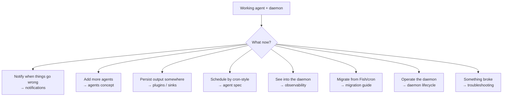

# Next Steps

> You have a working agent under the daemon. Pick what's next based on
> what you want to do.



---

## Make failures loud

The example in [`first-agent.md`](first-agent.md) already wired a
**desktop banner**. The rest of the built-in drivers (`slack`, `ntfy`,
`pushover`, `imessage`) follow the same shape — a `[[notifiers]]`
block, no plugin install, no subprocess fork:

```toml
[[notifiers]]
driver = "slack"
webhook_url = "https://hooks.slack.com/services/..."
events = ["given_up", "recovered"]
```

→ **Read**: [`concepts/notifications.md`](../concepts/notifications.md)
for every driver, the tiered-notify pattern (desktop on every fail,
phone only on `given_up`), and rate-limit semantics.

---

## Make output go somewhere

A *sink plugin* persists the agent's stdout. Two come pre-installed:

- **`sink-file`** — write to a file (overwrite or append).
- **`sink-roam`** — publish hierarchical content to Roam Research,
  idempotent via `marker_regex`.

```toml
[[on_success]]
plugin = "sink-file"
config = { path = "/Users/me/reports/daily.md", mode = "overwrite" }
```

→ **Read**: [`docs/plugins/sink-file.md`](../plugins/sink-file.md),
[`docs/plugins/sink-roam.md`](../plugins/sink-roam.md), and the
overview at [`concepts/plugins.md`](../concepts/plugins.md).

---

## Gate the run on something external

A *preflight plugin* fails the run before spawning the agent. Built-ins:

- **`preflight-warp`** — abort if Cloudflare WARP isn't connected.
- **`preflight-cmd`** — generic: run any command, gate on exit code +
  stdout match.

```toml
[[preflight]]
plugin = "preflight-cmd"
config = { command = "aws", args = ["sts", "get-caller-identity"], expect_exit = 0 }
```

→ **Read**: [`docs/plugins/preflight-cmd.md`](../plugins/preflight-cmd.md),
[`docs/plugins/preflight-warp.md`](../plugins/preflight-warp.md).

---

## Schedule like a grown-up

The tutorial used `type = "interval"` for speed. Production agents
usually want **cron-style** schedules with weekdays + hours + minute:

```toml
[[schedules]]
id = "daily"
type = "cron"
weekdays = [1, 2, 3, 4, 5]      # Mon-Fri (0 = Sun, 6 = Sat — matches launchd)
hours = [8]
minute = 30
```

Plus retry policy:

```toml
[defaults]
max_retries = 3
retry_backoff_minutes = [5, 15, 30]
stale_after_minutes = 120         # don't bother retrying a stale window
```

→ **Read**: [`reference/agent-spec.md`](../reference/agent-spec.md)
for the full manifest schema. [`concepts/agents.md`](../concepts/agents.md)
for the patterns (digest / triage / generator / watchdog).

---

## See into the daemon

Out of the box you get structured JSON logs, daily rotation, and a
sharded log per agent — zero config. To export traces to Honeycomb /
Grafana Tempo / Jaeger / Datadog, two lines of `config.toml`:

```toml
[telemetry]
otlp_endpoint = "https://api.honeycomb.io:443"
```

```bash
export OTEL_EXPORTER_OTLP_HEADERS="x-honeycomb-team=YOUR_KEY"
dotagent reload
```

→ **Read**: [`guides/observability.md`](../guides/observability.md) for log
schema, vendor recipes, jq queries.
→ **Or just tweak retention**: [`guides/config-reference.md`](../guides/config-reference.md).

---

## Add many agents

`agents/<name>/` is one directory per agent. Add a second:

```bash
mkdir -p ~/.config/dotagent/agents/hn-morning
# … drop your agent.toml + entry script …
dotagent doctor                  # validates every agent at once
dotagent reload                  # daemon picks up the new one on next tick
```

For inspiration:

- **`examples/disk-alert/`** — pure-shell agent with tiered notifications
- **`examples/hello-{fish,python,go,rust}/`** — minimal "hello"
  variants per language
- **The fish framework's gallery** — 9 production agents listed in
  [`concepts/agents.md#examples-gallery`](../concepts/agents.md#examples-gallery)

→ **Read**: [`concepts/agents.md`](../concepts/agents.md) — patterns,
extending, connecting agents.

---

## Migrate from Fish / cron

If you came from the `lib/agent.fish` framework, every concept maps
1-to-1:

→ **Read**: [`guides/migrating-from-fish.md`](../guides/migrating-from-fish.md).

If you came from `cron` (no framework), the pattern is:

1. Move the script body into `agents/<name>/agent.sh`.
2. Write an `agent.toml` that recreates your cron line in the
   `[[schedules]]` block.
3. Remove the cron entry; let the daemon take over.

There's no separate cron migration guide today — the Fish guide is the
closest thing, and `cron` ↔ launchd weekday differences are flagged in
[Troubleshooting](../guides/troubleshooting.md#symptom-cron-style-schedule-never-matches).

---

## Operate the daemon

How to install/start/stop/reload across macOS launchd + Linux systemd,
with diagnostics for "is this thing on?":

→ **Read**: [`guides/daemon-lifecycle.md`](../guides/daemon-lifecycle.md).

---

## Something broke

A sintoma → diagnostic decision tree covering:

- Daemon won't start
- `doctor` errors
- Agent never runs
- Agent runs but fails
- Notifier / sink not working
- Logs / audit / plugin issues
- Performance

→ **Read**: [`guides/troubleshooting.md`](../guides/troubleshooting.md).

---

## Read the source

When the docs disagree with the code, **the code wins**. Worth
bookmarking:

| Question                                                      | Crate / module                                                                  |
|---------------------------------------------------------------|---------------------------------------------------------------------------------|
| "What does the daemon actually do?"                           | [`crates/dotagent/src/commands/daemon.rs`](../../crates/dotagent/src/commands/daemon.rs) |
| "How does the runner spawn agents?"                           | [`crates/dotagent-runner/src/lib.rs`](../../crates/dotagent-runner/src/lib.rs)        |
| "How are heartbeats serialized?"                              | [`crates/dotagent-core/src/heartbeat.rs`](../../crates/dotagent-core/src/heartbeat.rs) |
| "How does scheduling math work?" (pure functions, no IO)      | [`crates/dotagent-scheduler/src/lib.rs`](../../crates/dotagent-scheduler/src/lib.rs)   |
| "What audit events exist?"                                    | [`crates/dotagent-core/src/audit.rs`](../../crates/dotagent-core/src/audit.rs)       |
| "What's in `agent.toml`?"                                     | [`crates/dotagent-core/src/manifest.rs`](../../crates/dotagent-core/src/manifest.rs)  |

For contributor onboarding: [`CLAUDE.md`](../../CLAUDE.md) at the
repo root.

---

## Read the FAQ

Quick answers to the recurring questions
([`docs/faq.md`](../faq.md)):

- Windows? root? cron → dotagent? debug without the daemon? multiple
  users? sandbox? when is 1.0? why not just cron?

---

That's the menu. Each section above is an entry point into a deeper
guide — pick the one closest to what you actually need, and ignore the
rest until later.
