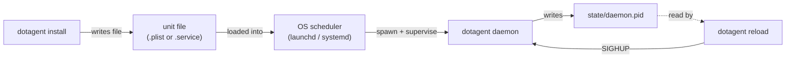
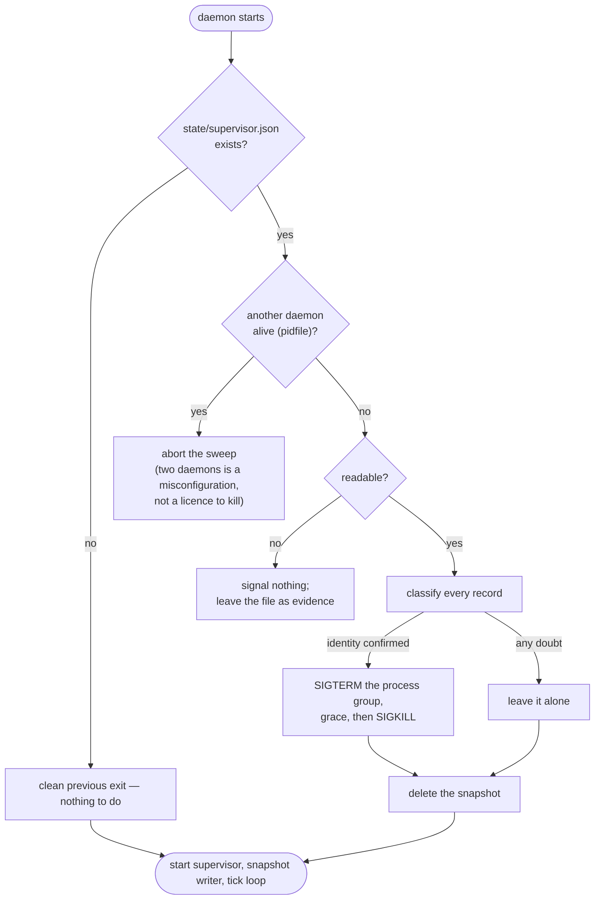
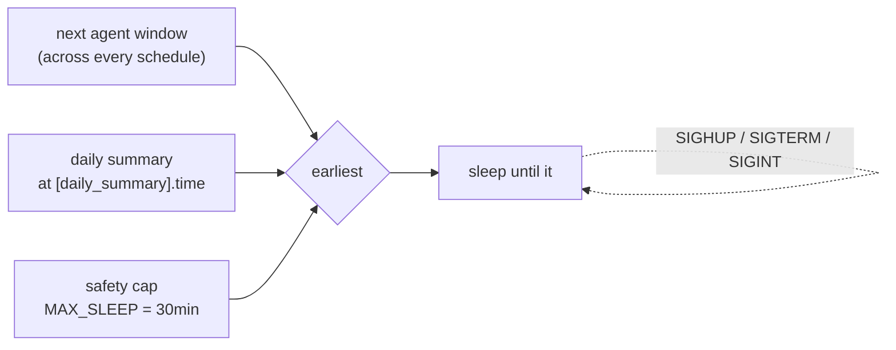
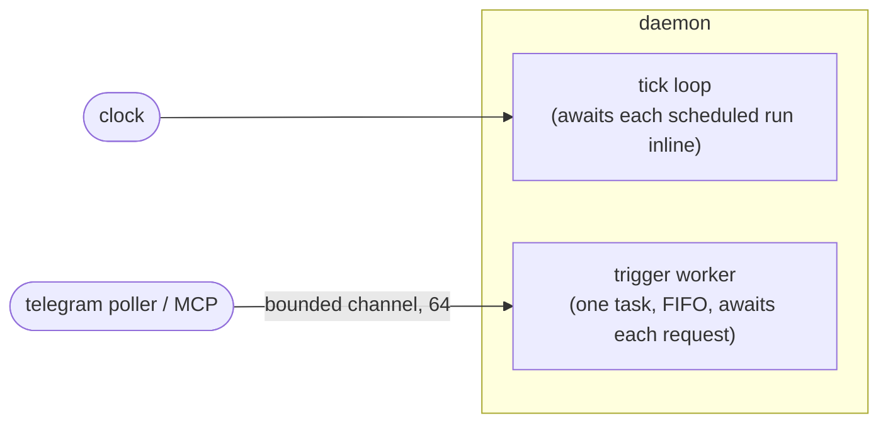

# Daemon Lifecycle

> Install, start, stop, reload, diagnose. macOS launchd + Linux
> systemd, side-by-side.

The dotagent daemon is **one process per user**. The OS (launchd on
macOS / systemd on Linux) keeps it alive. dotagent never installs
itself — `dotagent install` only generates the unit file; you load it
into the OS scheduler with one extra command.

If anything below isn't behaving as expected, the
[Diagnostics](#diagnostics) section at the bottom has the canonical
"is this thing on?" check.


```mermaid
flowchart LR
    A[dotagent install] -->|writes file| U["unit file<br/>(.plist or .service)"]
    U -->|loaded into| OS["OS scheduler<br/>(launchd / systemd)"]
    OS -->|spawn + supervise| D[dotagent daemon]
    D -->|writes| PID["state/daemon.pid"]
    PID -.->|read by| R[dotagent reload]
    R -->|SIGHUP| D
```

---

## TL;DR

```bash
# 1. Generate the unit file.
dotagent install

# 2. Load it into the OS scheduler (one of these two).
launchctl bootstrap "gui/$(id -u)" ~/Library/LaunchAgents/run.avelino.dotagent.plist          # macOS
systemctl --user daemon-reload && systemctl --user enable --now run.avelino.dotagent          # Linux

# 3. Verify.
dotagent status
cat ~/.config/dotagent/state/daemon.pid
```

---

## Generate the unit file

```bash
dotagent install
```

Writes a single unit, regardless of how many agents you have:

| Platform | File                                                            |
|----------|-----------------------------------------------------------------|
| macOS    | `~/Library/LaunchAgents/run.avelino.dotagent.plist`             |
| Linux    | `~/.config/systemd/user/run.avelino.dotagent.service`           |

The unit's `ExecStart` / `ProgramArguments` points at the **currently-running
`dotagent` binary** (resolved via `std::env::current_exe`). If you move the
binary after install, re-run `dotagent install` so the unit refreshes.

Both unit files set:

| Property           | macOS (`launchd`)                | Linux (`systemd`)         |
|--------------------|----------------------------------|---------------------------|
| Auto-restart       | `KeepAlive=true`                 | `Restart=always`          |
| Start at login     | `RunAtLoad=true`                 | (enable with `--now`)     |
| Throttle           | `ThrottleInterval=10`            | `RestartSec=10`           |
| stdout capture     | `StandardOutPath=…run.avelino.dotagent.log` | `StandardOutput=append:…` |
| stderr capture     | `StandardErrorPath=…-error.log`  | `StandardError=append:…`  |

> The stderr file catches **crashes**, not activity. The daemon only mirrors
> its `tracing` stream to stderr when stderr is a terminal — otherwise it
> would grow forever in a file no rotation policy covers. Read
> `logs/daemon/dotagent.log` to see what the daemon is doing;
> read `…-error.log` to find out why it died. `DOTAGENT_LOG_STDERR=1`/`0`
> forces the mirror on or off.

Templates live in
[`crates/dotagent-unit-gen/templates/`](../../crates/dotagent-unit-gen/templates/).

> **Note**: `dotagent install` accepts `--all` and a positional `NAME`
> for backwards compatibility with the legacy per-agent install flow.
> Both are **no-ops** now — the daemon manages every discovered manifest
> internally. The CLI prints a notice to remind you.

---

## Start

### macOS (launchd)

```bash
launchctl bootstrap "gui/$(id -u)" ~/Library/LaunchAgents/run.avelino.dotagent.plist
```

What this does: registers the plist with launchd's `gui/<uid>` domain
(the user session domain) and immediately spawns the daemon since
`RunAtLoad=true`.

Verify:

```bash
launchctl print "gui/$(id -u)/run.avelino.dotagent" 2>&1 | head -20
# Should print "state = running" plus the spawned PID.
```

> **`brew services start dotagent`** (coming soon, once the tap
> publishes) is a friendlier alternative — it runs `launchctl bootstrap`
> for you.

### Linux (systemd user units)

```bash
systemctl --user daemon-reload
systemctl --user enable --now run.avelino.dotagent
```

`daemon-reload` makes systemd re-scan `~/.config/systemd/user/`.
`enable --now` does two things: marks the unit to auto-start at the
next login AND starts it immediately.

For the unit to **actually survive logout**, you need lingering
enabled (otherwise systemd kills user sessions when you log out):

```bash
loginctl enable-linger $USER
```

Verify:

```bash
systemctl --user status run.avelino.dotagent
# Should print "Active: active (running)".
```

---

## Stop

### macOS

```bash
launchctl bootout "gui/$(id -u)/run.avelino.dotagent"
```

`bootout` is the inverse of `bootstrap` — unloads the plist from
launchd, sends SIGTERM, and removes the daemon from the user domain.
The plist file stays put on disk; the daemon just isn't running.

> Don't `kill -9` the daemon — `KeepAlive=true` will respawn it within
> 10s. Either bootout (above) or use `launchctl stop`:
>
> ```bash
> launchctl stop run.avelino.dotagent      # one-shot stop; bootstrap stays loaded → will restart
> ```

### Linux

```bash
systemctl --user stop run.avelino.dotagent
```

Doesn't disable auto-start at next login. To prevent re-spawn at the
next boot, also:

```bash
systemctl --user disable run.avelino.dotagent
```

---

## Restart

After upgrading the `dotagent` binary itself, the running daemon is
still pointing at the **old in-memory binary**. Replacing the file
doesn't change the running process. Restart it explicitly:

### macOS

```bash
launchctl kickstart -k "gui/$(id -u)/run.avelino.dotagent"
```

`kickstart -k` sends SIGTERM, waits for exit, then re-spawns.

### Linux

```bash
systemctl --user restart run.avelino.dotagent
```

> If you only changed **manifests** (`agent.toml` files) or
> **`config.toml`**, use `dotagent reload` (SIGHUP) instead — it's
> cheaper.

---

## Boot orphan reap

A daemon that exits through its shutdown path reaps its children and
deletes `state/supervisor.json`. A daemon that is `SIGKILL`ed, panics,
or is replaced by `launchctl kickstart -k` does neither. Its children
survive with **nobody holding their deadline** — the supervisor that
would have enforced it died with the daemon. Observed in production as
an agent process alive for 26 minutes against a 600-second timeout.

So a starting daemon opens its state store and audit log, and then —
before it starts a supervisor of its own — looks at what the last one
left behind:


```mermaid
flowchart TD
    S([daemon starts]) --> E{"state/supervisor.json<br/>exists?"}
    E -->|no| G["clean previous exit — nothing to do"]
    E -->|yes| P{"another daemon<br/>alive (pidfile)?"}
    P -->|yes| A["abort the sweep<br/>(two daemons is a misconfiguration,<br/>not a licence to kill)"]
    P -->|no| R{"readable?"}
    R -->|no| V["signal nothing;<br/>leave the file as evidence"]
    R -->|yes| C["classify every record"]
    C -->|identity confirmed| K["SIGTERM the process group,<br/>grace, then SIGKILL"]
    C -->|any doubt| L["leave it alone"]
    K --> D[delete the snapshot]
    L --> D
    G --> N(["start supervisor, snapshot writer, tick loop"])
    D --> N
```

The order matters: the reap runs **before** the snapshot writer starts,
because the writer's first tick would overwrite the only record of
those processes.

### It refuses to kill on doubt

The OS recycles pids. A pid read off disk with no further proof
eventually names somebody else's process, so every record is
corroborated against what the OS reports for that pid *right now*. A
record is reaped only when **all** of these hold:

| Check | What it rules out |
|---|---|
| pid > 1, and not our own | signalling init or ourselves |
| the record carries `pgid` and `command` | a snapshot from a build that predates identity checking |
| recorded `pgid == pid` | a record this supervisor did not produce — every supervised spawn does `setpgid(0, 0)` |
| the OS still reports the pid | a process that already exited (the common case) |
| observed `pgid == pid` | a recycled pid that is not its own group leader |
| observed start time within 5s of the recorded one | a process that inherited the number after the old daemon died |
| observed command consistent with the recorded one | a recycled pid running something else entirely |

Anything missing, ambiguous, or unparseable is a **skip**, never a
kill. Leaving one orphan alive costs memory; killing the wrong process
costs somebody's work. A snapshot that cannot be read or parsed
signals nothing at all and is left on disk, since a corrupt registry is
exactly when guessing is most expensive.

Confirmed orphans get the same treatment a live deadline expiry gets:
`SIGTERM` to the whole process group, one grace window, then `SIGKILL`.
Each one is logged at `warn` with the agent, label, pid, pgid, and how
far past its deadline it ran, and audited as
[`orphan_reaped`](../reference/paths.md#auditlog) at `critical` — a
process that outlived its deadline unsupervised is worth an out-of-band
notification, not just a log line. Skips are logged at `debug` with the
reason (`already_gone`, `start_time_mismatch`, `command_mismatch`,
`not_group_leader`, `ambiguous_record`, `unusable_record`) and are never
audited: refusing to signal is the expected outcome, not an event.

### Rollout

`pgid` and `command` are new fields in the snapshot. A
`state/supervisor.json` written by an older binary has neither, so
every record in it classifies as `ambiguous_record` and nothing is
killed. The reap becomes effective from the **second** restart after
the upgrade — the first one is what writes a snapshot the next boot can
actually check.

---

## Reload (SIGHUP)

```bash
dotagent reload
```

Reads `~/.config/dotagent/state/daemon.pid`, sends `SIGHUP` to that
process. The daemon picks up changes on its next tick:

- New manifests in `~/.config/dotagent/agents/`
- Modified manifests (drift is detected and audited)
- Updated `config.toml`
- Updated plugin binaries (resolution is re-done per tick)

What `reload` does NOT do:

- **Doesn't swap the binary.** A SIGHUP'd process keeps its
  in-memory code. For binary swaps, use `restart` (above).
- **Doesn't drain in-flight runs.** Currently-spawned agents keep
  running until they exit.
- **Doesn't cut short an in-flight answer.** Retiring
  [persistent](../concepts/lifecycle.md) instances waits for the slot each one
  holds, so an instance answering a trigger when the signal lands is retired
  after that answer is delivered. The wait is bounded by the agent's
  `timeout_seconds`. `dotagent reload` itself returns as soon as the signal is
  sent — it is the daemon-side effect that waits.
- **Doesn't reset the audit chain.** The new tick continues from the
  current `prev_hash`.

Errors:

| Error                                  | Meaning                                                                  |
|----------------------------------------|--------------------------------------------------------------------------|
| `reading ... (daemon not running?)`    | `state/daemon.pid` is missing. Daemon isn't running.                     |
| `sending SIGHUP: No such process`      | PID file is stale (daemon crashed without `Drop` cleanup). Start it again. |

A reload replaces the **whole** in-memory config, not just the parts
the ingress reads. Retention thresholds and the daily summary's time
and destinations were pinned at boot until recently; editing
`config.toml` and reloading now takes effect on the next tick, as the
table above says it should.

---

## What wakes the daemon

The daemon sleeps until the earliest thing it has to be awake for. Two
independent reasons produce a wake-up, plus a safety cap:


```mermaid
flowchart LR
    A["next agent window<br/>(across every schedule)"] --> M{"earliest"}
    B["daily summary<br/>at [daily_summary].time"] --> M
    C["safety cap<br/>MAX_SLEEP = 30min"] --> M
    M --> S["sleep until it"]
    S -.->|SIGHUP / SIGTERM / SIGINT| S
```

The safety cap is what picks up a manifest dropped into `agents/`
without a reload — within 30 minutes even if nothing is scheduled.

An **inbound trigger is not on this list**, and that is the point. A
chat message or an MCP tool call is drained by a worker task running
beside the loop, so it is answered on its own clock instead of waiting
for the loop to come back around:


```mermaid
flowchart LR
    subgraph daemon
      L["tick loop<br/>(awaits each scheduled run inline)"]
      W["trigger worker<br/>(one task, FIFO, awaits each request)"]
    end
    ING(["telegram poller / MCP"]) -->|bounded channel, 64| W
    CLK([clock]) --> L
```

Triggers were an arm of the loop's `select!` until recently, which
meant a scheduled run with a 20-minute deadline held every queued
message for its whole duration. Now only triggers queue behind each
other. See [Triggers → Serialization](../concepts/triggers.md#serialization).

The daily summary is a wake-up reason **in its own right**: it is the
one scheduled thing the daemon does that no agent schedule accounts
for. Before that was made explicit it only landed inside its window by
coincidence — the 30-minute sleep cap happened to match the 30-minute
grace window, two unrelated constants with nothing connecting them.
That coincidence broke the moment a tick overran its own sleep budget,
and it never held at all for a `time` / `grace_minutes` someone picked
themselves.

`dotagent tick --dry-run` reports the **agent** next event only, so the
real next wake-up can be earlier than what it prints when the summary
is closer. See
[`[daily_summary]`](config-reference.md#daily_summary).

---

## Uninstall

Stop the daemon first, then remove the unit:

```bash
# 1. Stop the running daemon (so the file we delete isn't actively in use).
launchctl bootout "gui/$(id -u)/run.avelino.dotagent"        # macOS
systemctl --user disable --now run.avelino.dotagent          # Linux

# 2. Remove the unit file.
dotagent uninstall
# → removed ~/Library/LaunchAgents/run.avelino.dotagent.plist
# (or systemd unit on Linux)
```

`dotagent uninstall` is idempotent — running it twice doesn't error,
the second call just prints "nothing to remove".

**`dotagent uninstall` does NOT delete your data.** Manifests,
heartbeats, audit log, config — all stay in `~/.config/dotagent/`.
See [`installation.md`](../getting-started/installation.md#uninstall)
for a full wipe.

---

## Diagnostics

### "Is the daemon running?"

```bash
# 1. PID file exists?
ls -l ~/.config/dotagent/state/daemon.pid
# → -rw-r--r-- ... daemon.pid

# 2. PID is alive?
ps -p $(cat ~/.config/dotagent/state/daemon.pid) -o command= 2>/dev/null
# → dotagent daemon
```

If either step fails:

- File missing → daemon never started (or was stopped cleanly).
- PID exists but `ps` empty → stale pidfile (daemon crashed without
  the `Drop` guard firing). Just start the daemon again.

### Platform-native checks

**macOS**:

```bash
launchctl print "gui/$(id -u)/run.avelino.dotagent" 2>&1 | head -30
# state = running           ← the line that matters
# program = .../dotagent
# arguments = .../dotagent → daemon
```

**Linux**:

```bash
systemctl --user status run.avelino.dotagent
# Active: active (running)  ← the line that matters
```

### "What's the daemon doing right now?"

Tail the structured log:

```bash
tail -F ~/.config/dotagent/logs/daemon/dotagent.log | jq -c .
# {"timestamp":"...","level":"INFO","fields":{"message":"daemon started"}}
# {"timestamp":"...","level":"INFO","fields":{"message":"dispatching run","agent":"hello","schedule":"every-2min"}}
```

That is the file to watch. `dotagent.log` is where the daemon's whole
`tracing` stream goes, and under launchd / systemd it is the **only** place
it goes.

The captured stdout/stderr files are a different thing:

```bash
tail -F ~/.config/dotagent/logs/daemon/run.avelino.dotagent.log        # stdout
tail -50 ~/.config/dotagent/logs/daemon/run.avelino.dotagent-error.log # crashes only
```

`…-error.log` is **not** an activity log. The daemon installs its stderr
`tracing` layer only when stderr is a terminal, because under a service
manager stderr is a plain file that nothing rotates — an unbounded log
growing next to the rotated one it duplicates. So the error file receives
panics, and startup failures that happen before logging is up, and nothing
else. A daemon that is running normally leaves it empty, which is the
correct outcome and not a symptom.

Override with `DOTAGENT_LOG_STDERR=1` (force the mirror on — useful when the
unit is rewired to journald, which does rotate) or `DOTAGENT_LOG_STDERR=0`
(force it off even in a terminal).

Health dashboard:

```bash
dotagent status
```

### "What will the daemon do next?"

```bash
dotagent tick --dry-run
# (dry-run) scanned 4 agent(s); would dispatch 1; next event: 2026-05-19T08:30:00-0300
```

That `next event` timestamp is the next **agent** window. The daemon
wakes at whichever comes first between it, the daily summary, and the
30-minute safety cap — see
[What wakes the daemon](#what-wakes-the-daemon).

### "Did the audit log break?"

The daemon verifies the chain on startup and emits
`AuditChainBroken` (with notify) if it fails. It checks the **live
segment** — the only file that changes. Manual check:

```bash
# Walk the file; each line's prev_hash must be sha256 of the previous line.
# In practice, just look for the audit_chain_broken event:
grep audit_chain_broken ~/.config/dotagent/audit.log
# (no output = chain intact)
```

Past 32MB the log rotates: the live file becomes
`audit.log.<YYYYMMDDTHHMMSS>` and a fresh one opens with a **seam**
(`audit_log_rotated`) whose `prev_hash` is the old file's tail hash, so
the chain has no gap at the rename. Rotation is normal and verifies
clean:

```bash
ls ~/.config/dotagent/audit.log*        # live file plus any segments
grep audit_log_rotated ~/.config/dotagent/audit.log | jq .
```

Segments are **never deleted by dotagent** — the log sweeper in `[logs]`
does not touch them. If you prune them yourself, verification still
reads as intact and reports how far back it reaches. What it will *not*
forgive is cutting lines off the head of the live file: that removes the
seam too, and the orphaned hash left behind is what fires
`audit_chain_broken`. Details in
[`security/threat-model.md`](../security/threat-model.md#what-the-hash-chain-guarantees-and-what-it-does-not).

---

## Signal reference

The daemon process responds to:

| Signal     | Effect                                                                             |
|------------|------------------------------------------------------------------------------------|
| `SIGHUP`   | Wake immediately; re-read manifests + plugins on the next tick. `dotagent reload`. |
| `SIGTERM`  | Graceful shutdown. Drops `daemon.pid`. Audit gets `DaemonStopped`.                 |
| `SIGINT`   | Same as SIGTERM.                                                                   |
| `SIGKILL`  | Immediate kill — no `Drop` runs → stale pidfile. Auto-restart via launchd/systemd. |

Don't `kill -9` unless you have to — let `launchctl bootout` / `systemctl --user stop`
do the work.

---

## Common patterns

### Run the daemon manually (development)

For debugging the daemon itself, bypass launchd/systemd:

```bash
RUST_LOG=debug dotagent daemon
# Foreground; Ctrl+C to stop. Same code path as the supervised daemon.
```

Don't do this while the supervised daemon is also running — they'll
both try to write `daemon.pid` and step on each other.

### Run on a non-standard root

```bash
DOTAGENT_HOME=/tmp/sandbox dotagent install
DOTAGENT_HOME=/tmp/sandbox launchctl bootstrap "gui/$(id -u)" \
    ~/Library/LaunchAgents/run.avelino.dotagent.plist
```

The unit file inherits the env var of the shell that ran `install` —
**not great** for permanence. Better: set the env var inside the unit
file directly (`EnvironmentVariables` for launchd / `Environment=` for
systemd).

### Make config / env changes survive restart

If you need persistent overrides (custom `DOTAGENT_HOME`, custom
`OTEL_EXPORTER_OTLP_HEADERS`, etc.) edit the unit file:

**macOS** (`~/Library/LaunchAgents/run.avelino.dotagent.plist`):

```xml
<key>EnvironmentVariables</key>
<dict>
    <key>DOTAGENT_HOME</key>
    <string>/var/lib/dotagent</string>
    <key>OTEL_EXPORTER_OTLP_HEADERS</key>
    <string>x-honeycomb-team=YOUR_KEY</string>
</dict>
```

After editing, reload:

```bash
launchctl bootout "gui/$(id -u)/run.avelino.dotagent"
launchctl bootstrap "gui/$(id -u)" ~/Library/LaunchAgents/run.avelino.dotagent.plist
```

**Linux** (`~/.config/systemd/user/run.avelino.dotagent.service`):

```ini
[Service]
Environment=DOTAGENT_HOME=/var/lib/dotagent
Environment=OTEL_EXPORTER_OTLP_HEADERS=x-honeycomb-team=YOUR_KEY
```

After editing:

```bash
systemctl --user daemon-reload
systemctl --user restart run.avelino.dotagent
```

> The unit file is **regenerated** by `dotagent install` — your manual
> edits are lost if you re-run it. Long-term, treat the unit file as a
> generated artifact and keep custom envvars in `config.toml` instead
> where possible.

---

## Related

- [`installation.md`](../getting-started/installation.md) — install
  paths (brew, release, cargo, source)
- [`cli.md`](../reference/cli.md) — `install`, `uninstall`, `reload`
- [`troubleshooting.md`](troubleshooting.md) — sintoma → diagnostic
- [`observability.md`](observability.md) — log streams + OTel
- [`paths.md`](../reference/paths.md) — every file the daemon touches
