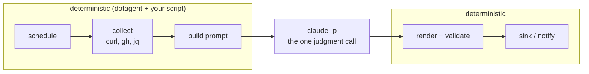
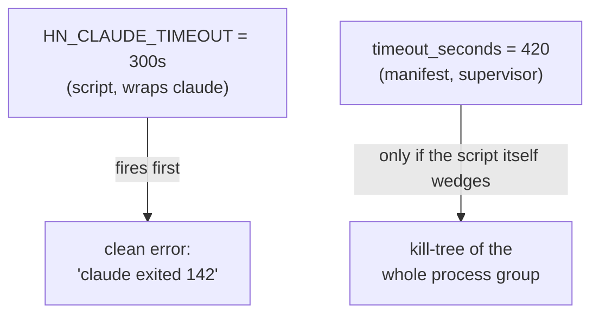

# LLM agents (`claude -p`)

> How to call a model from an agent without the model becoming the
> agent. The headless gotchas, the failure modes, and the two-layer
> timeout that keeps a hung run from becoming a zombie.

dotagent has **zero LLM dependencies**. There's no SDK to import, no API
key it reads, no provider it knows about. An agent that wants a model
spawns a CLI, exactly like it spawns `jq`:

```bash
claude --model sonnet --system-prompt "$system_prompt" -p - <prompt.txt >out.txt
```

That's the whole integration. Everything below is about doing it without
getting burned.

Working example to read alongside this page:
[`examples/hn-digest`](../../examples/hn-digest).

## The inverted loop

The default assumption in 2025-2026 is that an "AI agent" means a model
in charge: it decides what to run, when, and in what order, and calls
tools to get there.

dotagent inverts it. A scheduler that cannot think orchestrates, and the
model is a subprocess that does one bounded thing:



This sounds backwards until you run it daily for a month. The reasoning
is in [`concepts/agents.md`](../concepts/agents.md#the-dotagent-definition)
and the story of arriving at it is in the
[introduction](../README.md#how-this-got-here). The short version: an LLM
regenerating your orchestration on every run pays tokens to rewrite code
that already worked yesterday, and it's slower and less predictable while
doing it.

So the rule of thumb:

| Task                                        | Who does it |
|---------------------------------------------|-------------|
| Fetch the top 30 stories from an API        | Code        |
| Decide which 3 are worth reading            | Model       |
| Sort by score, filter nulls, dedupe         | Code        |
| Write one sentence on why a story matters   | Model       |
| Build the output the sink parses            | Code        |
| Classify an ambiguous email                 | Model       |

If a task has one correct answer, code it. If it needs judgment, prompt
it. Most agents need the model for one step, sometimes zero.

## The invocation

Two separate channels, and keeping them separate is the point:

```bash
# The contract: static, lives in git, reviewed like code.
system_prompt=$(cat "$AGENT_HOME/prompt.md")

# The data: this run only, built into a temp file.
{
  echo "Today's stories:"
  jq . "$AGENT_TMPDIR/stories.json"
  echo "Pick the 3 most interesting."
} >"$AGENT_TMPDIR/prompt.txt"

claude --model sonnet \
  --system-prompt "$system_prompt" \
  -p - <"$AGENT_TMPDIR/prompt.txt" >"$AGENT_TMPDIR/out.txt"
```

**`-p -` reads the user prompt from stdin.** Use it. Passing a large
prompt as an argv string runs into length limits and drags every shell
quoting problem along with it. Stdin has neither.

**The system prompt is a file in the agent directory.** It diffs in
review, and when output quality drifts you can `git log prompt.md` and
see what changed. A prompt built inline by string concatenation can't be
audited after the fact.

> `--system-prompt` **replaces** the CLI's default system prompt.
> `--append-system-prompt` adds to it. For a scheduled job that must
> produce one exact output shape, replacing is usually what you want.

## Headless is not your terminal

`claude -p` in a daemon-spawned process is a different environment from
`claude` in your shell, in ways that fail silently.

### There is nobody to approve a tool call

Interactively, a tool call prompts you. Headless, there's no TTY and no
human. Grant tools explicitly:

```bash
claude --allowedTools "WebFetch,WebSearch" --system-prompt "$sp" -p -
```

Without the flag the run can't use tools at all, which is a fine default
when the model only has to write prose about data you already collected.
List exactly what the task needs and nothing else — this is the one place
where you decide what a model running unattended on your machine is able
to touch.

### MCP servers are not inherited

An interactive session reads `mcpServers` from your user config. **A
headless `-p` run does not.** Your MCP tools are simply absent, and the
model reports it couldn't find the tool rather than failing loudly.

Pass the config explicitly:

```bash
# Extract the mcpServers block from the user config into a headless config.
python3 - <<'PY' >"$AGENT_TMPDIR/mcp.json"
import json, os, sys
with open(os.path.expanduser("~/.claude.json")) as f:
    d = json.load(f)
json.dump({"mcpServers": d.get("mcpServers", {})}, sys.stdout)
PY

claude --mcp-config "$AGENT_TMPDIR/mcp.json" \
  --allowedTools "mcp__myserver__search" \
  -p - <"$prompt_file"
```

### MCP tool names must match exactly

Headless resolves tool names by exact string, with no fuzzy matching. The
name is `mcp__<server>__<tool>`, where `<server>` is the key under
`mcpServers` in your config, not the product name.

If your config nests servers behind a proxy whose key is itself `mcp`,
the real name has both prefixes:

```
mcp__roam__get_page        # wrong, if "roam" is reached through a proxy
mcp__mcp__roam__get_page   # right, when the server key is "mcp"
```

Get it wrong and the tool is silently unavailable. Verify against your
config rather than guessing.

### Skills don't fire reliably

A skill that triggers dependably in an interactive session may not fire
under `-p`. If a skill's behavior is load-bearing, invoke it by name in
the prompt **and** inline the parts you can't lose. Defense in depth, not
a single hook.

## Two layers of timeout

A model call can hang. Guard it in the script *and* in the manifest, with
the script's limit lower:



The script's timeout tells you **which step** hung. The supervisor's
timeout only tells you the agent didn't finish. You want the first one to
win.

macOS ships no `timeout` (that's GNU coreutils). Perl's `alarm` is built
in everywhere, and `exec` preserves the PID so the supervisor's kill-tree
still reaches the real process:

```bash
run_with_timeout() {
  local seconds="$1"; shift
  perl -e 'alarm shift; exec @ARGV' "$seconds" "$@"
}

run_with_timeout 300 claude --model sonnet -p - <"$prompt_file" >"$out"
```

## How LLM calls actually fail

Not the way scripts fail. Handle these explicitly:

### Empty output with a zero exit

The most common failure, and it does **not** set a non-zero exit code.
Without a guard you publish a blank block over yesterday's good one:

```bash
if [[ ! -s "$out" ]]; then
  echo "[$AGENT_NAME] error: claude returned empty output" >&2
  exit 1
fi
```

Exiting non-zero here is the right move: dotagent retries per your
`[defaults]`, and pages you only when retries are exhausted.

### Output that ignores the format

The model wraps the answer in a fence, adds "Here's your digest:", or
appends a closing remark. When you need structured output, parse
tolerantly instead of trusting the first attempt:

```bash
# Try raw, then a ```json fence, then the first {...} block.
if jq -e . "$out" >/dev/null 2>&1; then
  cp "$out" "$parsed"
elif sed -n '/```json/,/```/p' "$out" | sed '1d;$d' | jq -e . >/dev/null 2>&1; then
  sed -n '/```json/,/```/p' "$out" | sed '1d;$d' >"$parsed"
else
  echo "[$AGENT_NAME] error: no JSON in claude output" >&2
  cat "$out" >&2
  exit 1
fi
```

### Formatting that breaks the downstream parser

Sink plugins parse stdout by indentation
([the contract](../concepts/plugins.md)). A stray blank line flattens the
hierarchy. Tell the model in `prompt.md`, then enforce it in the script
anyway:

```bash
sed '/^[[:space:]]*$/d' "$out"
```

**Never let a contract live only in the prompt.** State it there so the
model has the best chance, and re-assert it in code so a bad run degrades
instead of corrupting the destination.

Related: depend on ranges rather than exact values. The sink treats
`indent ≤ 3` as L1, so a model emitting 1 space on one line and 2 on the
next produces the same tree. A prompt that requires exact space counting
is a prompt that breaks weekly.

### Anything the output's correctness depends on

Generate it in the script, not the model. The marker a sink matches on,
the date, the page name, the root line:

```bash
echo "#hn-digest $(date +%Y-%m-%d)"   # script owns this
sed '/^[[:space:]]*$/d' "$out"        # model owns only the body
```

If the model hallucinates a marker, an idempotent sink stops recognizing
its own previous block and starts appending duplicates every run.

### Fall back to something deterministic when you can

If a degraded output beats no output, don't fail — drop to code:

```bash
body=$(claude --model sonnet -p - <"$prompt_file" 2>/dev/null)
if [[ -z "$body" ]]; then
  echo "[$AGENT_NAME] warn: claude failed, falling back to flat list" >&2
  body=$(jq -r '.[] | "  " + .title' "$AGENT_TMPDIR/stories.json")
fi
```

## Where the latency actually is

For a scheduled agent, none of this matters — nobody is waiting. For anything
conversational, it is the whole experience, and the intuition about where the
time goes is usually wrong.

Numbers below are measured on a real Telegram assistant, answering a trivial
prompt with no tool call, so they isolate fixed cost from the model's thinking.

### The MCP proxy you spawn per run

| toolkit | time |
|---|---|
| no MCP server at all | 4.0s |
| `dotagent mcp` (28 tools) | 3.8s |
| plus an aggregating proxy over **stdio** | 12.0s |
| plus the same proxy over **HTTP, already running** | 3.4s |

`dotagent mcp` is free — it reads the catalog off disk and answers in ~20ms.
An aggregating proxy is not: spawned per run it reopens its database,
rediscovers every backend and reclassifies every tool before the first
request. If a proxy is already listening, connect to it instead of spawning a
private copy:

```json
{ "mcpServers": { "proxy": { "type": "http", "url": "http://127.0.0.1:7332/mcp" } } }
```

### The transcript you replay

`--resume` sends the whole conversation as input, and nothing trims it:

| transcript | answer |
|---|---|
| ~90 KB | 8-10s |
| 977 KB (228 messages, ~128k tokens) | 26-141s |

A chat gets monotonically slower the more you use it, which reads as "the bot
got worse" rather than as a size problem. Put a ceiling on it and start a
fresh session past that, and keep what must survive in
[memory](../concepts/memory.md) instead of in the transcript.

### The process you fork per message

`claude -p` pays startup every invocation. `--input-format stream-json` keeps
one process reading turns from stdin, so the session never leaves memory:

| | 1st answer | 2nd answer |
|---|---|---|
| fork per message | 3.91s | 4.94s |
| one persistent process | 3.46s | **1.90s** |

Every message after the first is a second message. Holding a process alive used
to mean running something the supervisor did not manage — deadlines, reaping
and crash recovery became yours. It no longer does: declare `[lifecycle] mode =
"persistent"` and dotagent keeps the process alive, delivers requests over
[JSON lines](../reference/persistent-protocol.md), and supervises it like every
other subprocess. Set `key = "chat_id"` so each conversation gets its own.

Still worth it for a chat and not for a cron job. A process that lives is a
process that can leak and drift, and a scheduled agent has nothing to gain.

### Tools you publish but never call

Clients stop putting tool schemas in the prompt past a few hundred and defer
them behind a lookup step, which turns one answer into several round trips —
16 lookups in a single reply, in one measured case. Publishing 204 tools when
the agent uses a dozen is not free, so narrow the catalog to what the agent
actually needs.

### One that is easy to miss

Anything feeding the invocation must be **deterministic**, or the caching
underneath it silently never hits. A proxy listing its servers from a hash map
returned them in a different order every call; that reordered the allowlist,
which changed the session fingerprint, which threw away the warm session on
every single message. Sorting one list fixed it. If a cache "does not seem to
work", check that its key is stable before assuming the cache is broken.

## Cost control

**Dry run must not spend tokens.** `AGENT_DRY_RUN=true` should collect,
dump what it gathered, and exit before the model call. That's what makes
`dotagent run <name> --dry-run` safe to hammer while you're debugging
collection:

```bash
if [[ "$AGENT_DRY_RUN" == "true" ]]; then
  jq . "$AGENT_TMPDIR/stories.json"
  exit 0
fi
```

**Retry policy costs money.** Every retry is another full call. Two is
usually right for a model: it absorbs a rate limit or a network blip,
and a third failure means something real is broken.

```toml
[defaults]
max_retries = 2
retry_backoff_minutes = [5, 15]
```

**Match the model to the task.** Picking 3 items out of 20 and writing a
sentence each is not frontier work. Make it a tunable so you can change
your mind without touching the script:

```toml
[env.extra]
HN_CLAUDE_MODEL = "haiku"
```

**Shrink the prompt, not just the model.** Filter and compact in `jq`
before the call. Sending 20 pre-trimmed records beats sending 200 raw
ones and asking the model to ignore most of them.

## Secrets

The `claude` CLI uses the credentials it already has (keychain,
`~/.claude.json`). Agents in this shape export **no** API key.

If you call a provider that does need one, it goes in
`~/.config/dotagent/secrets.env` and never in `agent.toml` — see
[`concepts/secrets.md`](../concepts/secrets.md). Manifests are committed;
`[env.extra]` is for tunables, not credentials.

## Security

A model choosing what to do with granted tools is a wider blast radius
than a shell script following a fixed path. Declare it:

```toml
[security]
allowed_commands = ["bash", "curl", "jq", "perl", "claude"]
allowed_plugins = ["sink-file"]
network = ["hacker-news.firebaseio.com", "api.anthropic.com"]
filesystem_writable = ["/tmp"]
```

Enforcement is still landing (see
[`security/threat-model.md`](../security/threat-model.md)), so today this
documents intent and gives `dotagent doctor` something to audit. Writing
it is still worth the two minutes: it forces you to answer "what can this
thing reach?" while you still remember.

Two habits that matter more than the manifest:

- **Keep `--allowedTools` minimal.** It's the actual boundary right now.
- **Treat collected data as untrusted.** You're pasting HN titles, email
  bodies and Slack messages into a prompt. Anything that reaches the
  model can try to instruct it. This is why the script, not the model,
  owns the marker line and the destination.

## When not to reach for a model

- **The output is structured data.** If you know the fields, `jq` is
  faster, free, and can't hallucinate.
- **The rule is expressible.** "Sender matches this list → label it" is
  an `if`. Save the model for the residue.
- **You need the same answer every time.** Models are not idempotent.
- **It runs every 5 minutes.** Multiply tokens by 288 runs a day before
  committing.

The strongest agents in practice are mostly deterministic with one model
call in the middle. Some have none at all — see
[`examples/disk-alert`](../../examples/disk-alert).

## Related

- [`examples/hn-digest`](../../examples/hn-digest) — everything on this
  page, working, in bash
- [`concepts/agents.md`](../concepts/agents.md) — the agent patterns,
  including "Pattern 2 — Brief / digest"
- [`reference/env-vars.md`](../reference/env-vars.md) — the `AGENT_*`
  vars your script reads
- [`concepts/secrets.md`](../concepts/secrets.md) — where API keys go
- [`examples/telegram-assistant`](../../examples/telegram-assistant) — the
  conversational shape, with per-chat sessions and a ceiling on the transcript
- [`concepts/memory.md`](../concepts/memory.md) — what should outlive a
  conversation, and why a transcript is the wrong place for it
- [`guides/troubleshooting.md`](troubleshooting.md) — when a scheduled
  run misbehaves
- [`faq.md`](../faq.md#will-dotagent-run-my-llm-agents) — the short
  version of this page
