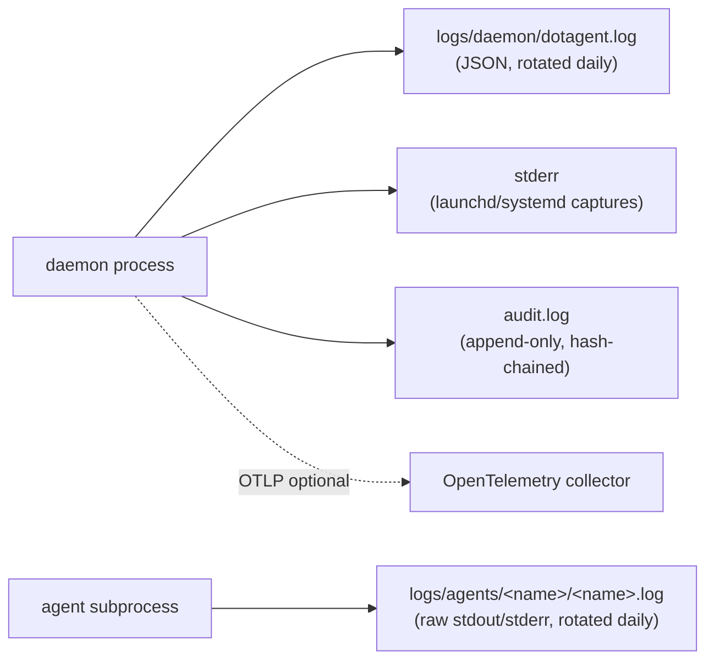

# Observability

> dotagent ships with structured JSON logs, daily rotation, and
> opt-in OpenTelemetry export from day zero. No need to bolt on a logging
> stack later — pick what you want to plug into and go.

## TL;DR

**There's nothing to configure.** Install dotagent, start the daemon,
and you immediately get:

- Daemon stderr → captured by launchd / systemd (compact human-friendly text)
- Daemon structured logs → `~/.config/dotagent/logs/daemon/dotagent.log` (JSON, rotated daily)
- Each agent's stdout+stderr → `~/.config/dotagent/logs/agents/<name>/<name>.log` (raw, rotated daily)
- Rotated files older than 1 day → gzipped automatically
- Files older than 30 days (daemon) / 14 days (agents) → deleted automatically
- Audit log → `~/.config/dotagent/audit.log` (append-only, never rotated)

The `config.toml` file is **entirely optional**. Create one only if you
want to:
- Change verbosity / retention horizons
- Enable OpenTelemetry export to a remote backend
- Override defaults for your environment

This guide covers:

1. [What gets logged](#what-gets-logged) — daemon, agents, plugins, audit
2. [Where things live](#filesystem-layout) — log directory layout
3. [Log format](#log-format) — JSON schema with examples
4. [Rotation and retention](#rotation-and-retention) — defaults + customizing
5. [Inspecting locally](#inspecting-locally) — `dotagent logs`, `jq` queries
6. [OpenTelemetry export](#opentelemetry-export) — opt-in, two-line setup
7. [Audit log vs operational log](#audit-log-vs-operational-log) — different purpose, different rules
8. [Troubleshooting](#troubleshooting)

## What gets logged

dotagent has **four** distinct log streams:



| Stream                  | Producer            | Format                | Rotation         | Purpose                                      |
|-------------------------|---------------------|-----------------------|------------------|----------------------------------------------|
| `logs/daemon/dotagent.log` | daemon's `tracing` | JSON (one line per record) | daily, gzip → delete | Structured operational logs for debugging   |
| `logs/agents/<name>/<name>.log` | agent process stdout+stderr | Raw text         | daily, gzip → delete | What the agent script actually said          |
| stderr                  | daemon's `tracing` | Compact text          | (launchd / systemd handles) | Human-friendly tail-able stream           |
| `audit.log`             | daemon              | Newline-delimited JSON, hash-chained | NEVER rotates | Tamper-evident security event ledger |

OpenTelemetry (when enabled) re-emits the **same** structured records as
OTLP spans, so any backend gets the full picture.

## Filesystem layout

Everything under `$DOTAGENT_HOME` (default `~/.config/dotagent`):

```text
~/.config/dotagent/
├── config.toml              # global config (logging + telemetry)
├── agents/                  # manifests
├── plugins/                 # custom plugin binaries
├── state/
│   ├── agents/<name>/<slug>.heartbeat.json
│   ├── windows/<agent>-<slug>-<date>.json
│   ├── plugins/<name>/<key>.json
│   ├── known_manifests.json
│   └── daemon.pid
├── logs/
│   ├── daemon/
│   │   ├── dotagent.log               # current (today)
│   │   ├── dotagent.log.2026-05-19    # yesterday
│   │   └── dotagent.log.2026-05-18.gz # older, compressed
│   └── agents/
│       ├── finops-weekly/
│       │   ├── finops-weekly.log
│       │   └── finops-weekly.log.2026-05-19
│       └── linkedin-hot-take/
│           └── linkedin-hot-take.log
└── audit.log                           # append-only, NEVER rotates
```

## Log format

Daemon records are JSON with `tracing`'s standard envelope:

```json
{
  "timestamp": "2026-05-19T10:34:12.518472-03:00",
  "level": "INFO",
  "fields": {
    "message": "dispatching run",
    "agent": "team-standup",
    "schedule": "daily",
    "attempt": 1,
    "max_retries": 20,
    "expected": "2026-05-19T08:30:00-0300"
  },
  "target": "dotagent::commands::daemon",
  "span": { "name": "tick", "agents_scanned": 4 },
  "spans": [
    { "name": "daemon" }
  ]
}
```

Key field conventions used across the codebase:

| Field            | Where                       | Notes                                              |
|------------------|-----------------------------|----------------------------------------------------|
| `agent`          | run/dispatch/plugin records | agent name (matches `agent.toml` `agent.name`)     |
| `schedule`       | run/dispatch records        | schedule id (matches `[[schedules]].id`)           |
| `attempt`        | retry records               | 1-based attempt number                             |
| `exit_code`      | post-run records            | agent's exit code (`124` = timeout)                |
| `duration_seconds` | post-run records          | wall-clock duration                                |
| `plugin`         | plugin / notifier invocations | plugin short name (`sink-roam`) or `notifier:<driver>` for built-in notifiers (`notifier:desktop`, `notifier:imessage`, ...) |
| `event`          | plugin / notifier invocations | `attempt_failed`/`given_up`/`recovered`/...        |

Agent log files (`logs/agents/<name>/<name>.log`) are NOT JSON — they're
the raw stdout+stderr the agent script produced, prefixed with a header
per run:

```text
=== 2026-05-19T08:30:01-0300 run started · schedule=daily · slug=period_dia-anterior ===
mount: /
free:  87.3 GB / 460.4 GB (18%)
threshold: 20%
--- stderr ---
🚨 disk-alert: 18% free on /
    avail: 87.3 GB / 460.4 GB
    threshold: 20%
    host: avelino-igloo
```

Mixing structured (daemon) + raw (agent) is deliberate: the daemon's
metadata is uniform across all runs, the agent's output is whatever
shape its author chose.

## Rotation and retention

**You don't need to configure anything.** Out of the box, dotagent
ships these defaults:

| Setting                    | Default | What it means                                          |
|----------------------------|---------|--------------------------------------------------------|
| `level`                    | `info`  | tracing filter (`off`, `error`, `warn`, `info`, `debug`, `trace`) |
| `format`                   | `compact` | stderr format. Files are always JSON regardless.    |
| `retention_days`           | `30`    | daemon logs older than this are deleted               |
| `per_agent_retention_days` | `14`    | agent logs (typically noisier; shorter horizon)       |
| `compress_after_days`      | `1`     | rotated files older than this are gzipped             |

If those match what you want, **don't create a `config.toml`** — the
defaults kick in automatically.

### Customizing

Override any subset by writing `~/.config/dotagent/config.toml`. Missing
fields keep their defaults — the file is purely partial overrides.

```toml
# ~/.config/dotagent/config.toml
[logging]
level = "debug"                # turn up verbosity
retention_days = 90            # keep three months
```

Apply with `dotagent reload` (sends SIGHUP; daemon re-reads the file on
the next tick).

You can also override the level transiently via env var (overrides the
config file):

```bash
RUST_LOG="dotagent=debug,dotagent_runner=trace" dotagent daemon
```

### How rotation works

`tracing-appender` rolls files daily — at midnight local time, the
current file gets renamed to `<name>.log.YYYY-MM-DD` and a fresh
`<name>.log` is opened.

### How retention sweeps work

The daemon runs an internal cleanup pass once per day at **03:00 local
time**. It:

1. Walks `logs/daemon/` and every `logs/agents/<name>/` directory.
2. Files older than `compress_after_days` get gzipped in-place.
3. Files older than `retention_days` (or `per_agent_retention_days`
   inside agent dirs) get deleted.

The audit log is **never** swept — see [Audit log vs operational
log](#audit-log-vs-operational-log).

To trigger a sweep manually:

```bash
# Restart the daemon at 03:00, OR — simpler — wait. The sweeper is
# idempotent; nothing happens if there's nothing aged out.
dotagent reload     # SIGHUP doesn't re-sweep, but the next 03:00 will
```

## Inspecting locally

### Tail the daemon log

```bash
tail -F ~/.config/dotagent/logs/daemon/dotagent.log | jq .
```

Or via the launchd-captured stderr (compact, human format):

```bash
tail -F ~/.config/dotagent/logs/daemon/run.avelino.dotagent.log
```

### Tail an agent's output

```bash
dotagent logs team-standup
dotagent logs team-standup --follow
dotagent logs team-standup -n 200
```

### Query the daemon log with `jq`

```bash
# All runs of a specific agent today
jq -c 'select(.fields.agent == "team-standup")' \
  ~/.config/dotagent/logs/daemon/dotagent.log

# Failures only
jq -c 'select(.level == "WARN" or .level == "ERROR")' \
  ~/.config/dotagent/logs/daemon/dotagent.log

# Runs that timed out
jq -c 'select(.fields.exit_code == 124)' \
  ~/.config/dotagent/logs/daemon/dotagent.log

# Plugin invocations and their outcomes
jq -c 'select(.fields.plugin) | {ts: .timestamp, plugin: .fields.plugin, ok: .fields.ok}' \
  ~/.config/dotagent/logs/daemon/dotagent.log
```

### Health snapshot

```bash
dotagent status         # textual dashboard
dotagent inspect team-standup     # heartbeat + schedule + windows
```

## OpenTelemetry export

**Disabled by default.** Out of the box, dotagent writes everything to
local files (stdout/stderr captured by launchd/systemd + the JSON file
described above). Nothing leaves your machine. That's intentional —
zero-config, zero network egress.

Turn it on by writing **just two lines** of `config.toml`:

```toml
# ~/.config/dotagent/config.toml
[telemetry]
otlp_endpoint = "https://api.honeycomb.io:443"
```

Authentication uses the standard OTel env var so dotagent doesn't need
vendor-specific config:

```bash
export OTEL_EXPORTER_OTLP_HEADERS="x-honeycomb-team=YOUR_API_KEY"
dotagent reload                    # daemon picks up the change on SIGHUP
```

That's it — every span the daemon emits (`tick`, `agent_run`,
`plugin_invoke`) shows up in your backend.

### Fuller config (all fields optional)

```toml
[telemetry]
otlp_endpoint = "https://api.honeycomb.io:443"
protocol = "grpc"                  # "grpc" (default) or "http"
service_name = "dotagent"          # default

[telemetry.resource]                # extra attributes attached to every span
"deployment.environment" = "production"
"host.name" = "avelino-igloo"
```

### Vendor recipes

#### Honeycomb

```toml
[telemetry]
otlp_endpoint = "https://api.honeycomb.io:443"
service_name = "dotagent"
```

```bash
export OTEL_EXPORTER_OTLP_HEADERS="x-honeycomb-team=YOUR_KEY"
```

EU region: use `api.eu1.honeycomb.io:443`.

#### Grafana Tempo (self-hosted or Grafana Cloud)

```toml
[telemetry]
otlp_endpoint = "https://tempo-prod-04-prod-eu-west-0.grafana.net:443"
service_name = "dotagent"
```

Grafana Cloud auth:

```bash
export OTEL_EXPORTER_OTLP_HEADERS="Authorization=Basic $(printf %s "$STACK_ID:$API_TOKEN" | base64)"
```

Self-hosted Tempo without auth:

```toml
[telemetry]
otlp_endpoint = "http://tempo.lan:4317"
service_name = "dotagent"
```

#### Jaeger (local)

```bash
docker run -d --name jaeger \
  -p 4317:4317 -p 16686:16686 \
  jaegertracing/all-in-one:latest
```

```toml
[telemetry]
otlp_endpoint = "http://localhost:4317"
service_name = "dotagent"
```

Open `http://localhost:16686`, pick `dotagent` from the service list.

#### Datadog

Datadog wants the OTLP receiver enabled on its agent:

```toml
[telemetry]
otlp_endpoint = "http://localhost:4317"        # local Datadog agent
service_name = "dotagent"
```

```bash
# In your datadog-agent.yaml:
#   otlp_config.receiver.protocols.grpc.endpoint: 0.0.0.0:4317
```

### What gets exported

Today the OTel pipeline exports **spans**:

- `daemon`            — root span for the daemon process lifetime
- `tick`              — one per scheduler tick
- `agent_run`         — one per agent invocation
- `plugin_invoke`     — one per plugin call (preflight / on_success / on_failure)

Logs are NOT yet OTLP-exported (the `tracing → OTLP logs` bridge is
on the roadmap). For now, ship logs via your filesystem agent
(`fluent-bit`, `vector`, `promtail`) reading the JSON file.

## Audit log vs operational log

These look similar but serve different purposes — **do not conflate them**.

|                | Audit log                          | Operational logs                     |
|----------------|------------------------------------|--------------------------------------|
| Path           | `~/.config/dotagent/audit.log`     | `~/.config/dotagent/logs/`           |
| Format         | NDJSON, hash-chained (`prev_hash`) | NDJSON (`tracing` style)             |
| Producer       | daemon, on consequential events    | daemon's `tracing` macros            |
| Frequency      | sparse (5–50 entries/day)          | dense (thousands/day)                |
| Rotation       | **NEVER**                          | daily, gzip, then delete             |
| Retention      | indefinite                         | configurable (default 30/14 days)    |
| Mutability     | append-only; tamper detectable     | overwritten on rotation              |
| Schema         | strict (typed `AuditEvent` variants) | unstructured (`tracing` Fields)    |
| Use case       | forensics, security audit          | debugging, tail-the-app              |

You should `grep` the audit log when answering "was this run authorized?
who changed manifest X? when did the daemon last say a plugin was
phantom?". You should `jq` the operational log when answering "why did
the last 5 ticks take so long?".

## Troubleshooting

### Log directory missing after install

dotagent creates `logs/daemon/` on first daemon start. Run:

```bash
dotagent run hello-fish --schedule manual   # smoke
ls -la ~/.config/dotagent/logs/
```

### Log file not rotating

`tracing-appender` rotates at **first write past midnight**. If the
daemon is idle (no event after midnight), the rename is deferred until
the next log line. Force one:

```bash
dotagent reload
```

### Sweeper not running

The sweeper fires at 03:00 ± 30min and is single-shot per calendar day.
Check the daemon log for the line `log retention sweep completed`. If
absent for >24h, file an issue with the daemon log timestamps.

### Disk filling despite retention

- Check `retention_days` isn't unreasonable: 90+ days × verbose level
  = real disk.
- Check that the sweeper has write permission. `logs/agents/<name>/`
  inherits the daemon's umask; if your agent script chowns its log
  dir, the sweep fails silently.

### OTel pipeline not exporting

Confirm the daemon picked up the config:

```bash
grep otlp_endpoint ~/.config/dotagent/config.toml
dotagent reload
tail -F ~/.config/dotagent/logs/daemon/dotagent.log | jq 'select(.fields.message | contains("otel"))'
```

Common gotchas:

- **TLS error**: the OTLP endpoint requires `https://` (gRPC over TLS).
  Local Jaeger uses `http://localhost:4317`.
- **Headers**: vendor-specific auth goes in `OTEL_EXPORTER_OTLP_HEADERS`,
  not in `config.toml`. Comma-separated `k1=v1,k2=v2`.
- **Reload required**: changing config without restarting the daemon
  is a no-op for OTel. Use `dotagent reload`.

### Logs full of noise

Lower the verbosity:

```toml
[logging]
level = "warn"
```

Or per-target via env:

```bash
RUST_LOG="dotagent=info,dotagent_runner=debug" dotagent daemon
```

## Related

- [`docs/concepts/agents.md`](../concepts/agents.md) — what an agent is
- [`docs/concepts/plugins.md`](../concepts/plugins.md) — how plugins emit events
- [`docs/reference/agent-spec.md`](../reference/agent-spec.md) — manifest fields
- [`docs/security/threat-model.md`](../security/threat-model.md) — audit log's
  role in detection
