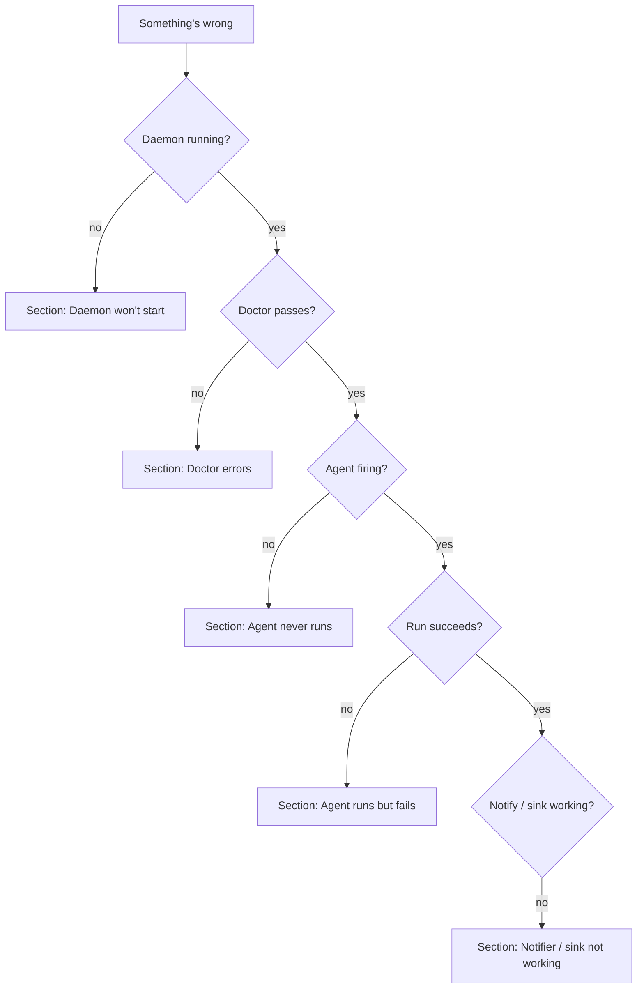

# Troubleshooting

> Sintoma → diagnostic → fix. Top-down by where the problem lives.

The decision tree:



When in doubt, start with `dotagent doctor` + `dotagent status` —
they're read-only and give the most signal per second.

---

## Daemon won't start

### Symptom: `dotagent reload` says "daemon not running"

```bash
ls -l ~/.config/dotagent/state/daemon.pid
```

- **File missing** → daemon was never started (or was bootouted). Start it:
  - macOS: `launchctl bootstrap "gui/$(id -u)" ~/Library/LaunchAgents/run.avelino.dotagent.plist`
  - Linux: `systemctl --user enable --now run.avelino.dotagent`
- **File present** but `ps -p $(cat …)` returns nothing → stale pidfile
  from a crashed daemon. Delete it and start again:
  ```bash
  rm ~/.config/dotagent/state/daemon.pid
  ```

### Symptom: launchd / systemd loads the unit but the daemon dies immediately

Check the captured stderr:

```bash
tail -50 ~/.config/dotagent/logs/daemon/run.avelino.dotagent-error.log
```

Common causes:

| Error in stderr                                | Fix                                                                                      |
|------------------------------------------------|------------------------------------------------------------------------------------------|
| `telemetry init failed: ...`                   | Bad `[telemetry]` config. Either fix `config.toml` or delete the section.                |
| `config.toml parse error: ...`                 | TOML syntax issue. Validate with `toml-cli get config.toml .` or remove the file.        |
| `No such file or directory: dotagent`          | The unit's `ExecStart` points at a binary that was moved. Re-run `dotagent install`.    |
| `permission denied`                            | The dotagent binary lost the executable bit. `chmod +x` it.                              |

### Symptom: macOS — unit loads but `launchctl print` shows `state = exited`

ThrottleInterval (10s) is in play — launchd waits 10s before respawning.
After many crashes in quick succession, launchd will back off further. The
real diagnosis is in the error log above.

### Symptom: Linux — `systemctl --user status` shows `Active: inactive (dead)` despite `enable --now`

```bash
journalctl --user -u run.avelino.dotagent -n 50
```

If you see `User lingering not enabled`, the user session is killed at
logout. Enable lingering:

```bash
loginctl enable-linger $USER
```

---

## Doctor errors

### `agent.name is empty`

The `[agent].name` field is missing or `""`. Open the manifest and add it.

### `run.command is empty`

`[run].command` field missing. dotagent needs the command to invoke
(e.g., `"fish"`, `"python3"`, `"./agent"`).

### `duplicate schedule id: <id>`

Two `[[schedules]]` blocks have the same `id`. Schedule ids must be
unique **within a single manifest** — across different manifests they
can repeat.

### `✗ plugin <name> not found`

A `[[preflight]]`, `[[on_success]]`, `[[on_failure]]`, or
`[[notifiers]] driver = "plugin"` references a plugin binary that
isn't on `$PATH`.

```bash
# Where would dotagent look?
echo $DOTAGENT_PLUGIN_PATH                                    # custom (if set)
ls ~/.config/dotagent/plugins/                                 # user-local
ls /usr/local/lib/dotagent/plugins/                            # system-wide
which dotagent-plugin-sink-roam                                # $PATH
```

If absent on all four:

- Brew install: `brew install dotagent` (when tap publishes) ships
  every first-party plugin.
- Cargo install: `cargo install --path plugins/sink-roam` (or whichever).
- Release binaries: re-extract the tarball into a `$PATH` directory.

### `⚠ <name>: no [security] section`

Warning, not error. v0 is schema-only. Add a minimal block to silence
it:

```toml
[security]
# Document intent — enforcement comes in a future release.
network = "allow"
```

See [`security/threat-model.md`](../security/threat-model.md).

### `⚠ <name>: manifest drift since last daemon run`

The on-disk manifest's sha256 doesn't match what's cached in
`state/known_manifests.json` from the last daemon load. Cause is one of:

- **You edited it intentionally.** Run `dotagent reload`. The new
  hash gets cached.
- **You DIDN'T edit it.** Drift detection is doing its job — investigate.
  Compare timestamps:
  ```bash
  stat ~/.config/dotagent/agents/<name>/agent.toml
  git log -p ~/dotfiles/agents/<name>/agent.toml   # if version-controlled
  ```
  See [V1 in the threat model](../security/threat-model.md#v1--manifest-hijack).

---

## Agent never runs

### Symptom: `dotagent doctor` says manifest is fine but the daemon never fires the agent

Start with the dry-run:

```bash
dotagent tick --dry-run
# → (dry-run) scanned N agent(s); would dispatch M; next event: <ts>
```

If `dispatched = 0` and you expected dispatch:

- The current window has already succeeded — heartbeat says
  `last_success_at >= expected_at`. Run `dotagent inspect <name>` to
  confirm.
- The agent's `monitor = false` excludes it from the daemon. Set
  `monitor = true` (or remove the line — default is true).
- The schedule's window is in the future. `next event` shows when.

### Symptom: `monitor = false` agents fire when I don't want them to

`monitor = false` excludes the agent from `tick` / daemon dispatch, but
NOT from `run` / `run-now`. The example `hello-*` agents use this so
they only run when you explicitly invoke them.

### Symptom: agent fires but with the wrong `args`

`AGENT_ARGV` is the schedule's `args`, NOT `[run].args`. The full argv
the agent receives is `[run].command + [run].args + schedule.args`.

```toml
[run]
command = "python3"
args = ["./agent.py", "--mode", "prod"]      # always present

[[schedules]]
id = "weekly"
args = ["--period", "last-week"]              # appended at runtime
```

The Python script is invoked as `python3 ./agent.py --mode prod --period last-week`.
Inside the script, `AGENT_ARGV = ["--period","last-week"]`.

### Symptom: schedule type "interval" doesn't fire on a fresh install

Interval schedules with no previous run start "from now". A
`interval_minutes = 60` agent installed at 14:32 next fires at 15:32.
Set a smaller interval (or `dotagent run-now`) to verify.

### Symptom: cron-style schedule never matches

```toml
[[schedules]]
id = "daily"
type = "cron"
weekdays = [1, 2, 3, 4, 5]
hours = [8]
minute = 30
```

`weekdays`: **0 = Sunday, 6 = Saturday** (matches launchd Weekday). Many
folks expect 0 = Monday — that's cron(8), not us. dotagent matches launchd.

Quick sanity:

```bash
dotagent tick --dry-run
# Compare "next event" with your expectation.
```

---

## Agent runs but fails

### Symptom: `exit_code = 124`

The agent was killed for exceeding `agent.timeout_seconds`. dotagent
sends SIGTERM, waits 5 seconds, then SIGKILL. Either:

- Bump `timeout_seconds` in the manifest.
- Fix the agent (most timeouts are an external CLI hanging — wrap
  with `--timeout`).

### Symptom: agent succeeded once but the daemon keeps re-firing it

The previous run failed and you fixed it without updating state. The
window doesn't yet show `succeeded_at`. Run `dotagent run-now <name>` to
force a fresh success, OR delete the window file:

```bash
rm ~/.config/dotagent/state/windows/<name>-<slug>-<ts>.json
```

The daemon will recompute on the next tick.

### Symptom: `dotagent run` works but the agent fails when the daemon fires it

Almost always an **environment difference**. The interactive shell has
`$PATH` / `$HOME` / `$LANG` you take for granted; the daemon inherits
launchd / systemd's much-poorer env.

Check what the daemon sees:

```bash
# macOS — what env launchd hands to the daemon
launchctl print "gui/$(id -u)/run.avelino.dotagent" 2>&1 | grep -A 20 environment

# Linux
systemctl --user show-environment
```

Set explicit `$PATH` in the agent's manifest:

```toml
[env.extra]
PATH = "/usr/local/bin:/usr/bin:/bin:/opt/homebrew/bin"
```

Or `inherit = true` plus tighten the unit-level env vars in the plist.

### Symptom: preflight aborts the run but I want to see why

```bash
tail ~/.config/dotagent/audit.log | jq 'select(.event.event_type == "preflight_failed")'
```

The `suggest` field is the message the plugin returned ("warp-cli
connect", etc.).

To run the preflight manually:

```bash
echo '{
  "kind": "preflight",
  "agent": "test",
  "schedule": "test",
  "event": "preflight",
  "config": { "connect_command": "warp-cli connect" }
}' | dotagent-plugin-preflight-warp invoke
```

---

## Notifier / sink not working

### Desktop notifier doesn't show banners (macOS)

System Settings → Notifications → make sure the **terminal app
running the daemon** (and possibly `dotagent` itself) is allowed.
notify-rust uses `NSUserNotification`, which inherits the parent
process's notification entitlements.

For launchd-managed daemons, the entitlement lives with the daemon
binary itself — TCC may show `dotagent` as the requestor first time.

### Desktop notifier doesn't show banners (Linux)

`notify-rust` uses D-Bus. Verify the daemon process can talk to your
notification daemon:

```bash
notify-send "test" "hello"
```

If `notify-send` shows nothing, no D-Bus session is reachable. Common
causes:

- Headless / SSH session with no `$DBUS_SESSION_BUS_ADDRESS`.
- systemd user unit started before the graphical target — set
  `Wants=graphical-session.target` in the unit.

### iMessage notifier doesn't send

`imessage` runs `osascript` to talk to Messages.app. Verify manually:

```bash
osascript -e 'tell application "Messages" to send "test" to buddy "+5511..."'
```

If that fails, automation isn't permitted: System Settings → Privacy &
Security → Automation → Terminal (or `dotagent`) → toggle Messages on.

The `imessage` driver also rate-limits via
`$DOTAGENT_HOME/state/notify/imessage/<slug>.json`. If you're sending
within `rate_limit_minutes` of a previous successful send, the call is
**skipped** (not failed). Look for it in the audit log:

```bash
tail ~/.config/dotagent/audit.log \
  | jq 'select(.event.plugin == "notifier:imessage")'
```

### Slack / ntfy / Pushover / Telegram notifier doesn't fire

Native HTTPS — check connectivity from the daemon's environment:

```bash
curl -v -X POST https://hooks.slack.com/services/T0000/B0000/SECRET \
    -H 'Content-Type: application/json' \
    -d '{"text":"test"}'
```

If that succeeds but dotagent's notifier doesn't, check the audit log
for a `Backend(...)` error:

```bash
tail ~/.config/dotagent/audit.log \
  | jq 'select(.event.event_type == "plugin_invoked" and (.event.plugin | startswith("notifier:")))'
```

### Sink plugin appears not to run

Sinks fire **only on agent exit 0**. If the agent failed, only the
notifier path runs.

```bash
# Did the agent succeed?
cat ~/.config/dotagent/state/agents/<name>/<slug>.heartbeat.json | jq .exit_code
# Did the sink get invoked?
tail ~/.config/dotagent/audit.log \
  | jq 'select(.event.event_type == "plugin_invoked" and .event.plugin == "sink-roam")'
```

### `sink-roam` writes but the previous block doesn't get replaced

Your `marker_regex` doesn't match the old root block. See
[`plugins/sink-roam.md`](../plugins/sink-roam.md#block-keeps-duplicating-after-re-runs).

---

## Logs

### `dotagent logs <name>` says "no logs found"

The agent has never run, or the log directory was deleted. Run:

```bash
dotagent run-now <name>
ls ~/.config/dotagent/logs/agents/<name>/
```

### Logs are noisy / full of `tracing` debug spam

```toml
# config.toml
[logging]
level = "warn"
```

Or transient:

```bash
RUST_LOG=warn dotagent daemon
```

### Disk filling despite retention being set

- `retention_days` in `config.toml` only kicks in during the 03:00
  sweep. If the daemon hasn't been alive at 03:00 since the last
  rollover, nothing got swept yet.
- The sweep needs write permission on `logs/agents/<name>/`. If your
  agent script chowns its log directory (don't), the sweep fails
  silently.
- The audit log is **never** swept — it grows linearly. Plan for ~1KB
  per event, a few hundred events/day max.

---

## Audit log

### `audit_chain_broken` event in the log

The daemon detected tampering (or a partial write) of `audit.log`. The
event is itself a chained entry — investigation:

```bash
grep audit_chain_broken ~/.config/dotagent/audit.log | jq .
# {"event":{"event_type":"audit_chain_broken","position":42,...}}
```

`position` is the line number where the chain broke. Read context:

```bash
sed -n '40,45p' ~/.config/dotagent/audit.log | jq .
```

Cause is almost always:

- Someone (or you) edited the file by hand.
- A crash mid-write left a half-line.
- Disk corruption.

dotagent continues operating — the new chain is anchored to the broken
position. Forensics is on you.

---

## Plugin protocol

### Plugin always returns `ok=false`

```bash
# Run the exact payload dotagent would send.
echo '{
  "kind": "sink",
  "agent": "test",
  "schedule": "test",
  "event": "success",
  "message": "smoke",
  "config": <whatever your manifest sets>
}' | dotagent-plugin-<name> invoke
```

Stderr has the human-readable error. Stdout has the JSON response.

### Plugin works manually but not from the daemon

Cause is almost always **environment**:

- `$PATH` differences (covered in
  [Agent runs but fails](#symptom-dotagent-run-works-but-the-agent-fails-when-the-daemon-fires-it)).
- `$DOTAGENT_PLUGIN_PATH` not inherited by launchd. Set it in the
  plist's `EnvironmentVariables`.
- HOME differences (the plugin reads `~/.config/<x>` but the daemon's
  HOME is somewhere unexpected).

### Plugin info JSON is malformed — `dotagent doctor` won't parse it

Run the plugin directly:

```bash
dotagent-plugin-<name> info | jq .
```

If `jq` errors out, the plugin is printing log lines to stdout
(forbidden — stdout is reserved for JSON). Patch the plugin to use
stderr for logs.

---

## Performance

### Daemon CPU usage is high

The daemon **should** be near-zero CPU outside of a tick. If
`top`/`htop` shows persistent CPU:

- A plugin is spinning. `dotagent plugin list` then check each.
- A schedule with `interval_minutes = 0` or similar — fix it (manifest
  validation should catch this; file an issue if not).
- Verbose tracing flooding the file. `RUST_LOG=info` and retry.

### Agent timeout fires every run

Profile the agent outside dotagent (`time fish ./agent.fish`). If it
genuinely takes longer than `timeout_seconds`, bump the manifest. If
it's fast in your shell but slow under the daemon — that's an
environment difference (see env section above).

---

## When all else fails

```bash
# 1. State of the daemon
dotagent status
dotagent tick --dry-run
ps -p $(cat ~/.config/dotagent/state/daemon.pid 2>/dev/null) -o command= 2>/dev/null
launchctl print "gui/$(id -u)/run.avelino.dotagent" 2>&1 | head -30      # macOS
systemctl --user status run.avelino.dotagent                              # Linux

# 2. State of the configured agents
dotagent doctor
dotagent plugin list
for a in ~/.config/dotagent/agents/*/; do
    dotagent inspect "$(basename $a)"
done

# 3. Recent events
tail -100 ~/.config/dotagent/audit.log | jq -c
tail -100 ~/.config/dotagent/logs/daemon/dotagent.log | jq -c

# 4. Resource sanity
df -h ~/.config/dotagent       # disk full?
ls -la ~/.config/dotagent/logs/agents/                   # rogue agent filling logs?
```

If you still can't pin it down, open an issue with the output of (1)
through (4) and a redacted copy of the affected `agent.toml`.

---

## Related

- [`cli.md`](../reference/cli.md) — every subcommand at a glance
- [`daemon-lifecycle.md`](daemon-lifecycle.md) — start / stop / reload
- [`observability.md`](observability.md) — log streams + jq recipes
- [`paths.md`](../reference/paths.md) — where every file lives
- Plugin-specific troubleshooting under [`docs/plugins/`](../plugins/README.md)
