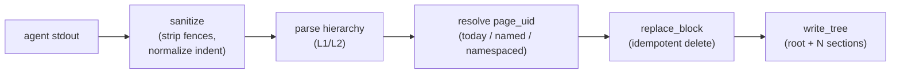

# sink-roam

> Publish an agent's stdout to Roam Research as a hierarchical block
> tree (root + L1 sections + L2 children). Idempotent: re-running a
> schedule replaces the previous block instead of duplicating.

| Property        | Value                                            |
|-----------------|--------------------------------------------------|
| Kind            | `sink`                                           |
| Platforms       | `darwin`, `linux`                                |
| Binary          | `dotagent-plugin-sink-roam`                      |
| External deps   | `mcp` CLI with `roam` server configured           |
| Network         | Whatever the `mcp roam` server hits internally    |

## What it does

This plugin is a faithful port of the legacy `lib/roam.fish` from the
Fish framework. The pipeline:



Each step calls the `mcp` CLI under `mcp roam <tool>` — `get_daily_note`,
`get_page`, `create_page`, `create_block_with_children`, `delete_block`.

## When to use

- Your agent generates **hierarchical markdown** (not arbitrary prose)
  destined for Roam.
- You want re-runs to be idempotent — yesterday's block is replaced,
  not appended to.
- You use Roam as the human-facing dashboard and want this agent's
  output in a specific page/daily note.

## Config schema

| Field          | Type    | Required | Default            | Description                                                          |
|----------------|---------|----------|--------------------|----------------------------------------------------------------------|
| `page`         | string  | **yes**  | —                  | Target page reference. `today` / `April 22nd, 2026` / `acme/tech/aws/X` |
| `marker_regex` | string  | no       | (matches nothing)  | Regex used to find and delete an existing block (idempotency)        |
| `mcp_binary`   | string  | no       | `~/.cargo/bin/mcp` | Override the `mcp` CLI path                                          |

Verify schema at runtime:

```bash
dotagent-plugin-sink-roam info | jq .schema
```

### `page` reference forms

| Form                         | Resolves to                                                       |
|------------------------------|-------------------------------------------------------------------|
| `today`                      | The current daily note (computed by the Roam MCP server)          |
| `April 22nd, 2026`           | A specific daily note (Roam native ordinal format — note `nd`)    |
| `acme/tech/infra/aws/X`     | A namespaced page (created if missing)                            |

> Reminder on Roam's date format: ordinal suffixes are mandatory — `1st`,
> `2nd`, `3rd`, `21st`, etc. Use `[[April 22nd, 2026]]` style in `page`,
> not ISO `2026-04-22` (which creates an orphan page outside the
> daily-note graph).

### Content hierarchy expected on stdin

The plugin's `parse_hierarchy` enforces this convention (mirrors the
Fish framework):

```
#TAG First line is the ROOT (no indentation).
  L1 header — direct child of root (indent ≤ 3 spaces)
    L2 child of the previous L1 (indent > 3 spaces)
    Another L2 of the same L1
  Another L1 header
    L2 of that L1
```

Code fences (` ``` `) are stripped. Everything after a `---` separator
is cut. Leading `- ` per line is removed (Roam adds bullets itself).

## Examples

### DORA standup in today's daily note

```toml
[agent]
name = "team-standup"

[[on_success]]
plugin = "sink-roam"
config = { page = "today", marker_regex = "#DORA.*dia-anterior" }
```

Agent's stdout must look like:

```
#DORA dia-anterior 2026-05-19
  📋 TL;DR
    24 PRs merged today
    Sentry: 3 new issues, none P0
  🎯 Por pessoa
    [[@avelino]]: 4 PRs, 1 release
    [[@mario]]: 6 PRs, 2 reviews
  ---
  Notes after the separator are cut.
```

The marker regex `#DORA.*dia-anterior` matches the root block; on the
next run the plugin deletes it and re-writes — no duplicates.

### LinkedIn draft in today's daily, replacing yesterday's

```toml
[[on_success]]
plugin = "sink-roam"
config = { page = "today", marker_regex = "#LinkedIn.*hot-take" }
```

### Namespaced page (created on first run)

```toml
[[on_success]]
plugin = "sink-roam"
config = {
  page = "acme/tech/infra/aws/finops-2026",
  marker_regex = "#weekly-report"
}
```

### Custom mcp binary path

```toml
[[on_success]]
plugin = "sink-roam"
config = {
  page = "today",
  marker_regex = "#summary",
  mcp_binary = "/opt/dev/mcp-staging"
}
```

## Response shape

### Success

```json
{ "ok": true, "root_uid": "abc123XYZ" }
```

`root_uid` is the UID of the new root block — useful for chasing the
result manually with `mcp roam get_page '{"uid":"abc123XYZ"}'`.

### Validation failed

```json
{ "ok": false, "error": "page is required" }
```

### Runtime failure

```json
{ "ok": false, "error": "<underlying error string>" }
```

Possible causes:

- `mcp` CLI not found (set `mcp_binary`)
- Roam MCP server misconfigured (`mcp roam get_daily_note '{}'` fails)
- Stdin was empty / unparseable
- Page reference couldn't be resolved or created

## Behavior details

### Idempotency

When `marker_regex` matches an existing child of the target page, the
plugin deletes that child *before* writing the new tree. If no match,
the plugin writes a new root regardless — running an un-markered config
twice WILL produce two roots. Always set `marker_regex` for production.

### Sanitization

The plugin tolerates Claude's habits:

- Strips opening/closing ` ``` ` code fences.
- Cuts at the first `---` line — Claude often adds notes / metadata
  after a separator. Those go away.
- Removes `- ` literals at the start of lines (Roam auto-renders bullets;
  the literal would produce `- - foo`).
- Normalizes whitespace.

### Hierarchy threshold

Indent ≤ 3 spaces → L1. Indent > 3 spaces → L2. This forgives small
indentation variations from the LLM.

Orphan L2 lines (no preceding L1) are silently dropped — matches the
legacy Fish parser. If you see content disappear, your output probably
has L2 indentation without an L1 header above it.

### Resolution order for `page`

1. If `page == "today"` → call `mcp roam get_daily_note '{}'` and use
   `.":block/uid"`.
2. Otherwise, try `mcp roam get_page '{"title":"<page>"}'`. If it
   returns a UID, use that.
3. Otherwise, `mcp roam create_page '{"title":"<page>"}'` and use the
   new UID.

This means namespaced pages are auto-created (matching the legacy
behavior). Named dailies (`April 22nd, 2026`) are NOT auto-created if
Roam refuses — it usually finds them.

## External dependencies

- **`mcp` CLI** (in Rust, separate project): https://github.com/avelino/mcp
- **Roam server configured** under the mcp client config
  (`~/.config/mcp/`). Test with:

```bash
mcp roam get_daily_note '{}' | head
```

You should see JSON containing `:block/uid` for today's daily note.

## Manual testing

```bash
# 1) Info
dotagent-plugin-sink-roam info | jq .

# 2) Validate
echo '{"page":"today"}' | dotagent-plugin-sink-roam validate

# 3) Real invoke
echo '{
  "kind": "sink",
  "agent": "test",
  "schedule": "test",
  "event": "success",
  "message": "#TEST root from sink-roam\n  L1 header\n    L2 child",
  "config": {"page":"today","marker_regex":"#TEST"}
}' | dotagent-plugin-sink-roam invoke
```

After this runs, open Roam — today's daily should have a `#TEST root
from sink-roam` block with `L1 header` and `L2 child` nested. Run the
same invoke again: the previous block is deleted and replaced (one
block, not two).

## Troubleshooting

### `mcp roam get_daily_note '{}'` fails

The dotagent plugin can't work without the `mcp` CLI's roam server. Fix
the upstream config:

```bash
ls ~/.config/mcp/                  # roam.json should be here
mcp roam get_daily_note '{}' 2>&1 | head
```

### "no JSON in mcp output"

The mcp CLI is printing tracing INFO lines before the JSON envelope.
The plugin already filters from the first `{` or `[`, but extremely
verbose log levels can corrupt the output. Lower verbosity:

```bash
RUST_LOG=warn mcp roam get_daily_note '{}'
```

Then in dotagent's environment ensure `RUST_LOG` is at most `info`.

### Block keeps duplicating after re-runs

Your `marker_regex` doesn't match the root block's text. Test the
regex against your actual output:

```bash
# What's currently in the daily?
mcp roam get_daily_note '{}' \
  | jq -r '.content[0].text' \
  | jq -r '.":block/children"[]? | .":block/string"'
```

The regex is matched via Rust's `regex` crate (PCRE-ish syntax). Anchor
with `^`/`$` if needed, escape `.`/`+`/`*`.

### Orphan L2 lines disappear

Make sure every L2 line has an L1 line above it. The parser drops L2
without context.

### Content was cut at `---`

That's intentional. Either remove the separator from your prompt's
output, or move the kept content above it.

## See also

- [Concept guide](../concepts/plugins.md)
- [`sink-file`](sink-file.md) — for non-hierarchical / flat output
- [Roam date format guidance](../../CLAUDE.md) — native ordinal format
  is mandatory for daily-note resolution
- Source: [`plugins/sink-roam/`](../../plugins/sink-roam/)
- Legacy reference: `lib/roam.fish` in the avelino/dotfiles repo
