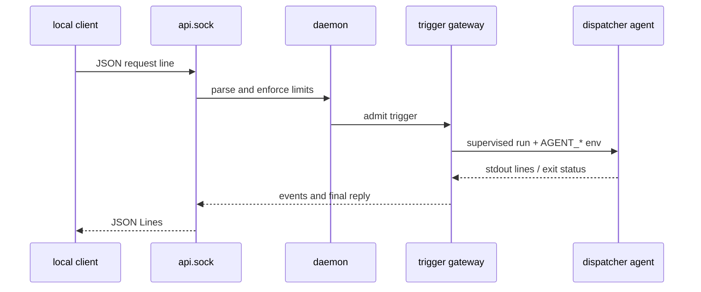

# Local Client API

This document specifies the current local client API served by the dotagent
daemon. It is a transport for triggers and run output, not a conversation
runtime.

The daemon remains a harness:

- It discovers the configured dispatcher, admits and orders triggers, supervises
  agent runs, and delivers output.
- It does not own a chat session, transcript, model context, or LLM state.
- `session_id` is opaque. The daemon passes it to the agent as
  `AGENT_SESSION_ID`; the agent decides whether and how to persist a
  conversation.

## Transport

The API is a Unix domain socket using JSON Lines. It does not expose HTTP or a
TCP listener.

The socket path is:

```text
$DOTAGENT_HOME/api.sock
```

The default is `~/.config/dotagent/api.sock`.

The daemon starts the listener only when `telegram.dispatcher_agent` resolves to
a discovered manifest. This condition is independent of Telegram polling:
Telegram still requires its own bot token and non-empty allowlist, while a
local client only needs the Unix socket.

### Raw CLI bridge

`dotagent api` is the smallest built-in client for this socket. It connects to
`$DOTAGENT_HOME/api.sock` by default, or to the path supplied with
`--socket <PATH>`:

```bash
printf '%s\n' '{"id":"status","method":"status.get"}' | dotagent api
```

The command forwards stdin frames to the socket and socket frames to stdout
without parsing, reformatting, or rendering them. It preserves the input and
output bytes, including line endings, and writes diagnostics only to stderr.
It is a raw JSONL bridge for scripts and TUI backends, not a TUI itself. After
stdin EOF it half-closes the socket write side and keeps reading until the
server closes the connection; it does not create a session or local state.



### Startup, reload, and shutdown

- At daemon boot, bind hygiene removes a stale socket left by a previous
  daemon when it is a socket owned by the current uid.
- A live listener is never replaced. A live socket, a non-socket file, or a
  stale socket owned by another uid makes bind fail instead of unlinking an
  object the daemon does not own.
- `dotagent reload` restarts the Telegram ingress so its allowlist and rate
  limit take effect. The local listener stays on the same socket and keeps one
  owner until the daemon restarts. A changed `dispatcher_agent` therefore takes
  effect for the local API only after restart.
- A graceful daemon shutdown stops the listener and removes the socket. A
  crash can leave the path behind; the next bind applies the stale-socket
  checks above.

## Framing

Both directions are one JSON object per line. A client must terminate each
request with `\n`; responses and events are newline-terminated as well. Blank
lines are ignored.

### Request envelope

```json
{
  "id": "request-1",
  "method": "message.send",
  "params": {
    "session_id": "chat-9_a",
    "text": "status?"
  }
}
```

| Field | Type | Meaning |
|---|---|---|
| `id` | string or number | Correlation token. The server normalizes it to a string and echoes that string. |
| `method` | string | One of the methods below. |
| `params` | object | Method parameters. Omit it when a method has no parameters. |

The request id is not a session id and is not persisted. A malformed request
gets an error response with the id recovered from the raw object when possible,
or `""` otherwise. The connection remains usable after a parse error.

### Response envelope

Exactly one of `result` or `error` is present:

```json
{"id":"request-1","result":{"accepted":true}}
```

```json
{"id":"request-1","error":{"code":"invalid_request","message":"text must not be empty"}}
```

An accepted `message.send` response means that the trigger entered the gateway;
it does not mean that the agent has finished. The reply is delivered later as
server events on the same connection.

## Methods

### `message.send`

Send one message to the configured dispatcher agent.

```json
{
  "id": 1,
  "method": "message.send",
  "params": {
    "session_id": "chat-9_a",
    "text": "What changed today?"
  }
}
```

`session_id` is optional. When omitted, the effective session is `default`.
The text must be non-empty after trimming and no larger than 32 KiB in UTF-8
bytes. A session id must match `^[A-Za-z0-9_-]{1,64}$`.

The successful result is always:

```json
{"accepted":true}
```

The request does not select an arbitrary agent. It always targets the
discovered `telegram.dispatcher_agent` configured for this daemon.

### `commands.list`

Return the discovered command catalog shaped for Telegram/local dispatch. It
does not execute a command.

```json
{"id":"commands","method":"commands.list"}
```

The result is an array whose entries have this shape:

```json
[
  {
    "name": "standup",
    "telegram_name": "standup",
    "description": "Post a standup",
    "argument_hint": "..."
  }
]
```

Invalid command files are omitted and logged by the daemon.

### `status.get`

Return the local API handler's current daemon/gateway snapshot:

```json
{"id":"status","method":"status.get"}
```

```json
{
  "id": "status",
  "result": {
    "daemon": "ok",
    "gateway": "ok",
    "dispatcher_agent": "telegram-assistant"
  }
}
```

## Events

Events are server-initiated JSON lines. They do not carry a request id; use
`session_id` to correlate them with a `message.send`. Different sessions may
run concurrently, so a client must not assume that events for different
sessions are globally ordered. Requests for the same gateway conversation are
FIFO.

| Event | Fields | Meaning |
|---|---|---|
| `typing` | `session_id` | The dispatcher run is in progress. Long runs may emit this more than once. |
| `run.started` | `session_id`, `agent` | The gateway admitted and started a run for the dispatcher agent. |
| `reply.delta` | `session_id`, `line` | One raw stdout line, in arrival order. Assistant protocol frames are not decoded or rewritten here. |
| `reply` | `session_id`, `text` | The shaped final reply for that trigger. |

For an agent using `assistant-v1`, the final `reply` uses the last assistant
`reply` frame. For a plain agent it falls back to the captured stdout tail, or
an explicit no-output message. The local API receives raw streaming deltas;
Telegram deliberately ignores deltas and sends only the final reply because the
Telegram Bot API path is final-only.

## Error codes

The wire error object contains a stable `code` and a human-readable `message`.
Clients should branch on `code`, not on message text.

| Code | Meaning |
|---|---|
| `invalid_request` | Invalid JSON/request shape, unknown method, invalid params, empty text, an oversized text field, or an oversized request line. |
| `rate_limited` | The per-connection local API budget or the gateway's local-trigger budget was exceeded. |
| `session_id_invalid` | The effective session id failed the allowed charset/length check. |
| `too_many_connections` | The 16-connection server cap was reached. The rejected connection is closed. |
| `internal` | The gateway is unavailable, the conversation cap/queue rejected the trigger, or the handler failed. The message may identify the admission reason. |

Socket bind failures happen before the wire exists and therefore have no JSON
error response.

## Limits and backpressure

These are the default limits in the current implementation:

| Limit | Default | Scope / behavior |
|---|---:|---|
| Live socket connections | 16 | An over-cap connection receives `too_many_connections` and closes. |
| Requests | 30 per minute | Sliding window per connection. Gateway local-trigger admission also defaults to 30 per minute per attested actor/session key. |
| `message.send` text | 32 KiB | Measured in UTF-8 bytes; invalid input is rejected before dispatch. |
| Request line | 64 KiB | An overlong JSON line is rejected without unbounded buffering. |
| Gateway conversations | 4 | New `(source, session)` conversations over the cap are rejected; existing conversations keep their FIFO queue. |
| Per-conversation queue | 64 jobs | A full queue is rejected instead of blocking unrelated conversations. |
| Pending event bytes | 1 MiB per connection | A slow client is disconnected when the budget is exceeded. A 512-frame channel is an additional backstop. |
| One socket write | 10 seconds | A client that stops reading is disconnected rather than pinning a writer task. |

The event queue is intentionally not an infinite buffer. A local client that
cannot consume `reply.delta` quickly enough loses that connection and must
retry at the application layer.

## Harness boundary and assistant-v1

An assistant dispatcher opts into the one-shot stdout protocol in its manifest:

```toml
[run]
command = "bash"
args = ["./agent.sh"]
protocol = "assistant-v1"
```

The agent emits one JSON object per stdout line:

```json
{"type":"delta","text":"partial answer"}
{"type":"reply","text":"final answer"}
{"type":"session","claude_session":"opaque-agent-session","transcript_bytes":1234}
```

The `delta` and `reply` fields are the assistant-v1 contract. `session` is
optional bookkeeping supplied by the agent. The daemon ignores `session` for
conversation ownership and persistence; it only uses `reply` when shaping the
final delivery, while forwarding every raw stdout line as `reply.delta` to a
local client.

`assistant-v1` is the only currently supported value for `[run].protocol`.
Unknown values are rejected while loading the manifest. The protocol does not
require Claude, a particular model, or a particular language. A flag such as
`claude --include-partial-messages` is an implementation detail of the example,
not part of the dotagent contract.

Persistent agents use the separate persistent JSON-lines protocol. This local
API document does not merge that process protocol with `assistant-v1`.

## Security model

The socket is created with mode `0600`. When the kernel provides peer
credentials, the daemon records the peer uid and pid in the trigger actor used
for audit attribution. Missing kernel credentials degrade to the actor
`local`; they are never invented.

The socket permission is the access boundary, not an authentication system.
There is no additional token, handshake, or user database. Any process able to
open this user-local socket can ask the configured dispatcher to run installed
agents and can read the replies it requested. A same-user attacker is already
outside dotagent's privilege boundary; see threat model V15.

The API does not write message text to the audit log. The daemon audits trigger
admission/rejection and agent execution, while the message body and streamed
reply remain data delivered to the client and agent.

## Versioning

The current local API has no version field, handshake, or capability
negotiation. `assistant-v1` names the agent stdout protocol; it is not a version
of the Unix-socket API. Clients should correlate by `id`/`session_id`, tolerate
unknown object fields, and treat an unknown event or error code as an
unsupported/failed operation rather than inferring semantics from the socket
path.

Any incompatible local wire revision must be introduced explicitly; there is
no second transport or versioned endpoint in the current implementation.

## See also

- [Agent spec](agent-spec.md) - manifest and injected environment contract
- [Environment variables](env-vars.md) - `AGENT_SESSION_ID` and trigger context
- [Triggers](../concepts/triggers.md) - admission, ordering, and trigger slugs
- [Lifecycle](../concepts/lifecycle.md) - one-shot versus persistent agents
- [Threat model](../security/threat-model.md#v15--local-unix-socket-api)
