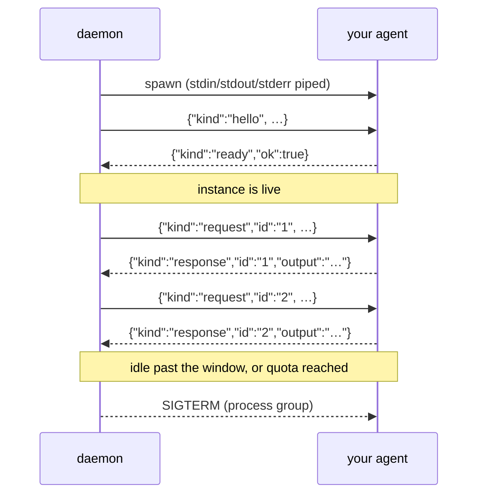

# Persistent Protocol

> The contract for agents declaring `[lifecycle] mode = "persistent"`.

A one-shot agent needs no protocol. stdout is the answer, the exit code is the
verdict, and the process ending is the boundary between one answer and the
next. A process that does not end has to say where an answer stops — and that
is all this is.

**One JSON object per line, both directions.** stdout is the channel; stderr is
the log. Same split the [plugin protocol](plugin-protocol.md) already uses.

For the *why*, see [Lifecycle](../concepts/lifecycle.md). A complete
implementation in ~20 lines of bash is in
[`examples/hello-persistent`](https://github.com/avelino/dotagent/tree/main/examples/hello-persistent).

## The exchange



## `hello` → `ready`

Written once, immediately after spawn.

```jsonc
// stdin
{ "v": 1, "kind": "hello", "agent": "telegram-assistant",
  "key": "12345", "schedule": "trigger" }

// stdout
{ "v": 1, "kind": "ready", "ok": true }
```

Answer `ready` only once whatever you needed to warm up is warm — that is what
the handshake is for. dotagent sends no request until it arrives, and gives up
after `[lifecycle] startup_timeout_seconds` (default 30).

Refusing is legal and better than dying silently:

```jsonc
{ "v": 1, "kind": "ready", "ok": false, "error": "no API key in the environment" }
```

Either failure kills the instance and surfaces as a spawn error, rather than
letting every message time out against a process that was never going to
answer.

## `request` → `response`

```jsonc
// stdin
{
  "v": 1,
  "kind": "request",
  "id": "1",
  "agent": "telegram-assistant",
  "schedule": "trigger",
  "args": [],
  "deadline_seconds": 600,
  "trigger": {
    "source": "telegram",
    "actor": "123456789",
    "reply_to": "123456789",
    "payload": { "text": "how are the disks?", "chat_id": 12345 }
  }
}

// stdout
{ "v": 1, "kind": "response", "id": "1", "ok": true, "output": "All under 70%." }
```

| Field | Meaning |
|---|---|
| `id` | Correlation handle. Echo it back. |
| `deadline_seconds` | How long dotagent will wait. Bail first and say something useful — being killed mid-sentence says nothing. |
| `trigger` | Present when a message or a tool call caused the run, absent when a clock did. Same shape as the `AGENT_TRIGGER_*` block a one-shot agent reads. |
| `output` | Goes back to whoever asked. |
| `ok` | Optional, defaults to `true`. |
| `exit_code` | Optional. Defaults to `0` when `ok`, `1` otherwise. Recorded in the heartbeat and the audit log exactly like a one-shot exit code. |
| `error` | Used as the output when `output` is absent — a failure with something to say beats silence in the chat. |

The minimum viable answer is `{"output":"hi"}`.

## Rules the reader follows

**A line that does not parse is dropped.** A stray `echo` on stdout costs a
debug line, not the conversation. Do not rely on it — put logs on stderr — but
one mistake will not corrupt the stream.

**A frame whose `id` is not the one in flight is dropped.** This is what stops
a late answer from being handed to the next question. Without it, one slow
reply would shift every subsequent answer by one and the bot would silently
start replying to the previous message.

**Omitting `id` is allowed.** There is only ever one request in flight per
instance, so an answer with no `id` is taken as the answer to it. Echoing it
back is still better: it is what makes the dropping rule work.

**A timeout recycles the instance.** dotagent does not wait for a late answer
and does not reuse the process — its state is now uncertain, and reciprocating
that uncertainty is cheaper than reasoning about it.

## The environment

The stable `AGENT_*` block is set at spawn, as always:
`AGENT_NAME`, `AGENT_HOME`, `AGENT_TMPDIR`, `AGENT_SLUG`, `AGENT_SCHEDULE_ID`,
`AGENT_HEARTBEAT_FILE`, `AGENT_ARGV`, plus `[env.extra]`. Two are specific to
this mode:

| Variable | Meaning |
|---|---|
| `AGENT_LIFECYCLE` | `persistent`. Absent for a one-shot run, so one script can support both. |
| `AGENT_PERSIST_KEY` | Which slice this instance answers for — the resolved `[lifecycle] key`, or `default`. |

**`AGENT_TRIGGER_*` is not set.** Those variables describe one message, and
this process will see many; frozen at spawn, they would read as perfectly valid
while being permanently stale. Trigger context arrives in the `trigger` field
of each request instead.

`AGENT_TMPDIR` belongs to the instance, not to a request — it survives between
requests and is removed when the instance is recycled.

## Shutting down

Recycling sends `SIGTERM` to the instance's process group, then `SIGKILL` after
the grace window. stdin also closes. Either is a valid signal to flush and
exit; a `while read` loop gets EOF and falls out of the loop on its own.

Nothing is asked of a well-behaved agent here. If you hold something that must
be persisted, persist it as you go — a recycle can happen between any two
requests, and the reasons are listed in
[Lifecycle](../concepts/lifecycle.md#when-an-instance-goes-away).

## Testing one by hand

The protocol is plain text, so a pipe is enough:

```bash
printf '%s\n%s\n' \
  '{"v":1,"kind":"hello","agent":"x","key":"default"}' \
  '{"v":1,"kind":"request","id":"1","deadline_seconds":30,"trigger":{"source":"cli","payload":{"text":"hi"}}}' \
  | bash ./agent.sh
```

Two lines out, `ready` then a `response` carrying `id: "1"`, and your logs on
stderr — that agent integrates.

Through dotagent, with the real pool:

```bash
DOTAGENT_ROOT=$PWD/examples dotagent run hello-persistent --schedule manual
```

## See also

- [Lifecycle](../concepts/lifecycle.md) — when to use this at all
- [Agent spec](agent-spec.md#lifecycle) — the `[lifecycle]` fields
- [Plugin protocol](plugin-protocol.md) — the one-shot JSON-stdio contract
- [Env vars](env-vars.md) — everything dotagent injects
