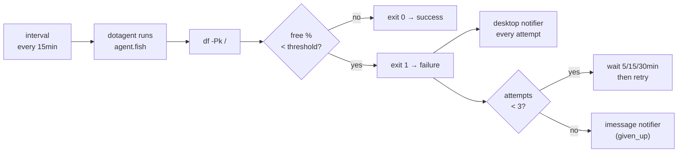

# Example: disk-alert

A complete dotagent agent that monitors free space on a mount point and
fires tiered notifications when it drops below a threshold.

This is the **canonical example** of using two built-in notifier drivers
together with retry policy: desktop banner is loud-and-fast for any
issue, iMessage only fires once retries are exhausted (a real problem).

## What it demonstrates

- A tiny **pure-shell agent** — 30 lines of fish, no LLM, no API keys.
- **Two-tier notifications** with different urgencies and channels:
  - `desktop` notifier fires on every failure (`attempt_failed`,
    `given_up`) → visible at the desk in real time
  - `imessage` notifier fires only on `given_up` → reaches your phone
    only when the issue persisted across retries
- **Retry policy** that tolerates transient spikes (docker pull, large
  build) without paging your phone, but catches a real disk fill.
- **Env-var configuration** from `agent.toml` (`DISK_FREE_MIN_PCT`,
  `DISK_CHECK_MOUNT`) — no need to edit the script to change threshold.

## Flow



## Install

```bash
# Symlink into the standard discovery path.
ln -s "$PWD" ~/.config/dotagent/agents/disk-alert

# Validate the manifest + verify plugins/notifiers resolve.
dotagent doctor

# Smoke-test (runs once, foreground).
dotagent run-now disk-alert

# Let the daemon pick it up.
dotagent reload
```

## Tweak the threshold

Edit `agent.toml`:

```toml
[env]
extra = {
    DISK_FREE_MIN_PCT = "10",       # alert when < 10% free
    DISK_CHECK_MOUNT  = "/Users",   # check a different mount
}
```

Then `dotagent reload`.

## Force a notification (to test the wiring)

The easiest way is to drop the threshold above the current free
percentage. On a healthy disk:

```bash
df -h /
# … 87% Available, say.
```

Bump the threshold above that:

```toml
[env]
extra = { DISK_FREE_MIN_PCT = "95" }
```

Then trigger:

```bash
dotagent run-now disk-alert
# → agent exits 1
# → desktop notifier fires (banner appears)
# → on every retry, banner fires again
# → after 3 attempts, imessage notifier fires with the same body
```

Reset the threshold when you're done.

## File layout

```
disk-alert/
  agent.toml       # manifest (schedule, env vars, retry policy, hooks)
  agent.fish       # the script: df + threshold check + exit code
  README.md        # this file
```

## Why two notifiers?

Notification fatigue is real. The pattern this example demonstrates:

| Severity                | Channel         | When                                                       |
|-------------------------|-----------------|------------------------------------------------------------|
| "I should know"         | desktop banner  | Every alert. Cheap, immediate, doesn't escape your desk.  |
| "I need to do something"| iMessage / push | Only after retries fail — the issue is real, not a spike. |

A 5-minute disk spike (docker layer pull, `cargo clean` mid-rebuild)
flashes a banner you can ignore. A 90-minute sustained low-disk problem
reaches your phone.

## Related

- [`docs/concepts/notifications.md`](../../docs/concepts/notifications.md)
  — every built-in notifier driver (desktop, imessage, slack, ntfy, pushover)
- [`docs/concepts/agents.md`](../../docs/concepts/agents.md) — for the
  broader "Pattern 5 / watchdog" shape this example fits
- [`docs/reference/agent-spec.md`](../../docs/reference/agent-spec.md)
  — full manifest schema
