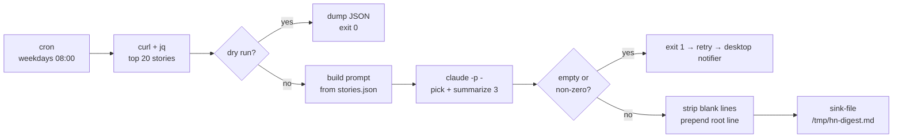

# Example: hn-digest

A complete LLM agent in ~120 lines of bash. Pulls the top Hacker News
stories, hands them to `claude -p` for the one decision that needs
judgment, and writes a digest file.

This is the **canonical example of calling an LLM from dotagent**. The
scheduling, retries, timeout and failure notification are the daemon's
job. The script only collects, prompts, and renders.

## What it demonstrates

- **`claude -p` as a subprocess**, not an SDK. dotagent has no LLM
  dependency, the agent just spawns a CLI like it would spawn `jq`.
- **Two prompt channels**: the static contract in `prompt.md`
  (`--system-prompt`) and this run's data on stdin (`-p -`).
- **A script-level timeout** that fires before the daemon's, so a hung
  model shows up as a clean error instead of a kill.
- **Guards for how LLMs actually fail**: empty output with a zero exit,
  a non-zero exit that only shows up on stderr, blank lines that break
  the downstream parser.
- **`--dry-run` that costs nothing** — collects and dumps, skips the model.
- **A `[security]` block** declaring the blast radius, which matters more
  here than in a pure-shell agent because the model picks what to do with
  the tools you granted it.

## Flow



## Requirements

- The [`claude` CLI](https://claude.com/claude-code), already
  authenticated (`claude` once, interactively). The script exports no API
  key and reads none.
- `curl`, `jq`, `perl` (for the portable timeout — macOS ships no
  `timeout`).

## Install

```bash
# Symlink the whole directory, not just agent.toml — the script resolves
# prompt.md through $AGENT_HOME.
ln -s "$PWD" ~/.config/dotagent/agents/hn-digest

dotagent doctor
dotagent run-now hn-digest       # smoke test, full pipeline incl. sink
dotagent reload                  # daemon picks it up
```

Try it from a checkout without installing anything:

```bash
DOTAGENT_ROOT=$PWD/examples dotagent run hn-digest --schedule weekday-morning --dry-run
```

> `run` executes the script and prints stdout. `run-now` runs the full
> pipeline including `on_success` hooks, so it's the one that actually
> writes the file.

## Tuning

Everything lives in `[env.extra]`, no script edit needed:

```toml
[env.extra]
HN_STORY_COUNT    = "40"      # bigger candidate pool, bigger prompt
HN_CLAUDE_MODEL   = "haiku"   # cheaper, for a task this simple
HN_CLAUDE_TIMEOUT = "180"     # keep below [agent].timeout_seconds
```

Then `dotagent reload`.

## Publishing somewhere else

The script prints hierarchical markdown and knows nothing about the
destination. To publish into a knowledge base instead of a file, swap
the hook. The script doesn't change:

```toml
[[on_success]]
plugin = "sink-roam"
config = { page = "today", marker_regex = "#hn-digest" }
```

## The indentation contract

Every sink plugin parses stdout the same way:

| Line              | Becomes                      |
|-------------------|------------------------------|
| line 1, no indent | root block                   |
| indent ≤ 3 spaces | L1                           |
| indent > 3 spaces | L2, child of the previous L1 |

Two details worth copying:

**The root line comes from the script**, not the model
(`echo "#hn-digest $(date +%Y-%m-%d)"`). Whatever the sink needs for
correctness — the marker it matches on, the date — stays deterministic.

**The parser matches a range, not an exact width.** In real runs this
agent's model emits 1 space on some lines and 2 on others. Both are L1,
so it doesn't matter. Don't write a prompt that depends on the model
counting spaces precisely; depend on it staying inside a band.

## File layout

```
hn-digest/
  agent.toml     # manifest: schedule, tunables, security, sink, notifier
  agent.sh       # collect → prompt → claude -p → render
  prompt.md      # system prompt: the output contract
  README.md      # this file
```

## Related

- [`docs/guides/llm-agents.md`](../../docs/guides/llm-agents.md) — why
  the pipeline is shaped this way, plus the headless gotchas (MCP config,
  tool allow-lists, non-determinism) this example works around
- [`docs/concepts/agents.md`](../../docs/concepts/agents.md) — "Pattern 2
  — Brief / digest", which this example implements
- [`docs/plugins/sink-file.md`](../../docs/plugins/sink-file.md) — the sink
- [`examples/disk-alert`](../disk-alert) — the same manifest features on a
  pure-shell agent, no LLM
