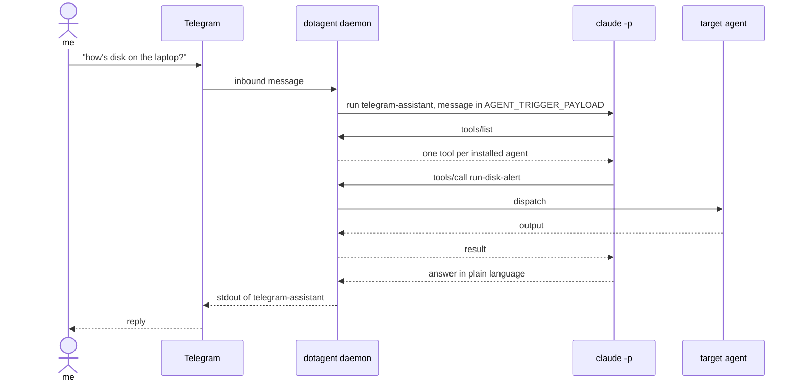

# telegram-assistant

Talk to your agents from Telegram. You write in plain language, a model picks the agent that handles it, dotagent runs it, and the answer comes back in the same thread.



## Setup

**1. A bot and your user id.** Create a bot with [@BotFather](https://t.me/BotFather) and note the token. Get your numeric user id from [@userinfobot](https://t.me/userinfobot) — the number, not the `@username`.

**2. The token, out of config.** `~/.config/dotagent/secrets.env`, mode `600`:

```
TELEGRAM_BOT_TOKEN=123456:AA...
```

**3. Daemon config.** `~/.config/dotagent/config.toml`:

```toml
[telegram]
bot_token        = "${TELEGRAM_BOT_TOKEN}"
allowed_user_ids = [123456789]
dispatcher_agent = "telegram-assistant"
```

One bot means one `getUpdates` consumer, which is why this is daemon-level rather than something each manifest declares.

**4. Install the agent.**

```bash
ln -s "$PWD" ~/.config/dotagent/agents/telegram-assistant
dotagent doctor
dotagent reload
```

Send the bot a message. `dotagent logs telegram-assistant --follow` shows what happened.

## What the model can and cannot do

It picks from `tools/list`, which is one entry per agent already installed. A name that is not in that list is not callable, so the model cannot reach anything you did not install. There is no shell in the loop.

Your message reaches the script through `AGENT_TRIGGER_PAYLOAD` as JSON — in the environment, not argv — so quoting and shell metacharacters in what you type are never interpreted.

## The conversation

Each chat gets its own `claude` session, keyed off the chat id, so "sim" refers to whatever was just proposed. Without it a confirm-then-act flow is impossible: the assistant asks "shall I?" and then has no idea what it offered.

That history is not kept forever. `--resume` replays the whole transcript as model input and nothing trims it, so a chat gets slower the more you use it — measured on a real bot, a ~90 KB transcript answers in 8-10s and a 977 KB one in 26-141s. Past 400 KB the session is retired and a fresh one starts, which costs the recent back and forth.

So anything that must survive goes to [memory](../../docs/concepts/memory.md), not to the transcript. State lives in `~/.config/dotagent/state/telegram-assistant/`: which session belongs to which chat, and how many times it has been retired.

More on what latency costs in a conversational agent: [LLM agents](../../docs/guides/llm-agents.md#where-the-latency-actually-is).

## Check it without Telegram

The MCP server is the interesting half and it stands alone:

```bash
printf '%s\n' '{"jsonrpc":"2.0","id":1,"method":"tools/list"}' | dotagent mcp
```

You should see one tool per installed agent. The same server works from Claude Code or Claude Desktop:

```json
{ "mcpServers": { "dotagent": { "command": "dotagent", "args": ["mcp"] } } }
```

## Failure modes worth knowing

**Nothing arrives.** The allowlist is the usual reason. A message from an unlisted id is refused before anything runs and lands in the audit log as `trigger_rejected` — `dotagent inspect` and the audit file will show it. An empty `allowed_user_ids` means nobody, not everybody, and the daemon logs that the ingress stayed off.

**The reply is cut off.** Telegram caps a message at 4096 characters. Longer output is trimmed with a `[truncated]` marker; the full text is in `dotagent logs`.

**A long agent times out.** `[agent].timeout_seconds` here has to cover the model call plus whichever agent it picks. The script's own `TELEGRAM_ASSISTANT_CLAUDE_TIMEOUT` fires first so you get "claude exited 142" instead of the supervisor killing the process group.

**Runs started this way are invisible to `dotagent status`.** `dotagent mcp` runs agents in its own process, like `run-now`. They keep their own heartbeat under the `trigger-mcp` slug, so they never overwrite the scheduled history of the same agent, but the live subprocess tree is not the daemon's.

## Rewriting it

The contract is env vars in, stdout out, exit code for success. Nothing about it is bash-specific:

| Variable | Meaning |
|---|---|
| `AGENT_TRIGGER_SOURCE` | `telegram` |
| `AGENT_TRIGGER_ACTOR` | numeric sender id |
| `AGENT_TRIGGER_REPLY_TO` | chat id being answered |
| `AGENT_TRIGGER_PAYLOAD` | JSON: `text`, `chat_id`, `user_id` |

Print the reply on stdout. Log everything else to stderr — stdout is what reaches the chat.
